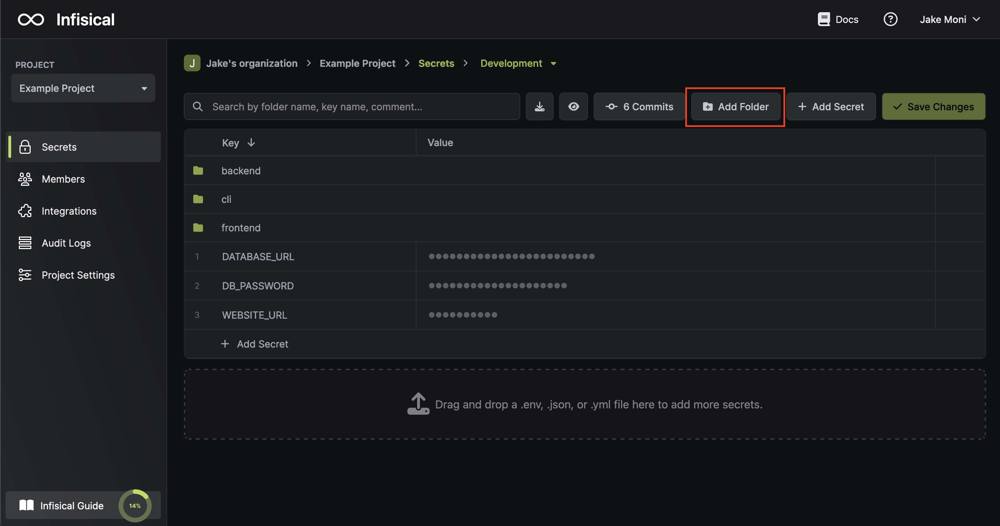
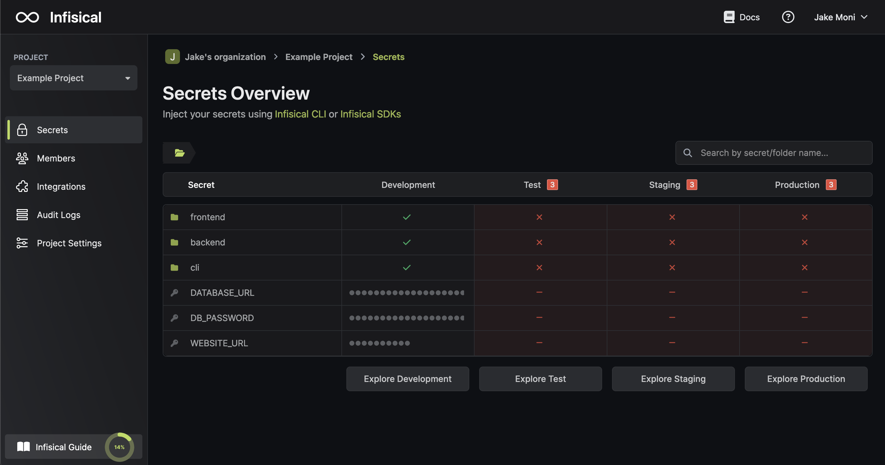
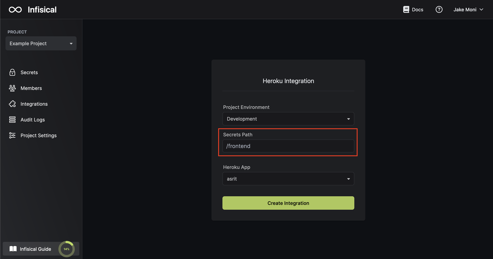
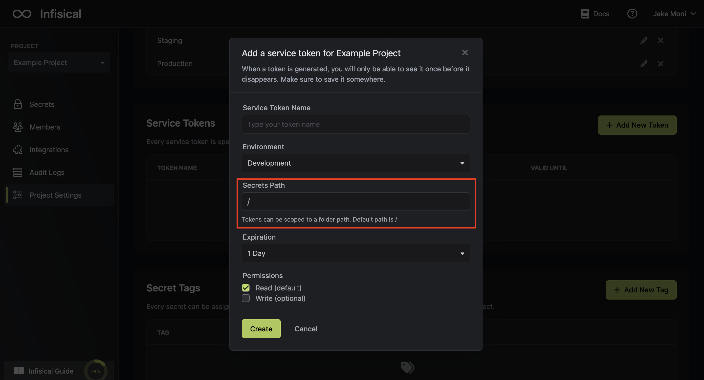

Folders can be used to group secrets into multiple levels, which can help organize secrets in monorepos or microservice-based architectures. For example, you could create a folder for each environment, such as production, staging, and development. 

Within each environment folder, you could create subfolders for different types of secrets, such as database credentials, API keys, and SSH keys. This can help to keep your secrets organized and easy to find.

## Dashboard

Only alphabets, numbers, and dashes are allowed in folder names. You can create a folder for each environment from the dashboard.

To create a nested folder or access the secrets of a folder, click on an existing folder to open it. You will then be able to modify the secrets of that folder and create new folders inside it.

## Dashboard Secret Overview

The overview screen provides a comprehensive view of all your secrets and folders, organized by environment. 

When you click on a folder, the overview will be updated to show only the secrets and folders in that folder. This makes it easy to find the information you need, no matter how deeply nested it is.

## Integrations

You can easily scope injected secrets to a folder during integrations by providing the secret path option.

For more information on integrations, [refer infisical integration](/integrations/overview)

## Service Tokens

You can scope the secrets that can be read and written using an Infisical token by providing the secret path option when creating the token.

You can provide the folder path as glob if you want to have access to multiple folders and the tokens do support multi-environment.

For more information, [refer infisical token section.](./token)

## Point-In-Time Recovery

For more information on how PIT recovery works on folders, [please refer to this section.](./pit-recovery)
