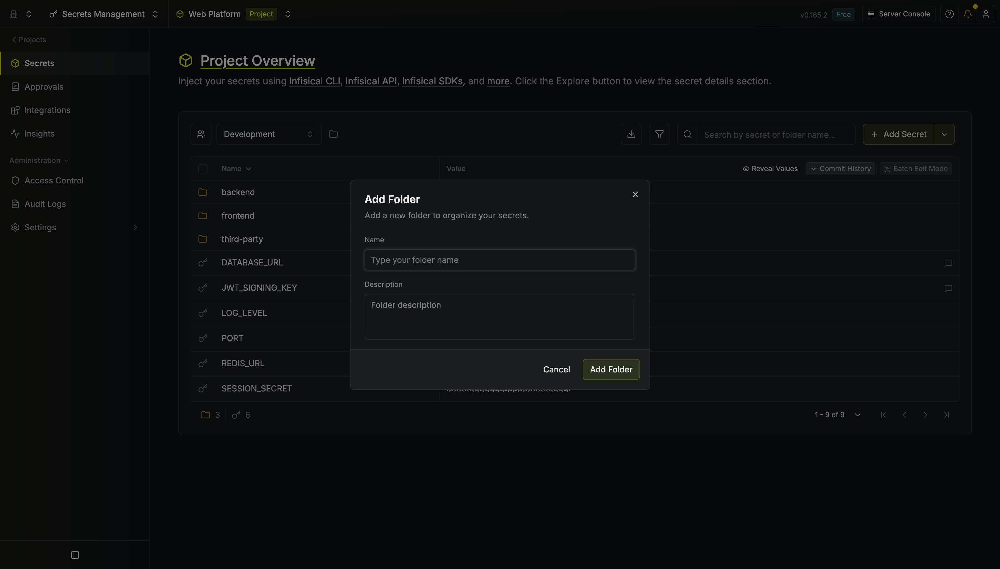
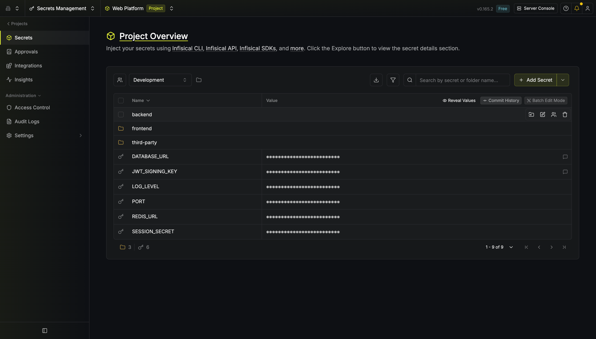
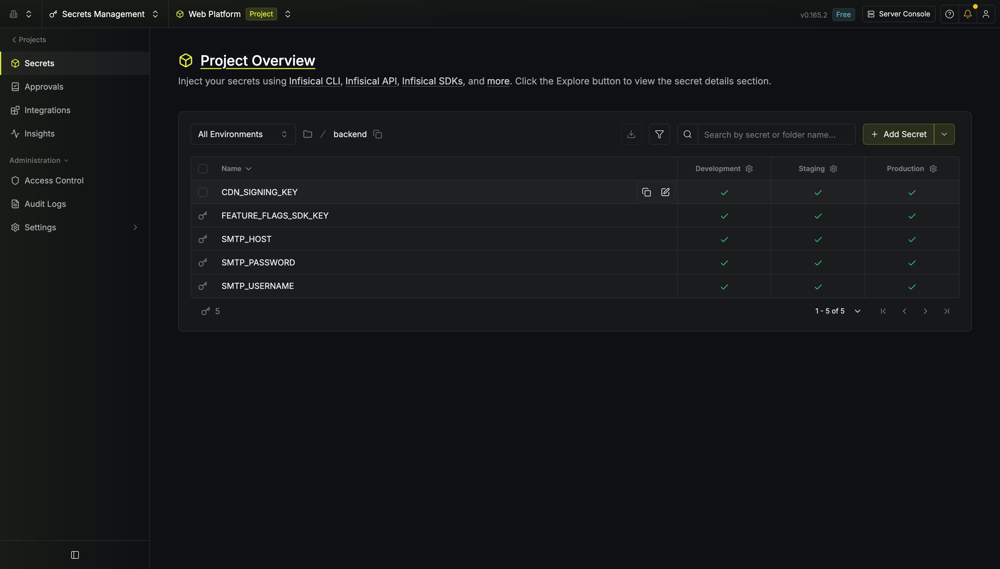
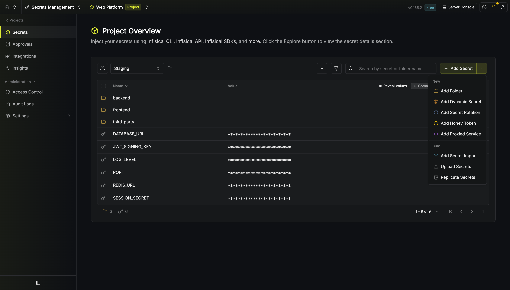
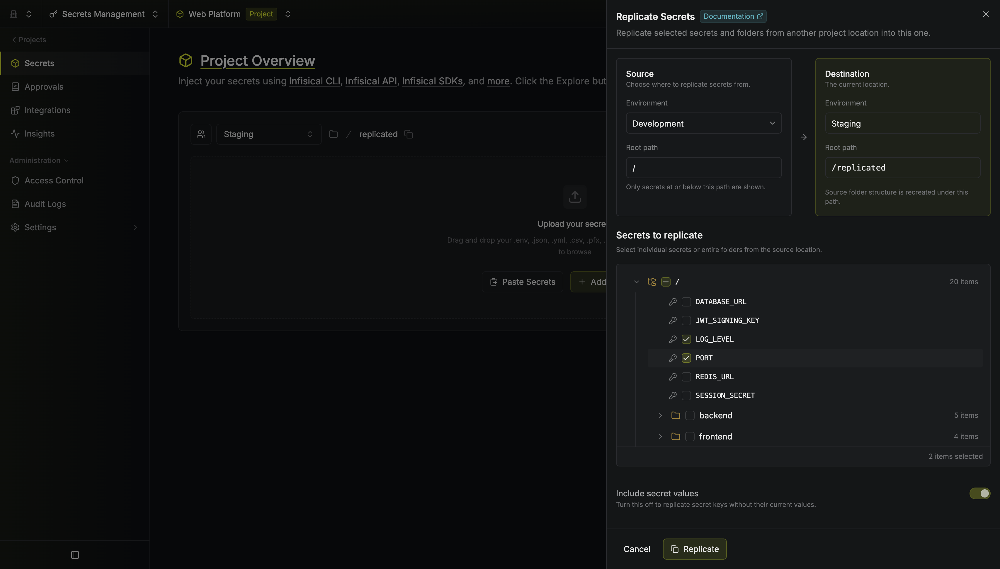
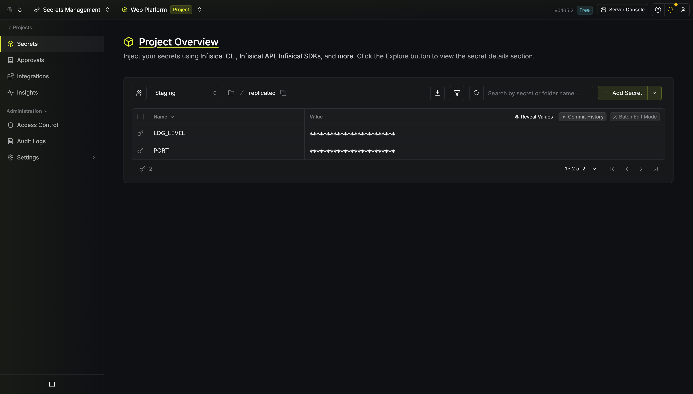

Infisical Folders enable users to organize secrets using custom structures dependent on the intended use case (also known as **path-based secret storage**).

It's great for organizing secrets around hierarchies with multiple services or types of secrets involved at large quantities.
Infisical Folders can be infinitely nested to mirror your application architecture – whether it's microservices, monorepos,
or any logical grouping that best suits your needs.

Consider the following structure for a microservice architecture:

```
| service1
|---- envars
|---- users
|-------- tokens1
|-------- tokens2
| service2
|---- envars
...
```

In this example, we store environment variables for each microservice under each respective `/envars` folder.
We also store user-specific secrets for micro-service 1 under `/service1/users`. With this folder structure in place, your applications only need to specify a path like `/microservice1/envars` to fetch secrets from there.
By extending this example, you can see how path-based secret storage provides a versatile approach to manage secrets for any architecture.

## Managing folders

To add a folder, select the chevron next to **Add Secret**, then select **Add Folder**.

<Info>
  Folder names can only contain alphabets, numbers, and dashes
</Info>



To delete a folder, hover over it and select the trash icon on the right.



### Comparing folders

It's possible to compare the contents of folders across environments in the **Secrets Overview** page.
When you select a folder, the table shows the items inside it across environments.

In the image below, `/backend` holds the same five secrets in Development, Staging, and Production. Where a check mark is missing, that secret isn't set for that environment.



### Replicating folder contents

**Destination** is always the folder you're looking at, so open the environment and folder you want the secrets copied into before you start.

To copy secrets or folders from another path into it, select the chevron next to **Add Secret**, then select **Replicate Secrets**.



Under **Source**, choose the **Environment** and **Root path** to copy from. **Secrets to replicate** then lists everything at or below that path. Select individual secrets, or select a folder to copy the folder and its contents. Turn off **Include secret values** to copy the keys without their values.

**Root path** also decides where the copies land. Infisical strips it from the path of each selected secret and recreates what's left under **Destination**. Replicating `/backend/API_KEY` into `/replicated` gives you `/replicated/backend/API_KEY` when the root path is `/`, and `/replicated/API_KEY` when it's `/backend`.



Select **Replicate**, then select **Replicate secrets** in the dialog that follows.



Here `LOG_LEVEL` and `PORT` were copied from the root of Development into `/replicated` in Staging.
