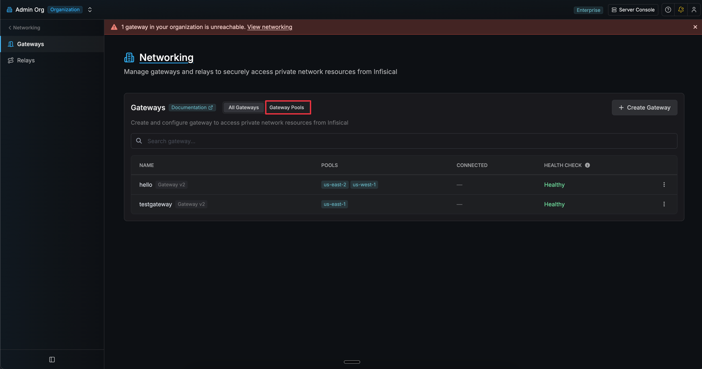
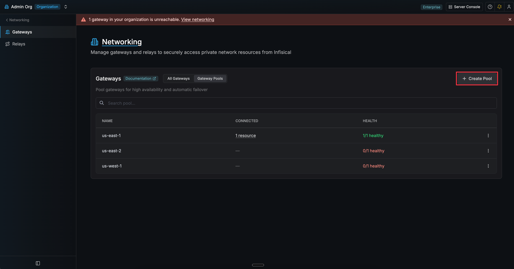
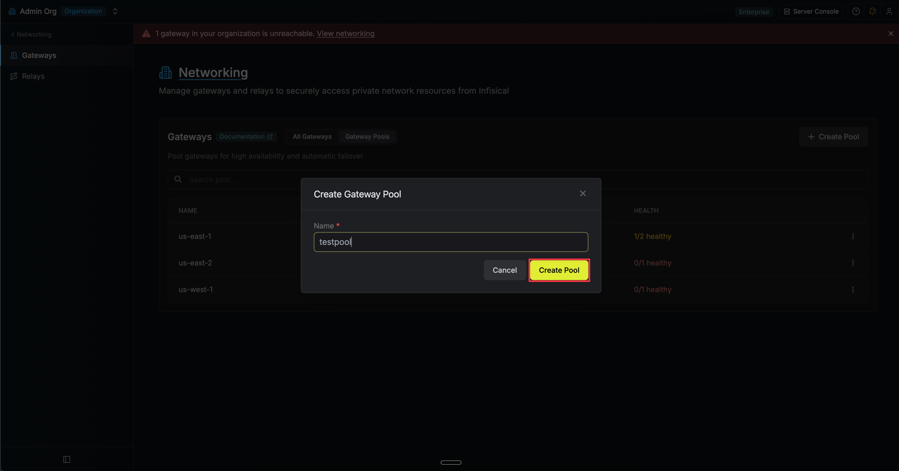
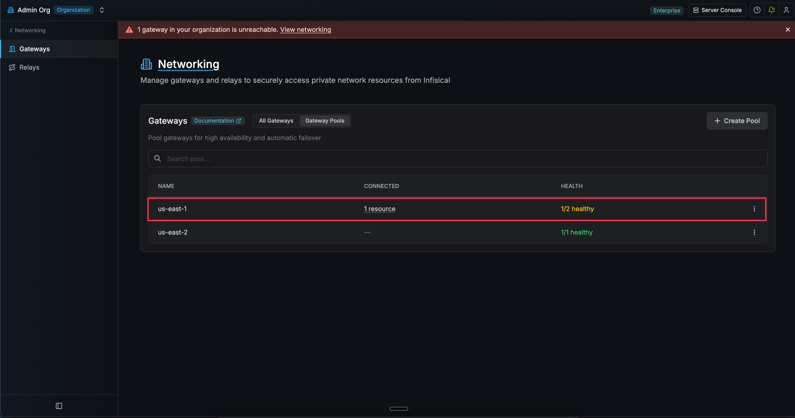
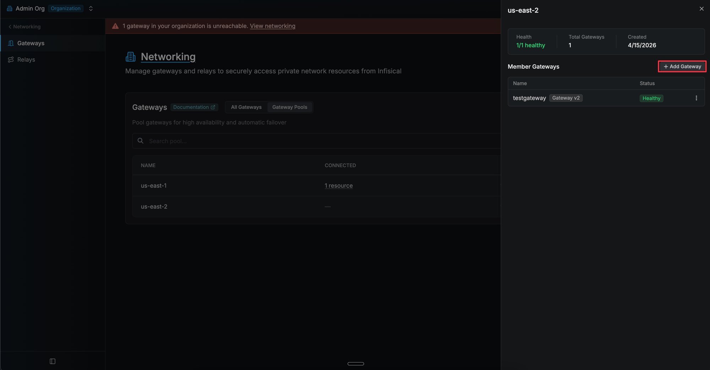

Gateway Pools provide high availability for your gateway infrastructure. A pool is a named collection of gateways that all have connectivity to the same private network. When the platform needs to reach a resource through a pool, it automatically routes through a healthy member, providing failover if any individual gateway goes down.

<Info>
  Gateway Pools is an enterprise feature. Self-hosted users can contact
  [sales@infisical.com](mailto:sales@infisical.com) to purchase an enterprise
  license.
</Info>

## How It Works

1. You create a Gateway Pool and add multiple gateways that share network access to the same resources.
2. When configuring a consumer (e.g., Kubernetes Auth), you select the pool instead of an individual gateway.
3. At request time, the platform picks a random healthy gateway from the pool and routes through it.
4. If a gateway goes down, subsequent requests automatically route through the remaining healthy members.

A gateway is considered healthy if it has sent a heartbeat within the last hour and its last health check did not fail.

## Creating a Gateway Pool

1. Navigate to **Organization Settings > Networking > Gateways**.
2. Click the **Gateway Pools** tab.

3. Click **Create Pool**.

4. Enter a name for the pool and click **Create Pool**.

## Adding Gateways to a Pool

1. In the **Gateway Pools** tab, click on a pool to open its detail view.

2. Click **Add Gateway** and select a gateway from the dropdown.

3. Repeat for each gateway you want to add.

A gateway can belong to multiple pools if it has connectivity to resources served by each pool. Pool membership can be changed at any time without restarting the gateway.

## Using a Pool in a Consumer Config

Anywhere you configure a gateway, the gateway picker dropdown shows both individual gateways and gateway pools. Pools are listed under the "Gateway Pools" section with an **HA** (high availability) badge and health status.

When you select a pool, the platform validates connectivity through one of its healthy members before saving.

## Gateway Selection

When a request is routed through a pool, the platform picks a gateway at random from the pool's healthy members. There is no round-robin or weighted selection.

## Pool Health

Each pool displays an aggregate health status based on its members:

- **Green** (e.g., "3/3 healthy") - All members are healthy
- **Yellow** (e.g., "2/3 healthy") - Some members are unhealthy
- **Red** (e.g., "0/3 healthy") - All members are unhealthy

If all gateways in a pool are unhealthy when a request is made, the request fails with a descriptive error.

## FAQ

<AccordionGroup>
  <Accordion title="Which features support gateway pools?">
    Gateway pools can currently be selected in **Kubernetes Auth** configurations. Support for additional consumers such as dynamic secrets, PAM, and app connections is coming soon.
  </Accordion>
  <Accordion title="Can I delete a pool that is in use?">
    No. A pool cannot be deleted if it is referenced by any consumer configurations (e.g., Kubernetes Auth). You must first update those configurations to use a different gateway or pool before deleting.
  </Accordion>
  <Accordion title="How can I see what is using a pool?">
    Each pool shows a count of connected consumer configurations in the table. Click the count to see the full list with links to each resource.
  </Accordion>
  <Accordion title="What happens if all gateways in a pool are unhealthy?">
    The request fails with a descriptive error. You should ensure at least one gateway in the pool is online and has a recent heartbeat.
  </Accordion>
  <Accordion title="Can a gateway belong to multiple pools?">
    Yes. A gateway can belong to as many pools as needed, as long as it has connectivity to the resources served by each pool.
  </Accordion>
</AccordionGroup>

