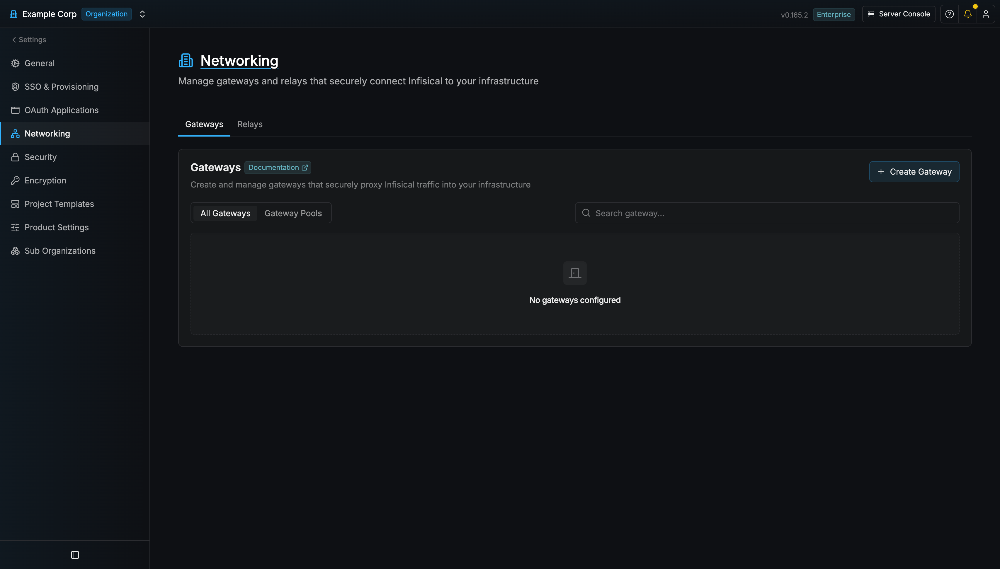
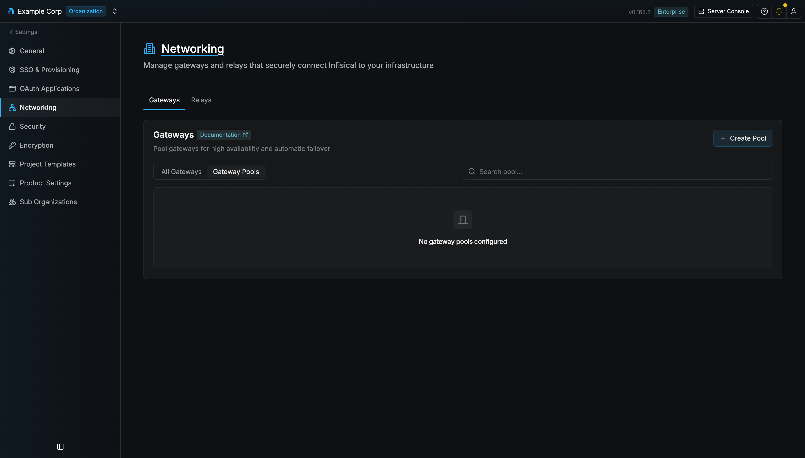
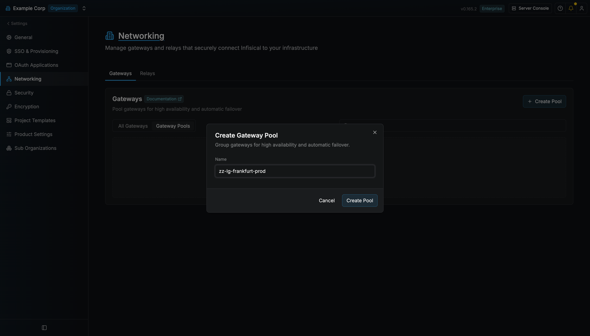
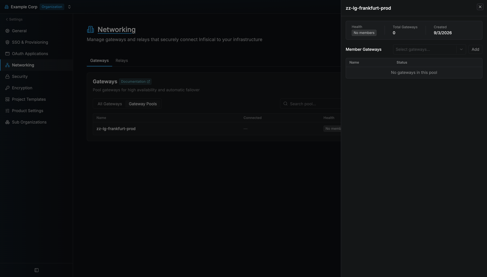
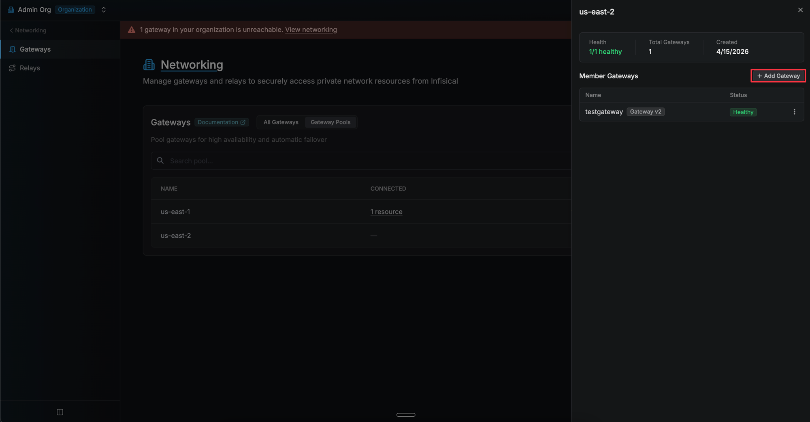

Gateway Pools spread work across your gateway infrastructure and keep it available when a gateway fails. A pool is a named collection of gateways that all have connectivity to the same private network. When the platform needs to reach a resource through a pool, it sends the work to whichever gateway is least busy, and retries on another gateway if the chosen one can't be reached.

<Info>
  Gateway Pools is an enterprise feature. Self-hosted users can contact
  [sales@infisical.com](mailto:sales@infisical.com) to purchase an enterprise
  license.
</Info>

## How it works

1. You create a Gateway Pool and add multiple gateways that share network access to the same resources.
2. When configuring a consumer (e.g., Kubernetes Auth), you select the pool instead of an individual gateway.
3. At request time, the platform sends the work to whichever healthy gateway in the pool is handling the fewest connections.
4. If that gateway can't be reached, the request is retried on another member and the failed gateway is skipped for the next minute.
5. If a gateway goes down, subsequent requests route through the remaining healthy gateways.

A gateway is considered healthy if it has sent a successful heartbeat within its TTL window.

## Creating a Gateway pool

1. Go to **Settings**, select **Networking**, then open the **Gateways** tab.
2. Select the **Gateway Pools** sub-tab.

3. Select **Create Pool**.

4. Enter a name for the pool and select **Create Pool**.

## Adding gateways to a pool

1. In the **Gateway Pools** sub-tab, select a pool to open its detail view.

2. Under **Member Gateways**, pick a gateway from the picker and select **Add**.

3. Repeat for each gateway you want to add.

A gateway can belong to multiple pools if it has connectivity to resources served by each pool. Pool membership can be changed at any time without restarting the gateway.

## Using a pool in a consumer config

Anywhere you configure a gateway, the gateway picker dropdown shows both individual gateways and gateway pools. Pools are listed under the "Gateway Pools" section with an **HA** (high availability) badge and health status.

When you select a pool, the platform validates connectivity through one of its healthy gateways before saving.

## Gateway selection

Each gateway reports how many connections it's currently handling. When a request is routed through a pool, the platform picks the healthy member handling the fewest, so a gateway holding several long-lived sessions stops attracting new work until the others catch up.

Members handling the same amount are chosen between at random. On an idle pool every member is equal, so traffic spreads evenly.

Because the count comes from the gateway itself, it includes work the platform doesn't proxy, such as a PAM session opened from the CLI.

<Warning>
  Load balancing requires gateways running a CLI version that reports connection counts. A gateway
  on an older version doesn't report, and a pool containing any non-reporting member falls back to
  choosing at random. Upgrade every gateway in a pool to get load balancing for that pool.
</Warning>

## Failover

If the platform can't establish a connection to the gateway it chose, it retries the request on another member of the pool, then marks the failed gateway as suspect and skips it for the next minute. This covers the window where a gateway has stopped responding but its last heartbeat is still recent enough to look healthy.

Only failures that occur *before* the platform reaches your resource are retried. If the connection succeeds and the resource itself rejects the request, for example bad credentials, that error is returned to you as-is and is never retried on another gateway. This is deliberate: an operation that changes something on the target, such as rotating a password, must not run twice.

## Pool health

Each pool displays an aggregate health status based on its gateways:

- **Green** (e.g., "3/3 healthy") - All gateways are healthy
- **Yellow** (e.g., "2/3 healthy") - Some gateways are unhealthy
- **Red** (e.g., "0/3 healthy") - All gateways are unhealthy

If all gateways in a pool are unhealthy when a request is made, the request fails with a descriptive error.

## FAQ

<AccordionGroup>
  <Accordion title="Can I delete a pool that is in use?">
    No. A pool can't be deleted if it's referenced by any consumer configurations (e.g., Kubernetes Auth). You must first update those configurations to use a different gateway or pool before deleting.
  </Accordion>
  <Accordion title="How can I see what is using a pool?">
    Each pool shows a count of connected consumer configurations in the table. Select the count to see the full list with links to each resource.
  </Accordion>
  <Accordion title="What happens if all gateways in a pool are unhealthy?">
    The request fails with a descriptive error. You should ensure at least one gateway in the pool is online and has a recent heartbeat.
  </Accordion>
  <Accordion title="Can a gateway belong to multiple pools?">
    Yes. A gateway can belong to as many pools as needed, as long as it has connectivity to the resources served by each pool.
  </Accordion>
</AccordionGroup>

