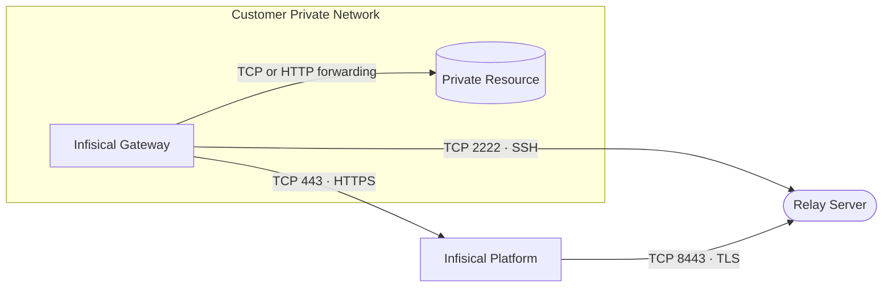

The Gateway is deployed inside your private network and makes **only outbound connections** — it never accepts inbound connections. It reaches Infisical through a [**relay server**](/documentation/platform/gateways/relay-deployment/overview) using an **SSH reverse tunnel over TCP**, so the platform can access your private resources (databases, internal APIs) without any inbound firewall rules. All traffic through the relay is double-encrypted, and the relay only routes traffic — it cannot decrypt it.

## Connection model

## Ports and connections

| Connection | Source | Destination | Port | Protocol | Purpose |
|---|---|---|---|---|---|
| Relay tunnel | Gateway | Relay server | 2222 | TCP (SSH) | Establishes the SSH reverse tunnel — **egress** |
| Infisical API | Gateway | Infisical instance host | 443 | TCP (HTTPS) | API communication + certificate requests — **egress** |
| Platform ↔ relay | Infisical Platform | Relay server | 8443 | TCP + TLS | Platform connects to the relay; traffic is then routed over the gateway's existing tunnel |
| Resource access | Gateway | Private resource | the resource's own port (e.g. 5432) | TCP or HTTP | Gateway forwards platform requests to the internal service — raw TCP for most resources (e.g. databases), HTTP for resources like Kubernetes — **local** |

## Firewall / egress allowlist

On the Gateway host, allow **outbound** access only:

- **TCP 2222** to the relay server (managed relay IP/hostname, or your self-hosted relay's address)
- **TCP 443** to the Infisical instance host (`app.infisical.com` for US, `eu.infisical.com` for EU, or your self-hosted domain)

No inbound rules are required.

With the default **Auto Select Relay** option there is no single relay address to allowlist, since the gateway may fail over between managed relays — see [Which relay address do I need to allowlist?](#frequently-asked-questions) below for the endpoints to include and how to pin to a single relay.

## Self-hosted relay (optional)

If you run a self-hosted relay, that host needs:

- **Inbound TCP 2222** from your gateways (SSH reverse tunnels)
- **Inbound TCP 8443** from the Infisical instance host (platform ↔ relay)
- **Outbound TCP 443** to the Infisical instance host (relay API + certificates)

## Frequently asked questions

<AccordionGroup>
  <Accordion title="Does the Gateway require any inbound ports?">
    No. The Gateway makes only outbound connections (TCP 2222 to the relay and TCP 443 to the Infisical API). The platform reaches the Gateway back over its own outbound SSH tunnel via the relay, so no inbound firewall rules are needed.
  </Accordion>

  <Accordion title="Does the Gateway only proxy raw TCP?">
    No. Depending on the target resource, the Gateway forwards either raw TCP or HTTP. Most resources (for example databases like PostgreSQL on 5432) are proxied as raw TCP, while resources such as Kubernetes are reached over HTTP forwarding. In both cases the Gateway connects to the resource on its own port inside your private network.
  </Accordion>

  <Accordion title="Which relay address do I need to allowlist?">
    With the default **Auto Select Relay**, the Gateway may connect to, and fail over between, any managed relay Infisical operates for your region, so a strict outbound TCP 2222 allowlist must include every managed relay endpoint. You can find these under **Organization Settings → Networking**, or ask Infisical support. To allowlist a single address instead, pin the Gateway to one relay at enrollment with the `--target-relay-name` option; this removes automatic failover to other relays.
  </Accordion>

  <Accordion title="Can Gateway traffic egress through an HTTP forward proxy?">
    Not currently. The Gateway's connection to the relay is a raw SSH tunnel over TCP (port 2222), and its connection to the Infisical API is TLS over TCP (port 443). Neither is HTTP, so an HTTP forward proxy cannot transparently carry this traffic.

    If an HTTP proxy is mandatory in your environment, you have two options:

    - Allow the Gateway's outbound rules (TCP 2222 and TCP 443) to bypass the proxy for the relay and Infisical endpoints.
    - Deploy a self-hosted relay inside your own network so the TCP 2222 tunnel stays internal and only TCP 443 needs to leave. The Infisical platform must still reach that relay on inbound TCP 8443, so the relay needs a network path from the platform (a public or forwarded 8443 endpoint); this only removes all external egress when you also self-host the Infisical platform in the same network.
  </Accordion>
</AccordionGroup>
