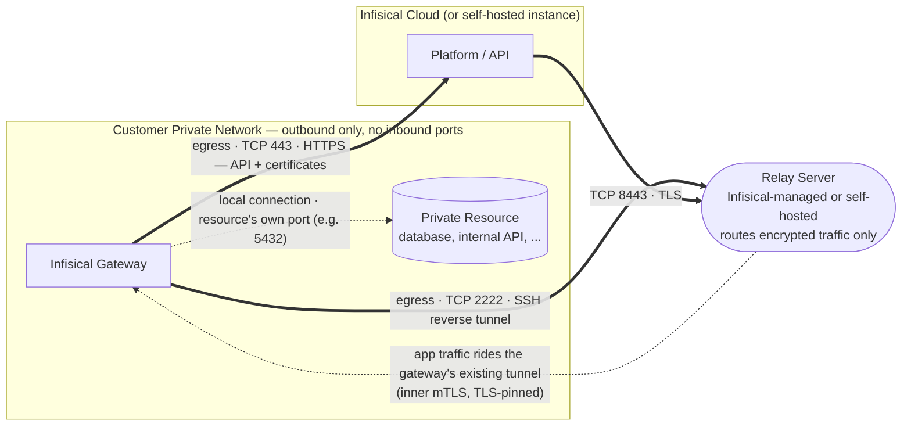

The Gateway is deployed inside your private network and makes **only outbound connections** — it never accepts inbound connections. It reaches Infisical through a **relay server** using an **SSH reverse tunnel over TCP**, so the platform can access your private resources (databases, internal APIs) without any inbound firewall rules. All traffic through the relay is double-encrypted, and the relay only routes traffic — it cannot decrypt it.

## Connection model

## Ports and connections

| Connection | Source | Destination | Port | Protocol | Purpose |
|---|---|---|---|---|---|
| Tunnel (data plane) | Gateway | Relay server | 2222 | TCP (SSH) | Establishes the SSH reverse tunnel — **egress** |
| Control plane | Gateway | Infisical instance host | 443 | TCP (HTTPS) | API communication + certificate requests — **egress** |
| Platform ↔ relay | Infisical Platform | Relay server | 8443 | TCP + TLS | Platform connects to the relay; traffic is then routed over the gateway's existing tunnel |
| Resource access | Gateway | Private resource | the resource's own port (e.g. 5432) | TCP | Gateway proxies platform requests to the internal service — **local** |

<Note>
  The Gateway requires no inbound ports — the platform reaches it back over the gateway's own outbound SSH tunnel via the relay.
</Note>

## Firewall / egress allowlist

On the Gateway host, allow **outbound** access only:

- **TCP 2222** to the relay server (managed relay IP/hostname, or your self-hosted relay's address)
- **TCP 443** to the Infisical instance host (`app.infisical.com` for US, `eu.infisical.com` for EU, or your self-hosted domain)

No inbound rules are required. The relay's IP/hostname is shown in your Infisical dashboard under **Organization Settings → Networking** when you generate the gateway deploy command — allowlist that specific address.

## Self-hosted relay (optional)

If you run a self-hosted relay, that host needs:

- **Inbound TCP 2222** from your gateways (SSH reverse tunnels)
- **Inbound TCP 8443** from the Infisical instance host (platform ↔ relay)
- **Outbound TCP 443** to the Infisical instance host (relay API + certificates)

## Can Gateway traffic egress through an HTTP forward proxy (e.g. Squid)?

Not currently. The Gateway's connection to the relay is a raw **SSH tunnel over TCP** (port 2222), and its connection to the Infisical API is **TLS over TCP** (port 443). Neither is HTTP, so an HTTP forward proxy such as Squid cannot transparently carry this traffic.

If an HTTP proxy is mandatory in your environment, you have two options:

- Allow the Gateway's two outbound rules (**TCP 2222** and **TCP 443**) to bypass the proxy for the relay and Infisical endpoints.
- Deploy a **self-hosted relay** inside your own network so the TCP 2222 tunnel stays internal, and only TCP 443 needs to leave your network.
