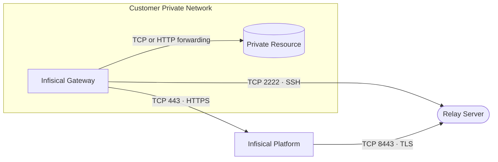
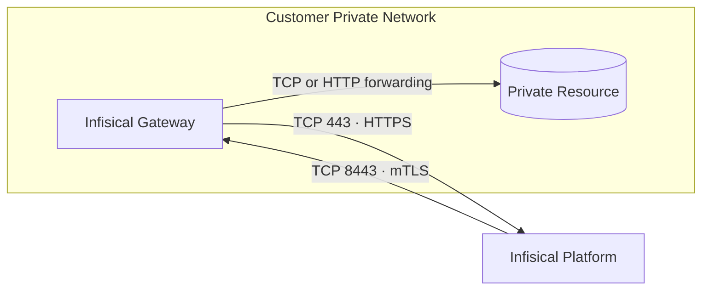

The Gateway is deployed inside your private network, alongside the resources it protects. Infisical never touches those resources directly. It sends every request through the Gateway, which forwards it to the database or internal API on the other side.

There are two ways the Gateway and Infisical reach each other, and they differ in one thing: which side opens the connection.

- **Relay mode.** The Gateway dials out to a [relay server](/documentation/platform/gateways/relay-deployment/overview) and keeps that tunnel open. Infisical connects to the relay, and its requests travel back down the tunnel the Gateway already established. The Gateway accepts no inbound connections, so your firewall needs no inbound rules.
- **Direct listen mode.** The Gateway listens on an address you register, and Infisical connects to it. There's no relay to deploy, but the address has to be reachable from wherever Infisical runs.

Both modes carry the same mutually authenticated TLS between Infisical and the Gateway, with certificates issued by your organization's own certificate authorities. In relay mode the relay routes bytes without holding the keys to read them.

<Info>
  Direct listen is available on self-hosted Infisical. On Infisical Cloud, gateways use relay mode.
</Info>

## Relay mode

```mermaid
%%{init: {'flowchart': {'nodeSpacing': 70, 'rankSpacing': 110, 'curve': 'basis'}}}%%
flowchart LR
  subgraph customer["Customer Private Network"]
    direction TB
    GW["Infisical Gateway"]
    RES[("Private Resource")]
    GW -->|"TCP or HTTP forwarding"| RES
  end
  PLAT["Infisical Platform"]
  RELAY(["Relay Server"])
  GW -->|"TCP 443 · HTTPS"| PLAT
  GW -->|"TCP 2222 · SSH"| RELAY
  PLAT -->|"TCP 8443 · TLS"| RELAY
```

| Connection | Source | Destination | Port | Protocol | Purpose |
|---|---|---|---|---|---|
| Relay tunnel | Gateway | Relay server | 2222 | TCP (SSH) | Establishes the SSH reverse tunnel. **Egress** |
| Infisical API | Gateway | Infisical instance host | 443 | TCP (HTTPS) | API communication and certificate requests. **Egress** |
| Platform to relay | Infisical Platform | Relay server | 8443 | TCP + TLS | Platform connects to the relay, which routes the traffic over the gateway's existing tunnel |
| Resource access | Gateway | Private resource | the resource's own port (e.g. 5432) | TCP or HTTP | Gateway forwards platform requests to the internal service. Raw TCP for most resources such as databases, HTTP for resources like Kubernetes. **Local** |

On the Gateway host, allow **outbound** access only:

- **TCP 2222** to the relay server (managed relay IP/hostname, or your self-hosted relay's address)
- **TCP 443** to the Infisical instance host (`app.infisical.com` for US, `eu.infisical.com` for EU, or your self-hosted domain)

No inbound rules are required.

With the default **Auto Select Relay** option there is no single relay address to allowlist, since the gateway may fail over between managed relays. See [Which relay address do I need to allowlist?](#frequently-asked-questions) below for the endpoints to include and how to pin to a single relay.

## Direct listen mode

```mermaid
%%{init: {'flowchart': {'nodeSpacing': 70, 'rankSpacing': 110, 'curve': 'basis'}}}%%
flowchart LR
  subgraph customer["Customer Private Network"]
    direction TB
    GW["Infisical Gateway"]
    RES[("Private Resource")]
    GW -->|"TCP or HTTP forwarding"| RES
  end
  PLAT["Infisical Platform"]
  GW -->|"TCP 443 · HTTPS"| PLAT
  PLAT -->|"TCP 8443 · mTLS"| GW
```

| Connection | Source | Destination | Port | Protocol | Purpose |
|---|---|---|---|---|---|
| Gateway listener | Infisical Platform | Gateway's registered address | the port you set with `--listen-address` | TCP + mTLS | Platform connects to the gateway to serve every operation. **Ingress** on the Gateway host |
| Infisical API | Gateway | Infisical instance host | 443 | TCP (HTTPS) | API communication and certificate requests. **Egress** |
| Resource access | Gateway | Private resource | the resource's own port (e.g. 5432) | TCP or HTTP | Gateway forwards platform requests to the internal service. **Local** |

On the Gateway host, allow:

- **Inbound** access on the port you set with `--listen-address`, from the Infisical instance host only
- **Outbound TCP 443** to the Infisical instance host

The address you register is the one Infisical dials, and it's written into the Gateway's server certificate, so it has to be stable. An internal DNS name or a load balancer in front of the Gateway both work. Changing it means re-running the deploy command so the Gateway is issued a certificate for the new address.

By default the Gateway binds the port from `--listen-address` on every interface. To bind somewhere else, such as one interface or a different local port behind a load balancer, pass `--bind` as well.

## Running both modes

A Gateway can run both modes at once. Pass `--relay` and `--listen-address` together, and Infisical uses the direct address first, and falls back to the relay when that address stops answering. Health checks probe each mode separately, so the Gateway stays healthy while either one works.

This is worth doing when you want direct connections for everything the platform does, and a relay so PAM CLI sessions still work for users outside the network.

## Self-hosted relay (optional)

If you run a self-hosted relay, that host needs:

- **Inbound TCP 2222** from your gateways (SSH reverse tunnels)
- **Inbound TCP 8443** from the Infisical instance host (platform to relay)
- **Outbound TCP 443** to the Infisical instance host (relay API + certificates)

## Frequently asked questions

<AccordionGroup>
  <Accordion title="Does the Gateway require any inbound ports?">
    In relay mode, no. The Gateway makes only outbound connections (TCP 2222 to the relay and TCP 443 to the Infisical API), and the platform reaches it back over that same tunnel.

    In direct listen mode, yes. The Gateway accepts inbound connections on the port you set with `--listen-address`, and that port needs to be open to the Infisical instance host. Scope the rule to that host rather than opening the port broadly.
  </Accordion>

  <Accordion title="Which mode should I use?">
    Use direct listen when Infisical can already reach the Gateway host at a stable address, which is the common case when you self-host Infisical in the same network as your resources. It needs no relay.

    Use relay mode when the Gateway sits behind NAT or a firewall you can't open, when you're on Infisical Cloud, or when PAM CLI users connect from outside the Gateway's network. See [Gateway deployment](/documentation/platform/gateways/gateway-deployment) for the full comparison.
  </Accordion>

  <Accordion title="Do PAM CLI sessions work in direct listen mode?">
    Only from a machine that can reach the Gateway's registered address. The CLI opens its own connection to the Gateway rather than going through Infisical, so a user on a laptop outside the network can't reach a Gateway that only listens on an internal address. Those users need a VPN into the network, or a relay on the Gateway.

    Browser-based PAM access is unaffected, because the platform brokers that connection.
  </Accordion>

  <Accordion title="Does the Gateway only proxy raw TCP?">
    No. Depending on the target resource, the Gateway forwards either raw TCP or HTTP. Most resources (for example databases like PostgreSQL on 5432) are proxied as raw TCP, while resources such as Kubernetes are reached over HTTP forwarding. In both cases the Gateway connects to the resource on its own port inside your private network.
  </Accordion>

  <Accordion title="Which relay address do I need to allowlist?">
    With the default **Auto Select Relay**, the Gateway may connect to, and fail over between, any managed relay Infisical operates for your region, so a strict outbound TCP 2222 allowlist must include every managed relay endpoint. You can find these under **Organization Settings → Networking**, or ask Infisical support. To allowlist a single address instead, pin the Gateway to one relay at enrollment with the `--relay` option; this removes automatic failover to other relays.
  </Accordion>

  <Accordion title="Can Gateway traffic egress through an HTTP forward proxy?">
    Not currently. In relay mode, the Gateway's connection to the relay is a raw SSH tunnel over TCP (port 2222), and its connection to the Infisical API is TLS over TCP (port 443). Neither is HTTP, so an HTTP forward proxy can't transparently carry this traffic.

    If an HTTP proxy is mandatory in your environment, you have two options:

    - Allow the Gateway's outbound rules (TCP 2222 and TCP 443) to bypass the proxy for the relay and Infisical endpoints.
    - Deploy a self-hosted relay inside your own network so the TCP 2222 tunnel stays internal and only TCP 443 needs to leave. The Infisical platform must still reach that relay on inbound TCP 8443, so the relay needs a network path from the platform (a public or forwarded 8443 endpoint); this only removes all external egress when you also self-host the Infisical platform in the same network.
  </Accordion>
</AccordionGroup>
