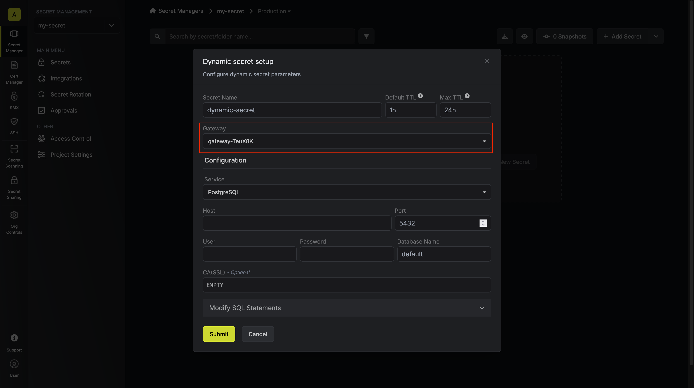

<Info>
    Note that Gateway is a paid feature.

    If you're using Infisical Cloud, then it is available under the **Enterprise Tier**
    If you're self-hosting Infisical, then you should contact sales@infisical.com to purchase an enterprise license to use it.

</Info>

## Introduction

Gateway is Infisical's solution for providing secure access to your private resources without exposing them to the internet.

By "without exposing," we mean that your resources remain completely closed to inbound connections - no SSH ports, no TCP ports are open.
This level of security ensures that even port scanning cannot detect your resources.

## How It Works

A gateway is a simple server that acts as a bridge for direct communication between the Infisical server and your private, closed resources (such as databases).

When deployed, the gateway establishes a connection with the relay server. Infisical then communicates with your gateway through these relays.
All communication between Infisical and the gateway is end-to-end encrypted, ensuring that only the platform and your gateway can decrypt the transmitted information.

## Deployment

You can easily deploy a gateway using the Infisical CLI by following these steps:

<Steps>
  <Step title="Create a Gateway Identity">
    1. Navigate to your **Organization Access Control**. 
    2. Create a dedicated identity for the gateway. 
    3. Best practice: Use one unique identity per gateway.
    
  </Step>
  
  <Step title="Configure Authentication Method">
    Set up authentication by following the [Identity Auth Method Configuration](../identities/universal-auth) guide.
  </Step>

  <Step title="Deploy the Gateway">
    1. Deploy the gateway using Infisical CLI with this command: 
    ```bash
    INFISICAL_TOKEN=$(infisical login ...) infisical gateway 
    ```
  <Note>
    Verify that the deployed gateway has access to your private resources
  </Note>

  </Step>
  <Step title="Verification">
    1. Check the gateway log to have **Gateway started successfully**
    
    2. Navigate to **Gateways** list page in Org Access Control
    
  </Step>
</Steps>

## Using Your Gateway

### Configuring Dynamic Secrets

To use your gateway with dynamic secrets:

1. Navigate to your dynamic secret provider settings
2. Under **Gateway** options, switch from **Internet Gateway** to your deployed gateway
   

### Supported Providers

Currently, gateways are supported for the following dynamic secret providers:

- SQL Database Providers (MySQL, PostgreSQL, etc.)

<Note>Additional provider support will be added in future updates.</Note>
