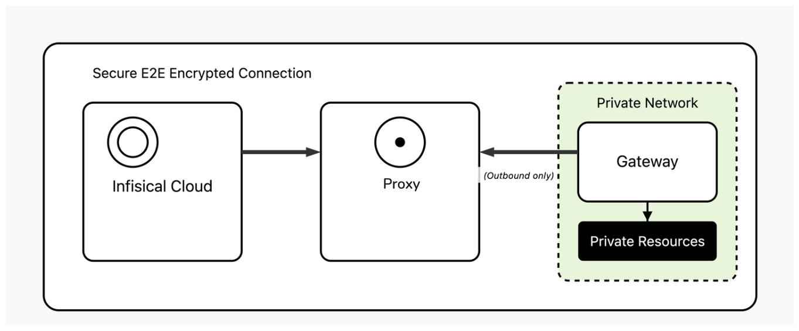

The Infisical Gateway provides secure access to private resources within your network without needing direct inbound connections to your environment. This method keeps your resources fully protected from external access while enabling Infisical to securely interact with resources like databases.

<Info>
  Gateway is a paid feature available under the Enterprise Tier for Infisical
  Cloud users. Self-hosted Infisical users can contact
  [sales@infisical.com](mailto:sales@infisical.com) to purchase an enterprise
  license.
</Info>

## What are Gateways and Relays?

### Gateway

A lightweight service deployed within your VPCs that provides secure access to private resources:

- **Runs inside your network** - Deployed within your VPCs, data centers, or on-premises infrastructure
- **Makes outbound connections only** - No inbound firewall rules required
- **Provides secure access** - Uses SSH reverse tunnels and certificate-based authentication
- **Handles resource connections** - Connects to your private databases, APIs, and services

### Relay Server

Infrastructure that routes encrypted traffic between the Infisical platform and gateways:

- **Routes encrypted traffic** - Routes traffic between the platform and gateways
- **Provides network isolation** - Enables communication without direct connections
- **Handles authentication** - Manages SSH certificate validation and routing
- **Ensures security** - Uses double encryption to protect data in transit

## How It Works

The Gateway system uses SSH reverse tunnels for secure, firewall-friendly connectivity:

1. **Gateway Registration**: The gateway establishes an outbound SSH reverse tunnel to a relay server using SSH certificates issued by Infisical
2. **Relay Routing**: The relay server routes encrypted traffic between the Infisical platform and gateways
3. **Resource Access**: The Infisical platform connects to your private resources through the established gateway connections

**Key Benefits:**

- **No inbound firewall rules needed** - all connections are outbound from your network
- **Firewall-friendly** - uses standard SSH over TCP
- **Certificate-based authentication** provides enhanced security
- **Automatic reconnection** if connections are lost

## Relay Types

### Instance Relays (Shared Infrastructure)

**Infisical Cloud:**

- Pre-configured and ready to use
- No setup required
- Shared across all organizations
- Managed by Infisical

**Self-hosted:**

- Set up by instance administrators
- Shared across all organizations on the instance
- Uses `INFISICAL_RELAY_AUTH_SECRET` for authentication

### Organization Relays (Customer-Deployed)

**Benefits:**

- Full control over infrastructure
- Lower latency (deploy closer to resources)
- Enhanced security and compliance
- Custom network policies

**Authentication:**

- Uses standard Infisical authentication methods
- Organization-specific credentials
- Full control over access and permissions

## When to Use Each

**Use Instance Relays when:**

- You want minimal operational overhead
- You don't need custom network policies
- You're okay with shared infrastructure
- You want to get started quickly

**Use Organization Relays when:**

- You need lower latency
- You have security or compliance requirements
- You need custom network policies
- You want full control over infrastructure

## Common Use Cases

- **Database credential rotation** - Automatically rotate database passwords
- **Dynamic secret generation** - Generate temporary credentials for services
- **Private API access** - Connect to internal APIs and services
- **Compliance requirements** - Meet data sovereignty and air-gapped environment needs

## Quick Start

The Infisical Gateway is integrated into the Infisical CLI under the `gateway` command, making it simple to deploy and manage.
You can install the Gateway in all the same ways you install the Infisical CLI—whether via npm, Docker, or a binary.
For detailed installation instructions, refer to the Infisical [CLI Installation instructions](/cli/overview).

**Prerequisites:**

1. **Relay Server**: Before deploying gateways, you need a running relay server
2. **Machine Identity**: Configure a machine identity with appropriate permissions to create and manage gateways

Once authenticated, the Gateway establishes an SSH reverse tunnel to the specified relay server, allowing secure access to your private resources.

## Next Steps

Ready to get started? Follow these guides:

1. **[Deployment Guide](/documentation/platform/gateways/deployment)** - Complete deployment instructions
2. **[Networking Requirements](/documentation/platform/gateways/networking)** - Network configuration and firewall setup
3. **[Security Architecture](/documentation/platform/gateways/security)** - Security model and best practices
