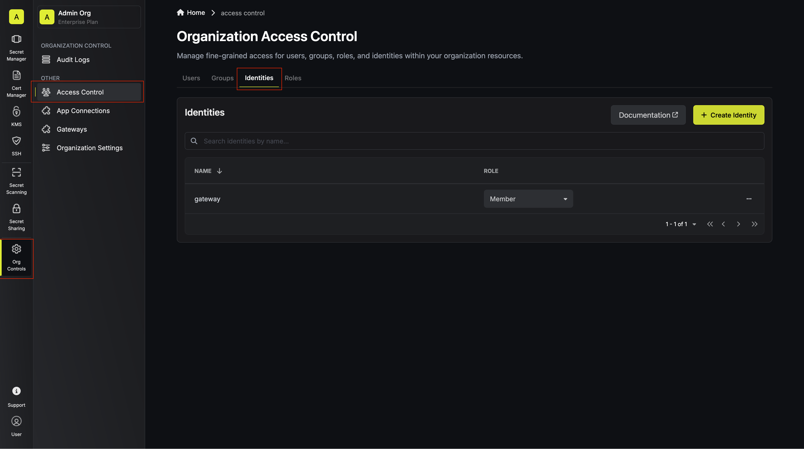
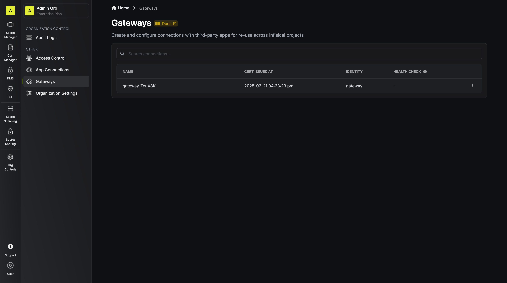
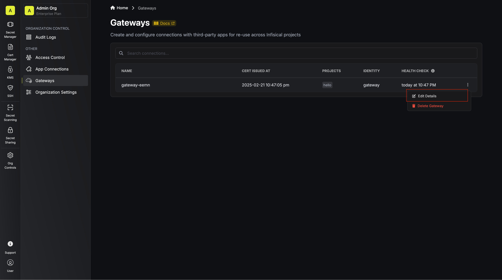
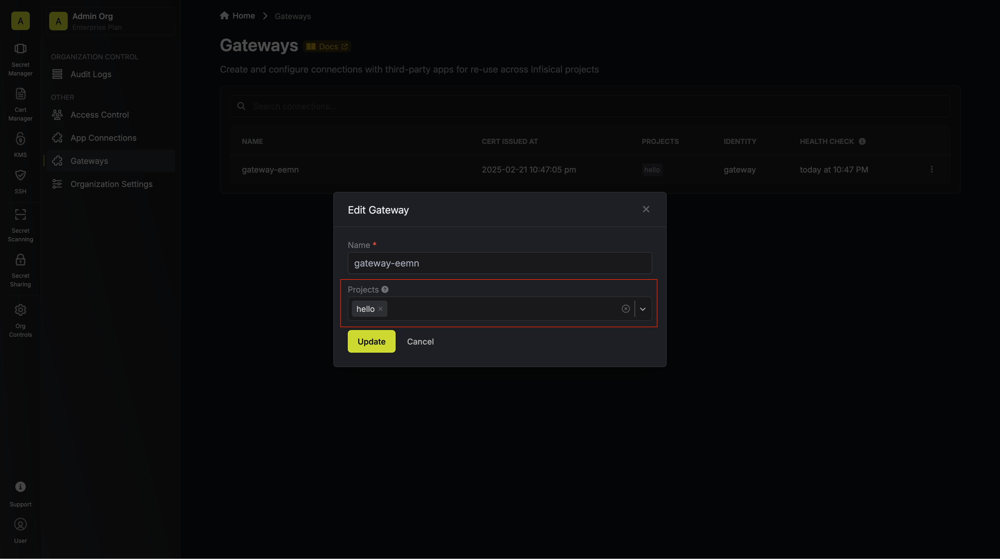

The Infisical Gateway provides secure access to private resources within your network without needing direct inbound connections to your environment.
This method keeps your resources fully protected from external access while enabling Infisical to securely interact with resources like databases.
Common use cases include generating dynamic credentials or rotating credentials for private databases.

<Info>
  **Note:** Gateway is a paid feature. - **Infisical Cloud users:** Gateway is
  available under the **Enterprise Tier**. - **Self-Hosted Infisical:** Please
  contact [sales@infisical.com](mailto:sales@infisical.com) to purchase an
  enterprise license.
</Info>

## How It Works

The Gateway serves as a secure intermediary that facilitates direct communication between the Infisical server and your private network.
It’s a lightweight daemon packaged within the Infisical CLI, making it easy to deploy and manage. Once set up, the Gateway establishes a connection with a relay server, ensuring that all communication between Infisical and your Gateway is fully end-to-end encrypted.
This setup guarantees that only the platform and your Gateway can decrypt the transmitted information, keeping communication with your resources secure, private and isolated.

## Deployment

The Infisical Gateway is seamlessly integrated into the Infisical CLI under the `gateway` command, making it simple to deploy and manage.
You can install the Gateway in all the same ways you install the Infisical CLI—whether via npm, Docker, or a binary.
For detailed installation instructions, refer to the Infisical [CLI Installation instructions](/cli/overview).

To function, the Gateway must authenticate with Infisical. This requires a machine identity configured with the appropriate permissions to create and manage a Gateway.
Once authenticated, the Gateway establishes a secure connection with Infisical to allow your private resources to be reachable.

### Deployment process

<Steps>
  <Step title="Create a Gateway Identity">
    1. Navigate to **Organization Access Control** in your Infisical dashboard.
    2. Create a dedicated machine identity for your Gateway.
    3. **Best Practice:** Assign a unique identity to each Gateway for better security and management.
    
  </Step>
  
  <Step title="Configure Authentication Method">
    You'll need to choose an authentication method to initiate communication with Infisical. View the available machine identity authentication methods [here](/documentation/platform/identities/machine-identities).
  </Step>

  <Step title="Deploy the Gateway">
    Use the Infisical CLI to deploy the Gateway. You can run it directly or install it as a systemd service for production:

    <Tabs>
      <Tab title="Production (systemd)">
        For production deployments on Linux, install the Gateway as a systemd service:
        ```bash
        sudo infisical gateway install --token <your-machine-identity-token> --domain <your-infisical-domain>
        sudo systemctl start infisical-gateway
        ```
        This will install and start the Gateway as a secure systemd service that:
        - Runs with restricted privileges:
          - Runs as root user (required for secure token management)
          - Restricted access to home directories
          - Private temporary directory
        - Automatically restarts on failure
        - Starts on system boot
        - Manages token and domain configuration securely in `/etc/infisical/gateway.conf`

        <Warning>
          The install command requires:
          - Linux operating system
          - Root/sudo privileges
          - Systemd
        </Warning>
      </Tab>

      <Tab title="Production (Helm)">

        The Gateway can be installed via [Helm](https://helm.sh/). Helm is a package manager for Kubernetes that allows you to define, install, and upgrade Kubernetes applications.

        For production deployments on Kubernetes, install the Gateway using the Infisical Helm chart:

        ### Install the latest Helm Chart repository
        ```bash
        helm repo add infisical-helm-charts 'https://dl.cloudsmith.io/public/infisical/helm-charts/helm/charts/' 
        ```

        ### Update the Helm Chart repository
        ```bash
        helm repo update
        ```

        ### Create a Kubernetes Secret with the gateway token

        Create a new Kubernetes secret containing the gateway token as the `TOKEN` key. You can optionally also set the `INFISICAL_API_URL` key to your Infisical instance URL. By default, `INFISICAL_API_URL` is set to `https://app.infisical.com`.


        ```bash
        kubectl create secret generic infisical-gateway-environment --from-literal=TOKEN=<your-machine-identity-access-token>
        ```
      
        <Note>
          The secret name is `infisical-gateway-environment` by default. The `TOKEN` key is required, and the `INFISICAL_API_URL` key is optional.
        </Note>

        ### Install the Infisical Gateway Helm Chart
        ```bash
        helm install infisical-gateway infisical-helm-charts/infisical-gateway
        ```

        ### Check the gateway logs
        After installing the gateway, you can check the logs to ensure it's running as expected.

        ```bash
        kubectl logs deployment/infisical-gateway
        ```

        You should see the following output which indicates the gateway is running as expected.
        ```bash
        $ kubectl logs deployment/infisical-gateway                  
        INF Provided relay port 5349. Using TLS
        INF Connected with relay
        INF 10.0.101.112:56735
        INF Starting relay connection health check
        INF Gateway started successfully
        INF New connection from: 10.0.1.8:34051
        INF Gateway is reachable by Infisical
        ```

      </Tab>

      <Tab title="Development (direct)">
        For development or testing, you can run the Gateway directly. Log in with your machine identity and start the Gateway in one command:
        ```bash
        infisical gateway --token $(infisical login --method=universal-auth --client-id=<> --client-secret=<> --plain)
        ```

        Alternatively, if you already have the token, use it directly with the `--token` flag:
        ```bash
        infisical gateway --token <your-machine-identity-token>
        ```

        Or set it as an environment variable:
        ```bash
        export INFISICAL_TOKEN=<your-machine-identity-token>
        infisical gateway
        ```
      </Tab>
    </Tabs>

    For detailed information about the gateway command and its options, see the [gateway command documentation](/cli/commands/gateway).

    <Note>
      Ensure the deployed Gateway has network access to the private resources you intend to connect with Infisical.
    </Note>
  </Step>
  
  <Step title="Verify Gateway Deployment">
    To confirm your Gateway is working, check the deployment status by looking for the message **"Gateway started successfully"** in the Gateway logs. This indicates the Gateway is running properly. Next, verify its registration by opening your Infisical dashboard, navigating to **Organization Access Control**, and selecting the **Gateways** tab. Your newly deployed Gateway should appear in the list.
    
  </Step>

 <Step title="Link Gateway to Projects">
    To enable Infisical features like dynamic secrets or secret rotation to access private resources through the Gateway, you need to link the Gateway to the relevant projects. 
    
    Start by accessing the **Gateway settings** then locate the Gateway in the list, click the options menu (**:**), and select **Edit Details**. 
     
    In the edit modal that appears, choose the projects you want the Gateway to access and click **Save** to confirm your selections. 
     
    Once added to a project, the Gateway becomes available for use by any feature that supports Gateways within that project.
  </Step>
</Steps>
