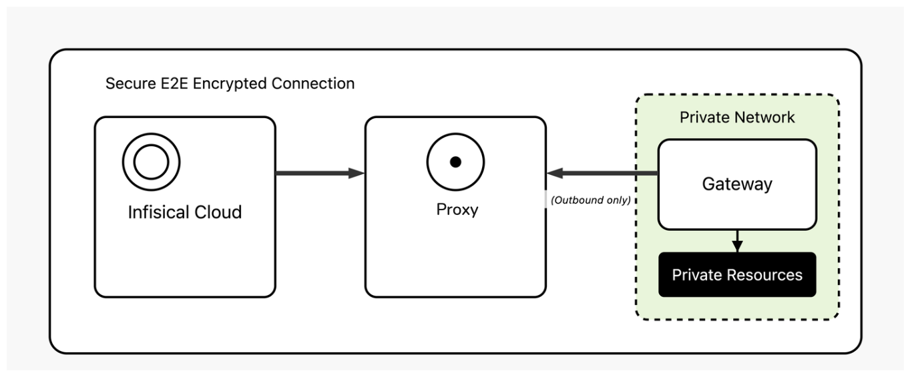

Some of the systems Infisical connects to aren't reachable from the internet: a database in a private subnet, an on-premises appliance, a server behind a corporate firewall. This section covers the two pieces that make those reachable, without opening an inbound port.

<CardGroup cols={2}>
  <Card title="Gateways" icon="server" href="/documentation/platform/gateways/gateway-deployment">
    A lightweight service you run inside your own network, next to the resources Infisical needs to reach. It only makes outbound connections, so no inbound firewall rules are needed.
  </Card>
  <Card title="Relays" icon="route" href="/documentation/platform/gateways/relay-deployment/overview">
    The routing layer between Infisical and your gateways. Passes encrypted traffic through without storing or inspecting it. Use the managed relays, or run your own closer to your infrastructure.
  </Card>
</CardGroup>

If the target is already reachable and you would rather not run a gateway, you can instead allow [Infisical's IP addresses](/documentation/setup/networking) through your firewall.

<Info>
  Gateway is a paid feature available under the Enterprise Tier for Infisical
  Cloud users. Self-hosted Infisical users can contact
  [sales@infisical.com](mailto:sales@infisical.com) to purchase an enterprise
  license.
</Info>

## How it works

The gateway system uses SSH reverse tunnels, so connectivity works without changing inbound firewall rules:

1. **Registration.** The gateway opens an outbound SSH reverse tunnel to a relay, using an SSH certificate issued by Infisical.
2. **Persistent connection.** The gateway holds that TCP connection open, giving Infisical a channel it can send requests down.
3. **Request routing.** When Infisical needs one of your resources, the request travels through the relay and into the tunnel that is already established.
4. **Resource access.** The gateway receives the request and connects to your private resource on Infisical's behalf.

## Health checks

Gateways send a heartbeat every 3 minutes, each carrying a TTL that says how long the gateway should be treated as healthy. If no heartbeat arrives before the TTL expires, the gateway is marked unhealthy. Relays send hourly heartbeats and are marked unhealthy if one is missed.

Infisical notifies all organization admins of unhealthy gateways and relays by email and in-app notification.

## High availability

- **Relay failover.** Gateways set to select a relay automatically will move to a healthy relay if the current one becomes unreachable. No configuration needed.
- **Gateway pools.** For production, group gateways into a [pool](/documentation/platform/gateways/gateway-pools) so the platform routes through a healthy member when one goes down.
