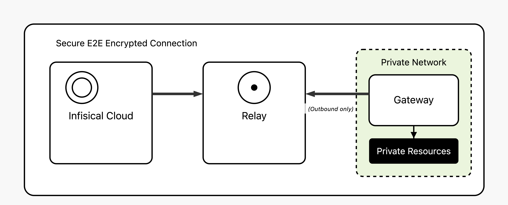

The Infisical Gateway provides secure access to private resources within your network without needing direct inbound connections to your environment.
This is particularly useful when Infisical isn't hosted within the same network as the resources it needs to reach.
This method keeps your resources fully protected from external access while enabling Infisical to securely interact with resources like databases.

<Info>
  Gateway is a paid feature available under the Enterprise Tier for Infisical
  Cloud users. Self-hosted Infisical users can contact
  [sales@infisical.com](mailto:sales@infisical.com) to purchase an enterprise
  license.
</Info>

## Core Components

The Gateway system consists of two primary components working together to enable secure network access:

<Tabs>
  <Tab title="Gateway" icon="server">
  A Gateway is a lightweight service that you deploy within your own network infrastructure to provide secure access to your private resources. Think of it as a secure bridge between Infisical and your internal systems.

  Gateways must be deployed within the same network where your target resources are located, with direct network connectivity to the private resources you want Infisical to access.
  For different networks, regions, or isolated environments, you'll need to deploy separate gateways.

  **Core Functions:**
  - **Network Placement**: Deployed within your VPCs, data centers, or on-premises infrastructure where your private resources live
  - **Connection Model**: Only makes outbound connections to Infisical's relay servers, so no inbound firewall rules are needed
  - **Security Method**: Uses SSH reverse tunnels with certificate-based authentication for maximum security
  - **Resource Access**: Acts as a proxy to connect Infisical to your private databases, APIs, and other services
  </Tab>

  <Tab title="Relay Server" icon="route">
  A Relay Server is the routing infrastructure that enables secure communication between the Infisical platform and your deployed gateways. It acts as an intermediary that never sees your actual data.

  **Core Functions:**
  - **Traffic Routing**: Routes encrypted traffic between the Infisical platform and your gateways without storing or inspecting the data
  - **Network Isolation**: Enables secure communication without requiring direct network connections between Infisical and your private infrastructure
  - **Authentication Management**: Validates SSH certificates and manages secure routing between authenticated gateways

  **Deployment Options:**
  To reduce operational overhead, Infisical Cloud (US/EU) provides managed relay infrastructure, though organizations can also deploy their own relays for reduced latency.
  - **Infisical Managed**: Use pre-deployed relays in select regions, shared across all Infisical Cloud organizations. Each organization traffic is isolated and encrypted.
  - **Self-Deployed**: Deploy your own dedicated relay servers geographically close to your infrastructure for reduced latency.
  </Tab>
</Tabs>

## How It Works

The Gateway system uses SSH reverse tunnels for secure, firewall-friendly connectivity:

1. **Gateway Registration**: The gateway establishes an outbound SSH reverse tunnel to a relay server using SSH certificates issued by Infisical
2. **Persistent Connection**: The gateway maintains an open TCP connection with the relay server, creating a secure channel for incoming requests
3. **Request Routing**: When Infisical needs to access your resources, requests are routed through the relay server to the already-established gateway connection
4. **Resource Access**: The gateway receives the routed requests and connects to your private resources on behalf of Infisical

## Health Check

To monitor their operational status, both gateways and relays transmit hourly heartbeats. A component is considered unhealthy if a heartbeat is not received for over an hour.

Infisical automatically notifies all organization admins of unhealthy gateway or relay statuses through email and in-app notifications.

## Getting Started

Ready to set up your gateway? Follow the guides below.

<Columns cols={2}>
  <Card title="Gateway Deployment" href="/documentation/platform/gateways/gateway-deployment">
    Deploy and configure your gateway within your network infrastructure.
  </Card>
  <Card title="Relay Deployment" href="/documentation/platform/gateways/relay-deployment">
    Set up relay servers if using self-deployed infrastructure.
  </Card>
</Columns>
<Columns cols={1}>
  <Card title="Security Architecture" href="/documentation/platform/gateways/security">
    Learn about the security model and implementation best practices.
  </Card>
</Columns>
