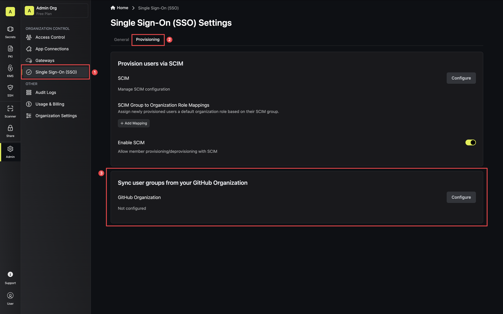
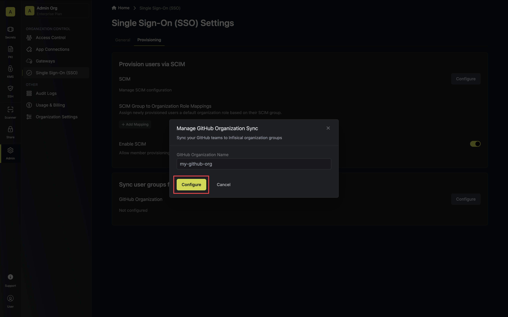
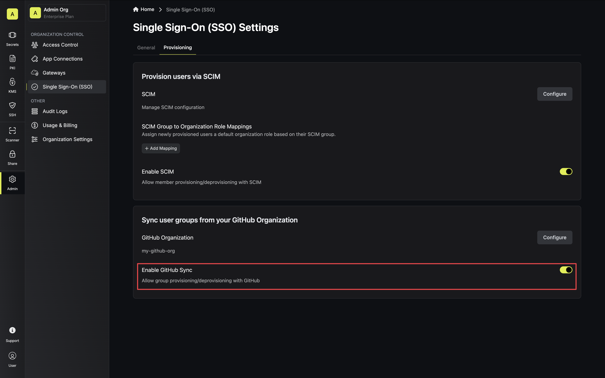
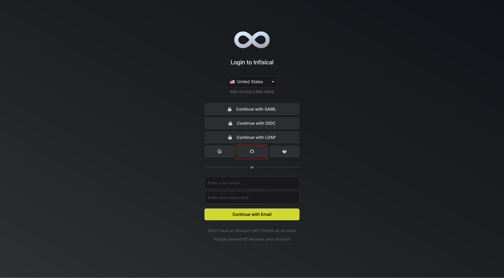
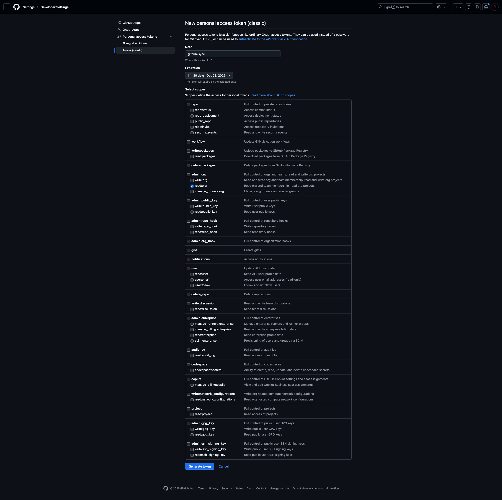
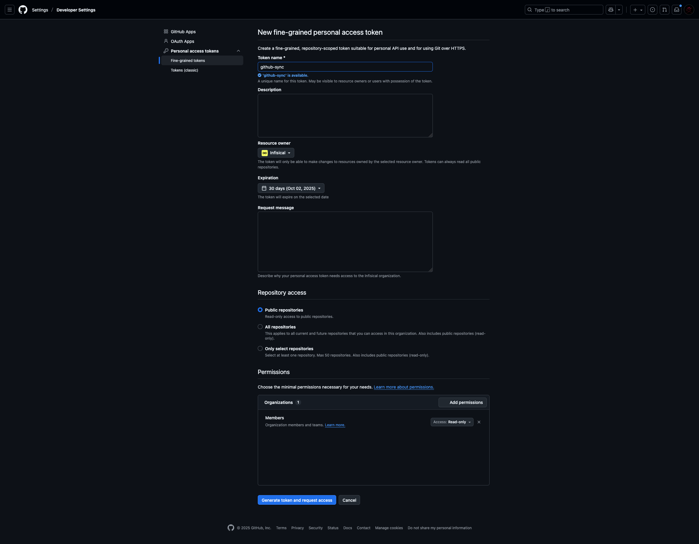
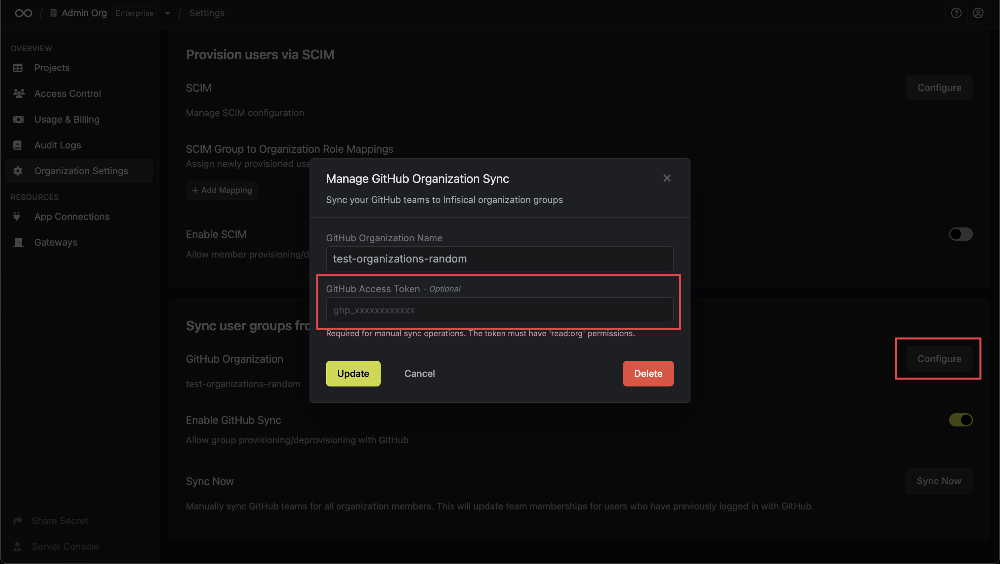
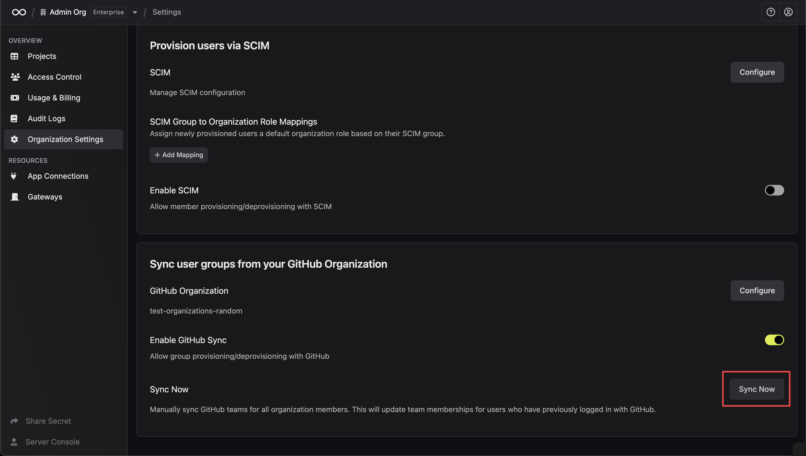
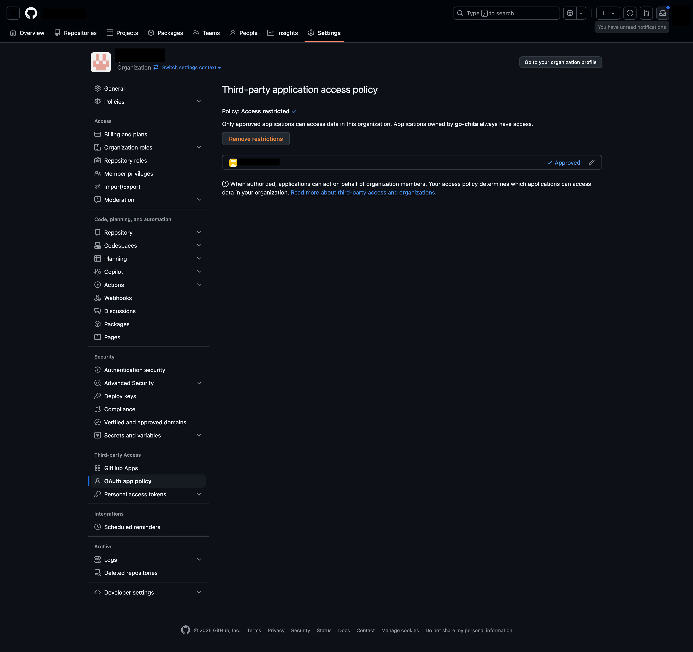

## Overview

The GitHub Organization Synchronization feature streamlines user and group management by automatically syncing users belonging to your specified GitHub organization with corresponding groups within Infisical. This integration ensures that users logging in via GitHub are automatically added to or removed from Infisical groups based on their team memberships within your GitHub organization.

## Configuration

To enable and configure GitHub Organization Synchronization, follow these steps:

<Steps>
    <Step title="Set up GitHub organization configuration">
        1. Navigate to the **Single Sign-On (SSO)** page and select the **Provisioning** tab.
        
        2. Click the **Configure** button and provide the name of your GitHub Organization.
        
    </Step>
    <Step title="Enable GitHub organization sync">
        Toggle ON GitHub Organization sync to activate sync.
        
    </Step>
    <Step title="Approve the Infisical OAuth application on your organization">
        Connecting the Infisical OAuth application grants it permission to **read:org** details. This approval is done by selecting your organization during the GitHub OAuth login process.

        1. Initiate the login process via the GitHub OAuth flow.
        
        2. Select the organization you have connected.
        3. Grant access to Infisical oauth application to your configured organization.  Infisical shown here is an organization, just for walkthrough.
        

        <Info>
          This action only needs to be done once and authorizes the Infisical OAuth app to read organization details, including team information.
          The following users don't need to select organization in GitHub on login anymore.
        </Info>
    </Step>

</Steps>

## Working

Once configured, the GitHub Organization Synchronization feature functions as follows:

When a user logs in via the GitHub OAuth flow and selects the configured organization, the system will then automatically synchronize the teams they are a part of in GitHub with corresponding groups in Infisical.

## Manual Team Sync

You can manually synchronize GitHub teams for all organization members who have previously logged in with GitHub. This bulk sync operation updates team memberships without requiring users to log in again.

<Steps>
    <Step title="Generate a GitHub Access Token">
        To perform manual syncs, you'll need to create a GitHub Personal Access Token with the appropriate permissions. GitHub offers two types of tokens:

        <Tabs>
            <Tab title="Classic Token">
                1. Go to [GitHub Settings → Personal Access Tokens → Tokens (classic)](https://github.com/settings/tokens)
                2. Click **Generate new token** → **Generate new token (classic)**
                3. Give your token a descriptive name (e.g., "Infisical GitHub Sync")
                4. Set an appropriate expiration date
                5. Select the **read:org** scope - Required to read organization team information
                6. Click **Generate token**
                7. Copy the token immediately (you won't be able to see it again)

                
            </Tab>
            <Tab title="Fine-grained Token">
                1. Go to [GitHub Settings → Personal Access Tokens → Fine-grained tokens](https://github.com/settings/personal-access-tokens/new)
                2. Click **Generate new token**
                3. Give your token a descriptive name (e.g., "Infisical GitHub Sync")
                4. Set an appropriate expiration date
                5. Select your organization under **Resource owner**
                6. Under **Organization permissions**, set **Members** to **Read**
                7. Click **Generate token**
                8. Copy the token immediately (you won't be able to see it again)

                
            </Tab>
        </Tabs>
    </Step>
    
    <Step title="Configure the Token in Infisical">
        1. Navigate to the **Single Sign-On (SSO)** page and select the **Provisioning** tab.
        2. Click the **Configure** button next to your GitHub Organization configuration.
        3. In the configuration modal, you'll find an optional **GitHub Access Token** field.
        4. Paste the token you generated in the previous step.
        5. Click **Update** to save the configuration.

        
    </Step>

    <Step title="Perform Manual Sync">
        Once you have configured the GitHub access token:

        1. Navigate to the **Single Sign-On (SSO)** page and select the **Provisioning** tab.
        2. You'll see a **Sync Now** section with a button to trigger the manual sync.
        3. Click **Sync Now** to synchronize GitHub teams for all organization members.

        

        The sync operation will process all organization members who have previously logged in with GitHub and update their team memberships accordingly.
    </Step>
</Steps>

## Troubleshooting

<Accordion title="Please check if your organization has approved the Infisical OAuth application.">
    If you encounter an error related to this, it indicates that you need to approve the Infisical OAuth application within your GitHub organization.

    You can verify the application's approval status by navigating to **https://github.com/organizations/__your-organization__/settings/oauth_application_policy**. Replace `__your-organization__` with the actual name of your GitHub organization.

    
</Accordion>
