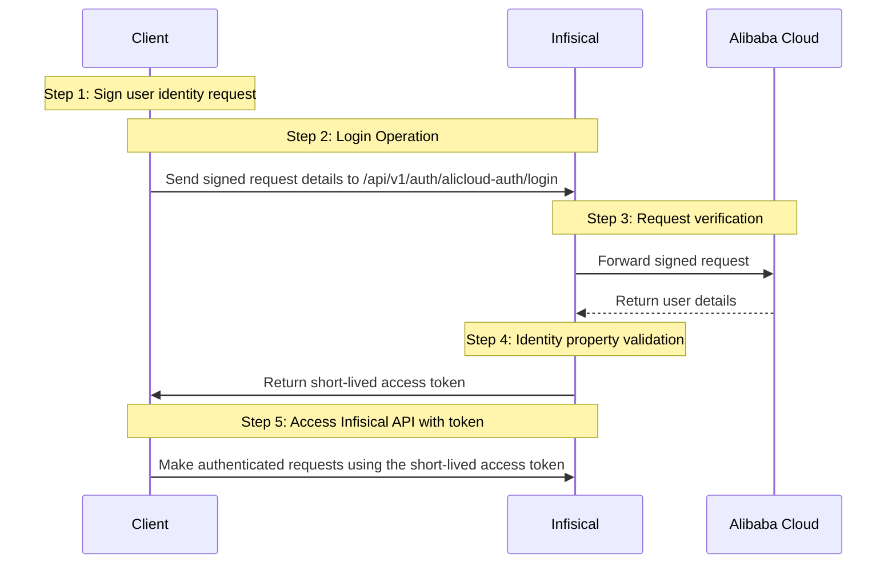

**Alibaba Cloud Auth** is an authentication method that verifies Alibaba Cloud users through signature validation, allowing secure access to Infisical resources.

## Diagram

The following sequence diagram illustrates the Alibaba Cloud Auth workflow for authenticating Alibaba Cloud users with Infisical.



## Concept

At a high level, Infisical authenticates an Alibaba Cloud user by verifying its identity and checking that it meets specific requirements (e.g., its ARN is whitelisted) at the `/api/v1/auth/alicloud-auth/login` endpoint. If successful,
then Infisical returns a short-lived access token that can be used to make authenticated requests to the Infisical API.

To be more specific:
1. The client signs a `GetCallerIdentity` request using an Alibaba Cloud user's access key secret; this is done using an HMAC sha1 algorithm.
2. The client sends the signed request information alongside the signature to Infisical at the `/api/v1/auth/alicloud-auth/login` endpoint.
3. Infisical reconstructs the request and sends it to Alibaba Cloud for verification and obtains the identity associated with the Alibaba Cloud user.
4. Infisical checks the user's properties against set criteria such as **Allowed ARNs**.
5. If all checks pass, Infisical returns a short-lived access token that the client can use to make authenticated requests to the Infisical API.

## Prerequisite

In order to sign requests, you must have an Alibaba Cloud user with credentials such as access key ID and secret. If you're unaware of how to create a user and obtain the needed credentials, expand the menu below.

<Accordion title="Creating an Alibaba Cloud user">
    <Steps>
        <Step title="Click 'Create User'">
            Visit https://ram.console.aliyun.com/users to get to the Users page and click **Create User**.

            
        </Step>
        <Step title="Provide User Info">
            Fill out the username and display name with values of your choice and click **OK**.

            
        </Step>
        <Step title="Click User Row">
            After a user has been created, click on its row to see user information.

            
        </Step>
        <Step title="Create Access Key">
            Click **Create AccessKey** and select the most relevant option for your use-case. Then click **Continue**.

            
        </Step>
        <Step title="Copy Credentials">
            Save the displayed credentials for later steps.

            
        </Step>
    </Steps>
</Accordion>

## Guide

In the following steps, we explore how to create and use identities for your workloads and applications on Alibaba Cloud to
access the Infisical API using request signing.

### Creating an identity

To create an identity, head to your Organization Settings > Access Control > [Identities](https://app.infisical.com/organization/access-management?selectedTab=identities) and press **Create identity**.


When creating an identity, you specify an organization-level [role](/documentation/platform/access-controls/role-based-access-controls) for it to assume; you can configure roles in Organization Settings > Access Control > [Organization Roles](https://app.infisical.com/organization/access-management?selectedTab=roles).


Input some details for your new identity:
- **Name (required):** A friendly name for the identity.
- **Role (required):** A role from the [**Organization Roles**](https://app.infisical.com/organization/access-management?selectedTab=roles) tab for the identity to assume. The organization role assigned will determine what organization-level resources this identity can have access to.

Once you've created an identity, you'll be redirected to a page where you can manage the identity.


Since the identity has been configured with [Universal Auth](https://infisical.com/docs/documentation/platform/identities/universal-auth) by default, you should reconfigure it to use Alibaba Cloud Auth instead. To do this, click the cog next to **Universal Auth** and then select **Delete** in the options dropdown.


Now create a new Alibaba Cloud Auth Method.


Here's some information about each field:
- **Allowed ARNs:** A comma-separated list of trusted Alibaba Cloud ARNs that are allowed to authenticate with Infisical.
- **Access Token TTL (default is `2592000` equivalent to 30 days):** The lifetime for an access token in seconds. This value will be referenced at renewal time.
- **Access Token Max TTL (default is `2592000` equivalent to 30 days):** The maximum lifetime for an access token in seconds. This value will be referenced at renewal time.
- **Access Token Max Number of Uses (default is `0`):** The maximum number of times that an access token can be used; a value of `0` implies an infinite number of uses.
- **Access Token Trusted IPs:** The IPs or CIDR ranges that access tokens can be used from. By default, each token is given the `0.0.0.0/0`, allowing usage from any network address.

### Adding an identity to a project

In order to allow an identity to access project-level resources such as secrets, you must add it to the relevant projects.

To do this, head over to the project you want to add the identity to and navigate to Project Settings > Access Control > Machine Identities and press **Add Identity**.


Select the identity you want to add to the project and the project-level role you want it to assume. The project role given to the identity will determine what project-level resources this identity can access.


### Accessing the Infisical API with the identity

To access the Infisical API as the identity, you need to construct a signed `GetCallerIdentity` request and then make a request to the `/api/v1/auth/alicloud-auth/login` endpoint passing the signed data and signature.

Below is an example of how you can authenticate with Infisical using NodeJS.

```ts
import crypto from "crypto";

// We highly recommend using environment variables instead of hardcoding these values
const ALICLOUD_ACCESS_KEY_ID = "...";
const ALICLOUD_ACCESS_KEY_SECRET = "...";

const params: { [key: string]: string } = {
  Action: "GetCallerIdentity",
  Format: "JSON",
  Version: "2015-04-01",
  AccessKeyId: ALICLOUD_ACCESS_KEY_ID,
  SignatureMethod: "HMAC-SHA1",
  Timestamp: new Date().toISOString(),
  SignatureVersion: "1.0",
  SignatureNonce: crypto.randomBytes(16).toString("hex"),
};

const canonicalizedQueryString = Object.keys(params)
  .sort()
  .map((key) => `${encodeURIComponent(key)}=${encodeURIComponent(params[key])}`)
  .join("&");

const stringToSign = `GET&%2F&${encodeURIComponent(canonicalizedQueryString)}`;

const signature = crypto
  .createHmac("sha1", `${ALICLOUD_ACCESS_KEY_SECRET}&`)
  .update(stringToSign)
  .digest("base64");

const res = await fetch(
  "https://app.infisical.com/api/v1/auth/alicloud-auth/login",
  {
    method: "POST",
    headers: {
      "Content-Type": "application/json",
    },
    body: JSON.stringify({
      identityId: "...", // Replace with your identity ID
      Signature: signature,
      ...params,
    }),
  },
);

const json = await res.json();

console.log("Infisical Response:", JSON.stringify(json));
```

<Note>
    Each identity access token has a time-to-live (TTL) which you can infer from the response of the login operation; the default TTL is `7200` seconds, which can be adjusted.

    If an identity access token expires, it can no longer access the Infisical API. A new access token should be obtained by performing another login operation.
</Note>
