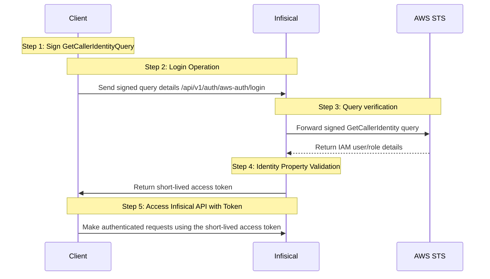

**AWS Auth** is an AWS-native authentication method for IAM principals like EC2 instances or Lambda functions to access Infisical.

## Diagram

The following sequence diagram illustrates the AWS Auth workflow for authenticating AWS IAM principals with Infisical.



## Concept

At a high-level, Infisical authenticates an IAM principal by verifying its identity and checking that it meets specific requirements (e.g. it is an allowed IAM principal ARN) at the `/api/v1/auth/aws-auth/login` endpoint. If successful,
then Infisical returns a short-lived access token that can be used to make authenticated requests to the Infisical API.

To be more specific:

1. The client IAM principal signs a `GetCallerIdentity` query using the [AWS Signature v4 algorithm](https://docs.aws.amazon.com/IAM/latest/UserGuide/create-signed-request.html); this is done using the credentials from the AWS environment where the IAM principal is running.
2. The client sends the signed query data to Infisical including the request method, request body, and request headers at the `/api/v1/auth/aws-auth/login` endpoint.
3. Infisical reconstructs the query and sends it to AWS STS API via the [sts:GetCallerIdentity](https://docs.aws.amazon.com/STS/latest/APIReference/API_GetCallerIdentity.html) method for verification and obtains the identity associated with the IAM principal.
4. Infisical checks the identity's properties against set criteria such **Allowed Principal ARNs**.
5. If all is well, Infisical returns a short-lived access token that the IAM principal can use to make authenticated requests to the Infisical API.

<Note>
We recommend using one of Infisical's clients like SDKs or the Infisical Agent
to authenticate with Infisical using AWS Auth as they handle the
authentication process including the signed `GetCallerIdentity` query
construction for you.

Also, note that Infisical needs network-level access to send requests to the AWS STS API
as part of the AWS Auth workflow.

</Note>

## Guide

In the following steps, we explore how to create and use identities for your workloads and applications on AWS to
access the Infisical API using the AWS Auth authentication method.

<Steps>
    <Step title="Creating an identity">
    To create an identity, head to your Organization Settings > Access Control > Identities and press **Create identity**.

    

    When creating an identity, you specify an organization level [role](/documentation/platform/access-controls/role-based-access-controls) for it to assume; you can configure roles in Organization Settings > Access Control > Organization Roles.

    

    Now input a few details for your new identity. Here's some guidance for each field:

    - Name (required): A friendly name for the identity.
    - Role (required): A role from the **Organization Roles** tab for the identity to assume. The organization role assigned will determine what organization level resources this identity can have access to.

    Once you've created an identity, you'll be redirected to a page where you can manage the identity.

    

    Since the identity has been configured with Universal Auth by default, you should re-configure it to use AWS Auth instead. To do this, press to edit the **Authentication** section,
    remove the existing Universal Auth configuration, and add a new AWS Auth configuration onto the identity.

    

    

    Here's some more guidance on each field:

    - Allowed Principal ARNs: A comma-separated list of trusted IAM principal ARNs that are allowed to authenticate with Infisical. The values should take one of three forms: `arn:aws:iam::123456789012:user/MyUserName`, `arn:aws:iam::123456789012:role/MyRoleName`, or `arn:aws:iam::123456789012:*`. Using a wildcard in this case allows any IAM principal in the account `123456789012` to authenticate with Infisical under the identity.
    - Allowed Account IDs: A comma-separated list of trusted AWS account IDs that are allowed to authenticate with Infisical.
    - STS Endpoint (default is `https://sts.amazonaws.com/`): The endpoint URL for the AWS STS API. This value should be adjusted based on the AWS region you are operating in (e.g. `https://sts.us-east-1.amazonaws.com/`); refer to the list of regional STS endpoints [here](https://docs.aws.amazon.com/general/latest/gr/sts.html).
    - Access Token TTL (default is `2592000` equivalent to 30 days): The lifetime for an acccess token in seconds. This value will be referenced at renewal time.
    - Access Token Max TTL (default is `2592000`  equivalent to 30 days): The maximum lifetime for an acccess token in seconds. This value will be referenced at renewal time.
    - Access Token Max Number of Uses (default is `0`): The maximum number of times that an access token can be used; a value of `0` implies infinite number of uses.
    - Access Token Trusted IPs: The IPs or CIDR ranges that access tokens can be used from. By default, each token is given the `0.0.0.0/0`, allowing usage from any network address.
    </Step>
    <Step title="Adding an identity to a project">
    To enable the identity to access project-level resources such as secrets within a specific project, you should add it to that project.

    To do this, head over to the project you want to add the identity to and go to Project Settings > Access Control > Machine Identities and press **Add identity**.

    Next, select the identity you want to add to the project and the project level role you want to allow it to assume. The project role assigned will determine what project level resources this identity can have access to.

    

    
    </Step>
    <Step title="Accessing the Infisical API with the identity">
        To access the Infisical API as the identity, you need to construct a signed `GetCallerIdentity` query using the [AWS Signature v4 algorithm](https://docs.aws.amazon.com/IAM/latest/UserGuide/create-signed-request.html) and make a request to the `/api/v1/auth/aws-auth/login` endpoint containing the query data
        in exchange for an access token.

        We provide a few code examples below of how you can authenticate with Infisical from inside a Lambda function, EC2 instance, etc. and obtain an access token to access the [Infisical API](/api-reference/overview/introduction).

        <AccordionGroup>
            <Accordion
                title="Sample code for inside a Lambda function"
            >
                The following query construction is an example of how you can authenticate with Infisical from inside a Lambda function.

                The shown example uses Node.js but you can use other languages supported by AWS Lambda.

                ```javascript
                import AWS from "aws-sdk";
                import axios from "axios";

                export const handler = async (event, context) => {
                    try {
                        const region = process.env.AWS_REGION;
                        AWS.config.update({ region });

                        const iamRequestURL = `https://sts.${region}.amazonaws.com/`;
                        const iamRequestBody = "Action=GetCallerIdentity&Version=2011-06-15";
                        const iamRequestHeaders = {
                            "Content-Type": "application/x-www-form-urlencoded; charset=utf-8",
                            Host: `sts.${region}.amazonaws.com`,
                        };

                        // Create the request
                        const request = new AWS.HttpRequest(iamRequestURL, region);
                        request.method = "POST";
                        request.headers = iamRequestHeaders;
                        request.headers["X-Amz-Date"] = AWS.util.date
                            .iso8601(new Date())
                            .replace(/[:-]|\.\d{3}/g, "");
                        request.body = iamRequestBody;
                        request.headers["Content-Length"] =
                        Buffer.byteLength(iamRequestBody).toString();

                        // Sign the request
                        const signer = new AWS.Signers.V4(request, "sts");
                        signer.addAuthorization(AWS.config.credentials, new Date());

                        const infisicalUrl = "https://app.infisical.com"; // or your self-hosted Infisical URL
                        const identityId = "<your-identity-id>";

                        const { data } = await axios.post(
                            `${infisicalUrl}/api/v1/auth/aws-auth/login`,
                            {
                                identityId,
                                iamHttpRequestMethod: "POST",
                                iamRequestUrl: Buffer.from(iamRequestURL).toString("base64"),
                                iamRequestBody: Buffer.from(iamRequestBody).toString("base64"),
                                iamRequestHeaders: Buffer.from(
                                JSON.stringify(iamRequestHeaders)
                                ).toString("base64"),
                            }
                        );

                        console.log("result data: ", data); // access token here
                    } catch (err) {
                        console.error(err);
                    }
                };
                ```

            </Accordion>
            <Accordion title="Sample code for inside an EC2 instance">
                The following query construction is an example of how you can authenticate with Infisical from inside a EC2 instance.

                The shown example uses Node.js but you can use other language you wish.

                ```javascript
                import AWS from "aws-sdk";
                import axios from "axios";

                const main = async () => {
                    try {
                        // obtain region from EC2 instance metadata
                        const tokenResponse = await axios.put("http://169.254.169.254/latest/api/token", null, {
                            headers: {
                            "X-aws-ec2-metadata-token-ttl-seconds": "21600"
                            }
                        });

                        const url = "http://169.254.169.254/latest/dynamic/instance-identity/document";
                        const response = await axios.get(url, {
                            headers: {
                                "X-aws-ec2-metadata-token": tokenResponse.data
                            }
                        });

                        const region = response.data.region;

                        AWS.config.update({
                            region
                        });

                        const iamRequestURL = `https://sts.${region}.amazonaws.com/`;
                        const iamRequestBody = "Action=GetCallerIdentity&Version=2011-06-15";
                        const iamRequestHeaders = {
                            "Content-Type": "application/x-www-form-urlencoded; charset=utf-8",
                            Host: `sts.${region}.amazonaws.com`
                        };

                        const request = new AWS.HttpRequest(new AWS.Endpoint(iamRequestURL), AWS.config.region);
                        request.method = "POST";
                        request.headers = iamRequestHeaders;
                        request.headers["X-Amz-Date"] = AWS.util.date.iso8601(new Date()).replace(/[:-]|\.\d{3}/g, "");
                        request.body = iamRequestBody;
                        request.headers["Content-Length"] = Buffer.byteLength(iamRequestBody);

                        const signer = new AWS.Signers.V4(request, "sts");
                        signer.addAuthorization(AWS.config.credentials, new Date());

                        const infisicalUrl = "https://app.infisical.com"; // or your self-hosted Infisical URL
                        const identityId = "<your-identity-id>";

                        const { data } = await axios.post(`${infisicalUrl}/api/v1/auth/aws-auth/login`, {
                            identityId,
                            iamHttpRequestMethod: "POST",
                            iamRequestUrl: Buffer.from(iamRequestURL).toString("base64"),
                            iamRequestBody: Buffer.from(iamRequestBody).toString("base64"),
                            iamRequestHeaders: Buffer.from(JSON.stringify(iamRequestHeaders)).toString("base64")
                        });

                        console.log("result data: ", data); // access token here
                    } catch (err) {
                        console.error(err);
                    }
                }

                main();
                ```
            </Accordion>
            <Accordion title="Sample code for general query construction">
                The following query construction provides a generic example of how you can construct a signed `GetCallerIdentity` query and obtain the required payload components.

                The shown example uses Node.js but you can use any language you wish.

                ```javascript
                const AWS = require("aws-sdk");

                const region = "<your-aws-region>";
                const infisicalUrl = "https://app.infisical.com"; // or your self-hosted Infisical URL

                const iamRequestURL = `https://sts.${region}.amazonaws.com/`;
                const iamRequestBody = "Action=GetCallerIdentity&Version=2011-06-15";
                const iamRequestHeaders = {
                    "Content-Type": "application/x-www-form-urlencoded; charset=utf-8",
                    Host: `sts.${region}.amazonaws.com`
                };

                const request = new AWS.HttpRequest(new AWS.Endpoint(iamRequestURL), region);
                request.method = "POST";
                request.headers = iamRequestHeaders;
                request.headers["X-Amz-Date"] = AWS.util.date.iso8601(new Date()).replace(/[:-]|\.\d{3}/g, "");
                request.body = iamRequestBody;
                request.headers["Content-Length"] = Buffer.byteLength(iamRequestBody);

                const signer = new AWS.Signers.V4(request, "sts");
                signer.addAuthorization(AWS.config.credentials, new Date());
                ```

                #### Sample request

                ```bash Request
                curl --location --request POST 'https://app.infisical.com/api/v1/auth/aws-auth/login' \
                    --header 'Content-Type: application/x-www-form-urlencoded' \
                    --data-urlencode 'identityId=...' \
                    --data-urlencode 'iamHttpRequestMethod=...' \
                    --data-urlencode 'iamRequestBody=...' \
                    --data-urlencode 'iamRequestHeaders=...'
                ```

                <Note>
                    Note that you should replace `<identityId>` with the ID of the identity you created in step 1.
                </Note>

                #### Sample response

                ```bash Response
                {
                    "accessToken": "...",
                    "expiresIn": 7200,
                    "accessTokenMaxTTL": 43244
                    "tokenType": "Bearer"
                }
                ```

                Next, you can use the access token to access the [Infisical API](/api-reference/overview/introduction)
            </Accordion>

            <Accordion title="Sample code for inside an EKS pod">
              The following query construction is an example of how you can authenticate with Infisical from inside an EKS pod.

              The shown example uses Node.js Typescript but you can use any language you wish.

              ```javascript
              import axios from "axios";
              import { Sha256 } from "@aws-crypto/sha256-js";
              import { fromNodeProviderChain } from "@aws-sdk/credential-providers";
              import { HttpRequest } from "@aws-sdk/protocol-http";
              import { SignatureV4 } from "@aws-sdk/signature-v4";

              const main = async () => {
                try {
                  const tokenRes = await axios.put<string>("http://169.254.169.254/latest/api/token", undefined, {
                    headers: {
                      "X-aws-ec2-metadata-token-ttl-seconds": "21600"
                    }
                  });

                  const {
                    data: { region }
                  } = await axios.get<{ region: string }>("http://169.254.169.254/latest/dynamic/instance-identity/document", {
                    headers: {
                      "X-aws-ec2-metadata-token": tokenRes.data,
                      Accept: "application/json"
                    }
                  });

                  const credentials = await fromNodeProviderChain()();

                  if (!credentials.accessKeyId || !credentials.secretAccessKey) {
                    throw new Error("Credentials not found");
                  }

                  const iamRequestURL = `https://sts.${region}.amazonaws.com/`;
                  const iamRequestBody = "Action=GetCallerIdentity&Version=2011-06-15";
                  const iamRequestHeaders = {
                    "Content-Type": "application/x-www-form-urlencoded; charset=utf-8",
                    Host: `sts.${region}.amazonaws.com`
                  };

                  const request = new HttpRequest({
                    protocol: "https:",
                    hostname: `sts.${region}.amazonaws.com`,
                    path: "/",
                    method: "POST",
                    headers: {
                      ...iamRequestHeaders,
                      "Content-Length": String(Buffer.byteLength(iamRequestBody))
                    },
                    body: iamRequestBody
                  });

                  const signer = new SignatureV4({
                    credentials,
                    region,
                    service: "sts",
                    sha256: Sha256
                  });

                  const signedRequest = await signer.sign(request);

                  const headers: Record<string, string> = {};
                  Object.entries(signedRequest.headers).forEach(([key, value]) => {
                    if (typeof value === "string") headers[key] = value;
                  });

                  const iamRequest = {
                    iamHttpRequestMethod: "POST",
                    iamRequestUrl: iamRequestURL,
                    iamRequestBody: iamRequestBody,
                    iamRequestHeaders: headers
                  };

                  const {
                    data: { accessToken }
                  } = await axios.post<{ accessToken: string }>("https://app.infisical.com/api/v1/auth/aws-auth/login", {
                    ...iamRequest,
                    identityId: "<replace-with-your-identity-id>"
                  });

                  console.log(`Infisical Access Token: ${accessToken}`);
                } catch (e) {
                  console.error("Failed to do AWS auth", e);
                }
              };
              ```
            </Accordion>
        </AccordionGroup>

        <Tip>
            We recommend using one of Infisical's clients like SDKs or the Infisical Agent to authenticate with Infisical using AWS Auth as they handle the authentication process including the signed `GetCallerIdentity` query construction for you.
        </Tip>

        <Note>
        Each identity access token has a time-to-live (TTL) which you can infer from the response of the login operation;
        the default TTL is `7200` seconds which can be adjusted.

        If an identity access token expires, it can no longer authenticate with the Infisical API. In this case,
        a new access token should be obtained by performing another login operation.
        </Note>
    </Step>

</Steps>
