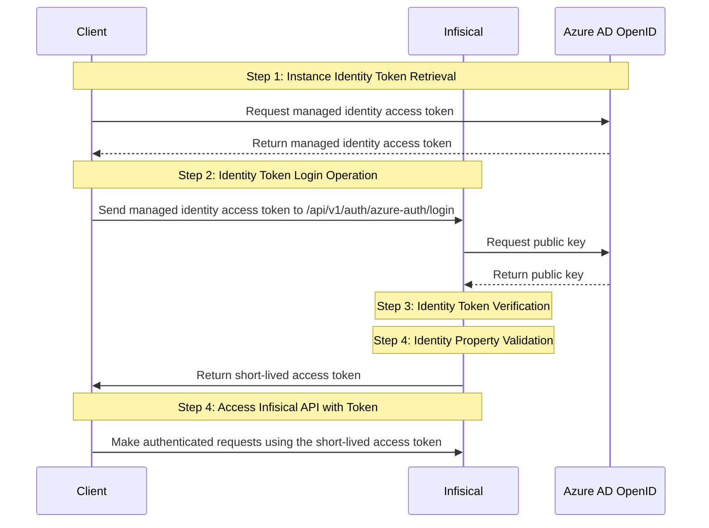

**Azure Auth** is an Azure-native authentication method for Azure resources like Azure VMs, Azure App Services, Azure Functions, Azure Kubernetes Service, etc. to access Infisical.

## Diagram

The following sequence diagram illustrates the Azure Auth workflow for authenticating Azure [service principals](https://learn.microsoft.com/en-us/entra/identity-platform/app-objects-and-service-principals?tabs=browser) with Infisical.



## Concept

At a high-level, Infisical authenticates an Azure service by verifying its identity and checking that it meets specific requirements (e.g. it is bound to an allowed service principal) at the `/api/v1/auth/azure-auth/login` endpoint. If successful,
then Infisical returns a short-lived access token that can be used to make authenticated requests to the Infisical API.

To be more specific:

1. The client running on an Azure service obtains an [access token](https://learn.microsoft.com/en-us/entra/identity/managed-identities-azure-resources/how-to-use-vm-token#get-a-token-using-http) that is a JWT token representing the managed identity for the Azure resource such as a Virtual Machine; the managed identity is associated with a service principal in Azure AD.
2. The client sends the access token to Infisical.
3. Infisical verifies the token against the corresponding public key at the [public Azure AD OpenID configuration endpoint](https://learn.microsoft.com/en-us/answers/questions/793793/azure-ad-validate-access-token).
4. Infisical checks if the entity behind the access token is allowed to authenticate with Infisical based on set criteria such as **Allowed Service Principal IDs**.
5. If all is well, Infisical returns a short-lived access token that the client can use to make authenticated requests to the Infisical API.

<Note>
We recommend using one of Infisical's clients like SDKs or the Infisical Agent
to authenticate with Infisical using Azure Auth as they handle the
authentication process including generating the client access token for you.

Also, note that Infisical needs network-level access to send requests to the Google Cloud API
as part of the Azure Auth workflow.

</Note>

## Guide

In the following steps, we explore how to create and use identities for your applications in Azure to
access the Infisical API using the Azure Auth authentication method.

<Steps>
    <Step title="Creating an identity">
    To create an identity, head to your Organization Settings > Access Control > Identities and press **Create identity**.

    

    When creating an identity, you specify an organization level [role](/documentation/platform/access-controls/role-based-access-controls) for it to assume; you can configure roles in Organization Settings > Access Control > Organization Roles.

    

    Now input a few details for your new identity. Here's some guidance for each field:

    - Name (required): A friendly name for the identity.
    - Role (required): A role from the **Organization Roles** tab for the identity to assume. The organization role assigned will determine what organization level resources this identity can have access to.

    Once you've created an identity, you'll be redirected to a page where you can manage the identity.

    

    Since the identity has been configured with Universal Auth by default, you should re-configure it to use Azure Auth instead. To do this, press to edit the **Authentication** section,
    remove the existing Universal Auth configuration, and add a new Azure Auth configuration onto the identity.

    

    

    Here's some more guidance on each field:

    - Tenant ID: The [tenant ID](https://learn.microsoft.com/en-us/entra/fundamentals/how-to-find-tenant) for the Azure AD organization.
    - Resource / Audience: The resource URL for the application registered in Azure AD. The value is expected to match the `aud` claim of the access token JWT later used in the login operation against Infisical. See the [resource](https://learn.microsoft.com/en-us/entra/identity/managed-identities-azure-resources/how-to-use-vm-token#get-a-token-using-http) parameter for how the audience is set when requesting a JWT access token from the Azure Instance Metadata Service (IMDS) endpoint. In most cases, this value should be `https://management.azure.com/` which is the default.
    - Allowed Service Principal IDs: A comma-separated list of Azure AD service principal IDs that are allowed to authenticate with Infisical.
    - Access Token TTL (default is `2592000` equivalent to 30 days): The lifetime for an acccess token in seconds. This value will be referenced at renewal time.
    - Access Token Max TTL (default is `2592000`  equivalent to 30 days): The maximum lifetime for an acccess token in seconds. This value will be referenced at renewal time.
    - Access Token Max Number of Uses (default is `0`): The maximum number of times that an access token can be used; a value of `0` implies infinite number of uses.
    - Access Token Trusted IPs: The IPs or CIDR ranges that access tokens can be used from. By default, each token is given the `0.0.0.0/0`, allowing usage from any network address.

    </Step>
    <Step title="Adding an identity to a project">
    To enable the identity to access project-level resources such as secrets within a specific project, you should add it to that project.

    To do this, head over to the project you want to add the identity to and go to Project Settings > Access Control > Machine Identities and press **Add identity**.

    Next, select the identity you want to add to the project and the project level role you want to allow it to assume. The project role assigned will determine what project level resources this identity can have access to.

    

    
    </Step>
    <Step title="Accessing the Infisical API with the identity">
        To access the Infisical API as the identity, you need to generate a managed identity [access token](https://learn.microsoft.com/en-us/entra/identity/managed-identities-azure-resources/how-to-use-vm-token#get-a-token-using-http) that is a JWT token representing the managed identity for the Azure resource such as a Virtual Machine. The client token must be sent to the `/api/v1/auth/azure-auth/login` endpoint in exchange for a separate access token to access the Infisical API.

        We provide a few code examples below of how you can authenticate with Infisical to access the [Infisical API](/api-reference/overview/introduction).

        <AccordionGroup>
            <Accordion
                title="Sample code for generating the access token"
            >
                Start by making a request from your Azure client such as Virtual Machine to obtain a managed identity access token.

                For more examples of how to obtain the managed identity access token, refer to the [official documentation](https://learn.microsoft.com/en-us/entra/identity/managed-identities-azure-resources/how-to-use-vm-token#get-a-token-using-http).

                #### Sample request
                ```bash curl
                curl 'http://169.254.169.254/metadata/identity/oauth2/token?api-version=2018-02-01&resource=https%3A%2F%2Fmanagement.azure.com%2F' -H Metadata:true -s
                ```

                #### Sample response
                ```bash
                {
                    "access_token": "eyJ0eXAi...",
                    "refresh_token": "",
                    "expires_in": "3599",
                    "expires_on": "1506484173",
                    "not_before": "1506480273",
                    "resource": "https://management.azure.com/",
                    "token_type": "Bearer"
                }
                ```

                Next use send the obtained managed identity access token (i.e. the token from the `access_token` field above) to authenticate with Infisical and obtain a separate access token.

                #### Sample request

                ```bash Request
                curl --location --request POST 'https://app.infisical.com/api/v1/auth/gcp-auth/login' \
                    --header 'Content-Type: application/x-www-form-urlencoded' \
                    --data-urlencode 'identityId=...' \
                    --data-urlencode 'jwt=...'
                ```

                <Note>
                    Note that you should replace `<identityId>` with the ID of the identity you created in step 1.
                </Note>

                #### Sample response

                ```bash Response
                {
                    "accessToken": "...",
                    "expiresIn": 7200,
                    "accessTokenMaxTTL": 43244
                    "tokenType": "Bearer"
                }
                ```

                Next, you can use this access token to access the [Infisical API](/api-reference/overview/introduction)
            </Accordion>
        </AccordionGroup>

        <Tip>
            We recommend using one of Infisical's clients like SDKs or the Infisical Agent to authenticate with Infisical using Azure Auth as they handle the authentication process including retrieving the client access token.
        </Tip>
        <Note>
        Each identity access token has a time-to-live (TTL) which you can infer from the response of the login operation;
        the default TTL is `7200` seconds which can be adjusted.
        If an identity access token expires, it can no longer authenticate with the Infisical API. In this case,
        a new access token should be obtained by performing another login operation.
        </Note>
    </Step>

</Steps>
