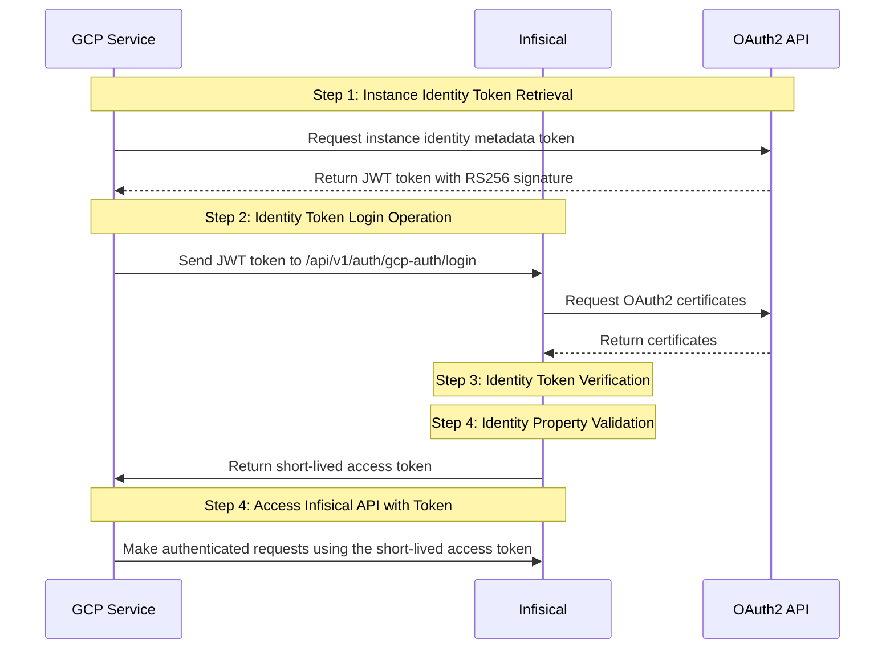
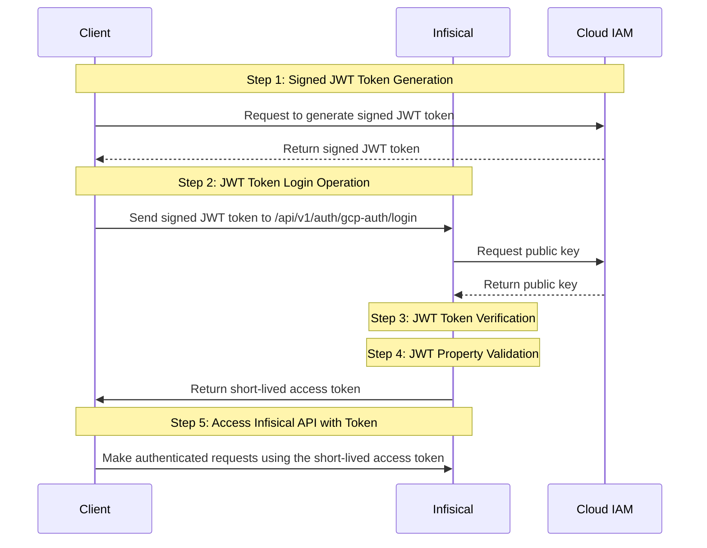

**GCP Auth** is a GCP-native authentication method for GCP resources to access Infisical. It consists of two sub-methods/approaches:

- GCP ID Token Auth: For GCP services including [Compute Engine](https://cloud.google.com/compute/docs/instances/verifying-instance-identity#request_signature), [App Engine standard environment](https://cloud.google.com/appengine/docs/standard/python3/runtime#metadata_server), [App Engine flexible environment](https://cloud.google.com/appengine/docs/flexible/python/runtime#metadata_server), [Cloud Functions](https://cloud.google.com/functions/docs/securing/function-identity#using_the_metadata_server_to_acquire_tokens), [Cloud Run](https://cloud.google.com/run/docs/container-contract#metadata-server), [Google Kubernetes Engine](https://cloud.google.com/kubernetes-engine/docs/concepts/workload-identity#instance_metadata), and [Cloud Build](https://cloud.google.com/kubernetes-engine/docs/concepts/workload-identity#instance_metadata) to authenticate with Infisical.
- GCP IAM Auth: For Google Cloud Platform (GCP) service accounts to authenticate with Infisical.

<Tabs>
  <Tab title="Google ID Token Auth">

    ## Diagram

    The following sequence diagram illustrates the GCP ID Token Auth workflow for authenticating GCP resources with Infisical.



    ## Concept

At a high-level, Infisical authenticates a GCP resource by verifying its identity and checking that it meets specific requirements (e.g. it is an allowed GCE instance) at the `/api/v1/auth/gcp-auth/login` endpoint. If successful,
then Infisical returns a short-lived access token that can be used to make authenticated requests to the Infisical API.

To be more specific:

1. The client running on a GCP service obtains an [ID token](https://cloud.google.com/docs/authentication/get-id-token) constituting the identity for a GCP resource such as a GCE instance or Cloud Function; this is a unique JWT token that includes details about the instance as well as Google's [RS256 signature](https://datatracker.ietf.org/doc/html/rfc7518#section-3.3).
2. The client sends the ID token to Infisical at the `/api/v1/auth/gcp-auth/login` endpoint.
3. Infisical verifies the token against Google's [public OAuth2 certificates](https://www.googleapis.com/oauth2/v3/certs).
4. Infisical checks if the entity behind the ID token is allowed to authenticate with Infisical based on set criteria such as **Allowed Service Account Emails**.
5. If all is well, Infisical returns a short-lived access token that the client can use to make authenticated requests to the Infisical API.

<Note>
We recommend using one of Infisical's clients like SDKs or the Infisical Agent
to authenticate with Infisical using GCP ID Token Auth as they handle the
authentication process including generating the instance ID token for you.

Also, note that Infisical needs network-level access to send requests to the Google Cloud API
as part of the GCP Auth workflow.

</Note>

## Guide

In the following steps, we explore how to create and use identities for your workloads and applications on GCP to
access the Infisical API using the GCP ID Token authentication method.

<Steps>
    <Step title="Creating an identity">
    To create an identity, head to your Organization Settings > Access Control > Identities and press **Create identity**.

    

    When creating an identity, you specify an organization level [role](/documentation/platform/access-controls/role-based-access-controls) for it to assume; you can configure roles in Organization Settings > Access Control > Organization Roles.

    

    Now input a few details for your new identity. Here's some guidance for each field:

    - Name (required): A friendly name for the identity.
    - Role (required): A role from the **Organization Roles** tab for the identity to assume. The organization role assigned will determine what organization level resources this identity can have access to.

    Once you've created an identity, you'll be redirected to a page where you can manage the identity.

    

    Since the identity has been configured with Universal Auth by default, you should re-configure it to use GCP Auth instead. To do this, press to edit the **Authentication** section,
    remove the existing Universal Auth configuration, and add a new GCP Auth configuration onto the identity; set the **Type** field to **GCP ID Token Auth**.

    

    

    Here's some more guidance on each field:

    - Allowed Service Account Emails: A comma-separated list of trusted service account emails corresponding to the GCE resource(s) allowed to authenticate with Infisical; this could be something like `test@project.iam.gserviceaccount.com`, `12345-compute@developer.gserviceaccount.com`, etc.
    - Allowed Projects: A comma-separated list of trusted GCP projects that the GCE instance must belong to authenticate with Infisical. Note that this validation property will only work for GCE instances.
    - Allowed Zones: A comma-separated list of trusted zones that the GCE instances must belong to authenticate with Infisical; this should be the fully-qualified zone name in the format `<region>-<zone>`like `us-central1-a`, `us-west1-b`, etc. Note that this validation property will only work for GCE instances.
    - Access Token TTL (default is `2592000` equivalent to 30 days): The lifetime for an acccess token in seconds. This value will be referenced at renewal time.
    - Access Token Max TTL (default is `2592000`  equivalent to 30 days): The maximum lifetime for an acccess token in seconds. This value will be referenced at renewal time.
    - Access Token Max Number of Uses (default is `0`): The maximum number of times that an access token can be used; a value of `0` implies infinite number of uses.
    - Access Token Trusted IPs: The IPs or CIDR ranges that access tokens can be used from. By default, each token is given the `0.0.0.0/0`, allowing usage from any network address.

    </Step>
    <Step title="Adding an identity to a project">
    To enable the identity to access project-level resources such as secrets within a specific project, you should add it to that project.

    To do this, head over to the project you want to add the identity to and go to Project Settings > Access Control > Machine Identities and press **Add identity**.

    Next, select the identity you want to add to the project and the project level role you want to allow it to assume. The project role assigned will determine what project level resources this identity can have access to.

    

    
    </Step>
    <Step title="Accessing the Infisical API with the identity">
        To access the Infisical API as the identity, you need to generate an [ID token](https://cloud.google.com/docs/authentication/get-id-token) constituting the identity of the present GCE instance and make a request to the `/api/v1/auth/gcp-auth/login` endpoint containing the token in exchange for an access token.

        We provide a few code examples below of how you can authenticate with Infisical to access the [Infisical API](/api-reference/overview/introduction).

        <AccordionGroup>
            <Accordion
                title="Sample code for generating the ID token"
            >
                Start by making a request from the GCE instance to obtain the ID token.
                For more examples of how to obtain the token in Java, Go, Node.js, etc. refer to the [official documentation](https://cloud.google.com/docs/authentication/get-id-token#curl).

                #### Sample request
                <CodeGroup>
                ```bash curl
                curl -H "Metadata-Flavor: Google" \
                'http://metadata/computeMetadata/v1/instance/service-accounts/default/identity?audience=<identityId>&format=full'
                ```
                </CodeGroup>

                <Note>
                    Note that you should replace `<identityId>` with the ID of the identity you created in step 1.
                </Note>

                Next use send the obtained JWT token along to authenticate with Infisical and obtain an access token.

                #### Sample request

                ```bash Request
                curl --location --request POST 'https://app.infisical.com/api/v1/auth/gcp-auth/login' \
                    --header 'Content-Type: application/x-www-form-urlencoded' \
                    --data-urlencode 'identityId=...' \
                    --data-urlencode 'jwt=...'
                ```

                #### Sample response

                ```bash Response
                {
                    "accessToken": "...",
                    "expiresIn": 7200,
                    "accessTokenMaxTTL": 43244
                    "tokenType": "Bearer"
                }
                ```

                Next, you can use the access token to access the [Infisical API](/api-reference/overview/introduction)
            </Accordion>
        </AccordionGroup>

        <Tip>
            We recommend using one of Infisical's clients like SDKs or the Infisical Agent to authenticate with Infisical using GCP IAM Auth as they handle the authentication process including generating the signed JWT token.
        </Tip>
        <Note>
        Each identity access token has a time-to-live (TTL) which you can infer from the response of the login operation;
        the default TTL is `7200` seconds which can be adjusted.
        If an identity access token expires, it can no longer authenticate with the Infisical API. In this case,
        a new access token should be obtained by performing another login operation.
        </Note>
    </Step>

</Steps>

  </Tab>
<Tab title="GCP IAM Auth">

    ## Diagram

    The following sequence diagram illustrates the GCP IAM Auth workflow for authenticating GCP IAM service accounts with Infisical.



## Concept

At a high-level, Infisical authenticates an IAM service account by verifying its identity and checking that it meets specific requirements (e.g. it is an allowed service account) at the `/api/v1/auth/gcp-auth/login` endpoint. If successful,
then Infisical returns a short-lived access token that can be used to make authenticated requests to the Infisical API.

To be more specific:

1. The client generates a signed JWT token using the `projects.serviceAccounts.signJwt` [API method](https://cloud.google.com/iam/docs/reference/credentials/rest/v1/projects.serviceAccounts/signJwt); this is done using the service account credentials associated with the client.
2. The client sends the signed JWT token to Infisical at the `/api/v1/auth/gcp-auth/login` endpoint.
3. Infisical verifies the signed JWT token.
4. Infisical checks if the service account behind the JWT token is allowed to authenticate with Infisical based **Allowed Service Account Emails**.
5. If all is well, Infisical returns a short-lived access token that the client can use to make authenticated requests to the Infisical API.

<Note>
We recommend using one of Infisical's clients like SDKs or the Infisical Agent
to authenticate with Infisical using GCP IAM Auth as they handle the
authentication process including generating the signed JWT token.

Also, note that Infisical needs network-level access to send requests to the Google Cloud API
as part of the GCP Auth workflow.

</Note>

## Guide

In the following steps, we explore how to create and use identities for your workloads and applications on GCP to
access the Infisical API using the GCP IAM authentication method.

<Steps>
    <Step title="Creating an identity">
    To create an identity, head to your Organization Settings > Access Control > Identities and press **Create identity**.

    

    When creating an identity, you specify an organization level [role](/documentation/platform/access-controls/role-based-access-controls) for it to assume; you can configure roles in Organization Settings > Access Control > Organization Roles.

    

    Now input a few details for your new identity. Here's some guidance for each field:

    - Name (required): A friendly name for the identity.
    - Role (required): A role from the **Organization Roles** tab for the identity to assume. The organization role assigned will determine what organization level resources this identity can have access to.

    Once you've created an identity, you'll be redirected to a page where you can manage the identity.

    

    Since the identity has been configured with Universal Auth by default, you should re-configure it to use GCP Auth instead. To do this, press to edit the **Authentication** section,
    remove the existing Universal Auth configuration, and add a new GCP Auth configuration onto the identity; set the **Type** field to **GCP IAM Auth**.

    

    

    Here's some more guidance on each field:

    - Allowed Service Account Emails: A comma-separated list of trusted IAM service account emails that are allowed to authenticate with Infisical; this could be something like `test@project.iam.gserviceaccount.com`, `12345-compute@developer.gserviceaccount.com`, etc.
    - Access Token TTL (default is `2592000` equivalent to 30 days): The lifetime for an acccess token in seconds. This value will be referenced at renewal time.
    - Access Token Max TTL (default is `2592000`  equivalent to 30 days): The maximum lifetime for an acccess token in seconds. This value will be referenced at renewal time.
    - Access Token Max Number of Uses (default is `0`): The maximum number of times that an access token can be used; a value of `0` implies infinite number of uses.
    - Access Token Trusted IPs: The IPs or CIDR ranges that access tokens can be used from. By default, each token is given the `0.0.0.0/0`, allowing usage from any network address.

    </Step>
    <Step title="Adding an identity to a project">
    To enable the identity to access project-level resources such as secrets within a specific project, you should add it to that project.

    To do this, head over to the project you want to add the identity to and go to Project Settings > Access Control > Machine Identities and press **Add identity**.

    Next, select the identity you want to add to the project and the project level role you want to allow it to assume. The project role assigned will determine what project level resources this identity can have access to.

    

    
    </Step>
    <Step title="Accessing the Infisical API with the identity">
        To access the Infisical API as the identity, you need to generate a signed JWT token using the `projects.serviceAccounts.signJwt` [API method](https://cloud.google.com/iam/docs/reference/credentials/rest/v1/projects.serviceAccounts/signJwt) and make a request to the `/api/v1/auth/gcp-auth/login` endpoint containing the signed JWT token in exchange for an access token.

        <Info>
            Make sure that the service account has the `iam.serviceAccounts.signJwt` permission or the `roles/iam.serviceAccountTokenCreator` role.
        </Info>

        We provide a few code examples below of how you can authenticate with Infisical to access the [Infisical API](/api-reference/overview/introduction).

        <AccordionGroup>
            <Accordion
                title="Sample code for generating a signed JWT token"
            >
                The following code provides a generic example of how you can generate a signed JWT token against the `projects.serviceAccounts.signJwt` API method.

                The shown example uses Node.js and the official [google-auth-library](https://github.com/googleapis/google-auth-library-nodejs#readme) package but you can use any language you wish.


                ```javascript
                const { GoogleAuth } = require("google-auth-library");

                const auth = new GoogleAuth({
                    scopes: "https://www.googleapis.com/auth/cloud-platform",
                });

                const credentials = await auth.getCredentials();

                const identityId = "<your-infisical-identity-id>";

                const jwtPayload = {
                    sub: credentials.client_email,
                    aud: identityId,
                };

                const { data } = await client.request({
                    url: `https://iamcredentials.googleapis.com/v1/projects/-/serviceAccounts/${credentials.client_email}:signJwt`,
                    method: "POST",
                    data: { payload: JSON.stringify(jwtPayload) },
                });

                const jwt = data.signedJwt // send this jwt to Infisical in the next step
                ```

                #### Sample request

                ```bash Request
                curl --location --request POST 'https://app.infisical.com/api/v1/auth/gcp-auth/login' \
                    --header 'Content-Type: application/x-www-form-urlencoded' \
                    --data-urlencode 'identityId=...' \
                    --data-urlencode 'jwt=...'
                ```

                #### Sample response

                ```bash Response
                {
                    "accessToken": "...",
                    "expiresIn": 7200,
                    "accessTokenMaxTTL": 43244
                    "tokenType": "Bearer"
                }
                ```

                Next, you can use the access token to access the [Infisical API](/api-reference/overview/introduction)
            </Accordion>
        </AccordionGroup>

        <Tip>
            We recommend using one of Infisical's clients like SDKs or the Infisical Agent to authenticate with Infisical using GCP IAM Auth as they handle the authentication process including generating the signed JWT token.
        </Tip>
        <Note>
        Each identity access token has a time-to-live (TTL) which you can infer from the response of the login operation;
        the default TTL is `7200` seconds which can be adjusted.
        If an identity access token expires, it can no longer authenticate with the Infisical API. In this case,
        a new access token should be obtained by performing another login operation.
        </Note>
    </Step>

</Steps>
  </Tab>

</Tabs>
