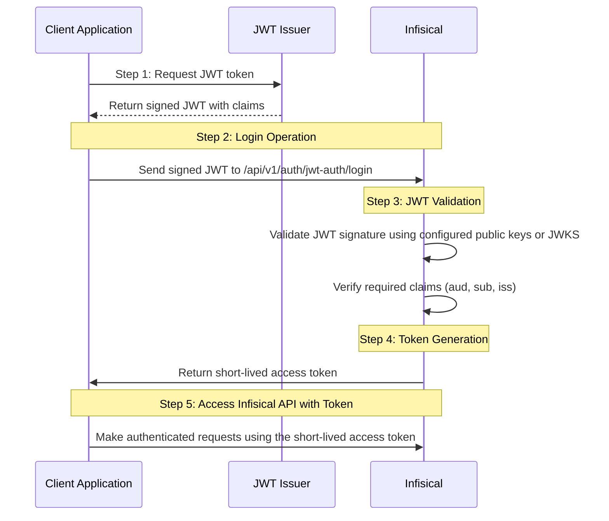

**JWT Auth** is a platform-agnostic authentication method that validates JSON Web Tokens (JWTs) issued by your JWT issuer or authentication system, allowing secure authentication from any platform or environment that can obtain valid JWTs.

## Diagram

The following sequence diagram illustrates the JWT Auth workflow for authenticating with Infisical.



## Concept

At a high-level, Infisical authenticates a client by verifying the JWT and checking that it meets specific requirements (e.g. it is signed by a trusted key) at the `/api/v1/auth/jwt-auth/login` endpoint. If successful, then Infisical returns a short-lived access token that can be used to make authenticated requests to the Infisical API.

To be more specific:

1. The client requests a JWT from their JWT issuer.
2. The fetched JWT is sent to Infisical at the `/api/v1/auth/jwt-auth/login` endpoint.
3. Infisical validates the JWT signature using either:
   - Pre-configured public keys (Static configuration)
   - Public keys fetched from a JWKS endpoint (JWKS configuration)
4. Infisical verifies that the configured claims match in the token. This includes standard claims like subject, audience, and issuer, as well as any additional custom claims specified in the configuration.
5. If all is well, Infisical returns a short-lived access token that the client can use to make authenticated requests to the Infisical API.

<Note>
  For JWKS configuration, Infisical needs network-level access to the configured
  JWKS endpoint.
</Note>

## Guide

In the following steps, we explore how to create and use identities to access the Infisical API using the JWT authentication method.

<Steps>
<Step title="Creating an identity">
    To create an identity, head to your Organization Settings > Access Control > Machine Identities and press **Create organization machine identity**.

    

    When creating an identity, you specify an organization level [role](/documentation/platform/access-controls/role-based-access-controls) for it to assume; you can configure roles in Organization Settings > Access Control > Organization Roles.

    

    Now input a few details for your new identity. Here's some guidance for each field:

    - Name (required): A friendly name for the identity.
    - Role (required): A role from the **Organization Roles** tab for the identity to assume. The organization role assigned will determine what organization level resources this identity can have access to.

    Once you've created an identity, you'll be redirected to a page where you can manage the identity.

    

    Since the identity has been configured with Universal Auth by default, you should re-configure it to use JWT Auth instead. To do this, press to edit the **Authentication** section,
    remove the existing Universal Auth configuration, and add a new JWT Auth configuration onto the identity.

    

    
    

    <Warning>Restrict access by properly configuring the JWT validation settings.</Warning>

    Here's some more guidance for each field:

    **Static configuration**:
    - Public Keys: One or more PEM-encoded public keys (RSA or ECDSA) used to verify JWT signatures. Each key must include the proper BEGIN/END markers.

    **JWKS configuration**:
    - JWKS URL: The endpoint URL that serves your JSON Web Key Sets (JWKS). This endpoint must provide the public keys used for JWT signature verification.
    - JWKS CA Certificate: Optional PEM-encoded CA certificate used for validating the TLS connection to the JWKS endpoint.

    **Common fields for both configurations**:
    - Issuer: The unique identifier of the JWT provider. This value is used to verify the iss (issuer) claim in the JWT.
    - Audiences: A list of intended recipients. This value is checked against the aud (audience) claim in the token.
    - Subject: The expected principal that is the subject of the JWT. This value is checked against the sub (subject) claim in the token.
    - Claims: Additional claims that must be present in the JWT for it to be valid. You can specify required claim names and their expected values.
    - Access Token TTL (default is `2592000` equivalent to 30 days): The lifetime for an access token in seconds. This value will be referenced at renewal time.
    - Access Token Max TTL (default is `2592000` equivalent to 30 days): The maximum lifetime for an access token in seconds. This value will be referenced at renewal time.
    - Access Token Max Number of Uses (default is `0`): The maximum number of times that an access token can be used; a value of `0` implies infinite number of uses.
    - Access Token Trusted IPs: The IPs or CIDR ranges that access tokens can be used from. By default, each token is given the `0.0.0.0/0`, allowing usage from any network address.

    <Info>The `subject`, `audiences`, and `claims` fields support glob pattern matching; however, we highly recommend using hardcoded values whenever possible.</Info>
    </Step>

    <Step title="Adding an identity to a project">
    To enable the identity to access project-level resources such as secrets within a specific project, you should add it to that project.

    To do this, head over to the project you want to add the identity to and go to Project Settings > Access Control > Machine Identities and press **Add identity**.

    Next, select the identity you want to add to the project and the project level role you want to allow it to assume. The project role assigned will determine what project level resources this identity can have access to.

    

    
    </Step>

    <Step title="Accessing the Infisical API with the identity">
    To access the Infisical API as the identity, you will need to obtain a JWT from your JWT issuer that meets the validation requirements configured in step 2.

    Once you have obtained a valid JWT, you can use it to authenticate with Infisical at the `/api/v1/auth/jwt-auth/login` endpoint.

    We provide a code example below of how you might use the JWT to authenticate with Infisical to gain access to the [Infisical API](/api-reference/overview/introduction).

   <Accordion
        title="Sample code for inside an application"
    > 
        The shown example uses Node.js but you can use any other language to authenticate with Infisical using your JWT.
        
        ```javascript   
        try {
            // Obtain JWT from your issuer
            const jwt = "<your-jwt-token>";

            const infisicalUrl = "https://app.infisical.com"; // or your self-hosted Infisical URL
            const identityId = "<your-identity-id>";

            const { data } = await axios.post(
                `{infisicalUrl}/api/v1/auth/jwt-auth/login`,
                {
                    identityId,
                    jwt,
                }
            );

            console.log("result data: ", data); // access token here
        } catch(err) {
            console.error(err);
        }
        ```
    </Accordion>

    <Tip>
        We recommend using one of Infisical's clients like SDKs or the Infisical Agent to authenticate with Infisical using JWT Auth as they handle the authentication process for you.
    </Tip>

    <Note>
    Each identity access token has a time-to-live (TTL) which you can infer from the response of the login operation;
    the default TTL is `2592000` seconds (30 days) which can be adjusted in the configuration.

    If an identity access token exceeds its max TTL or maximum number of uses, it can no longer authenticate with the Infisical API. In this case,
    a new access token should be obtained by performing another login operation with a valid JWT.
    </Note>

  </Step>
</Steps>
