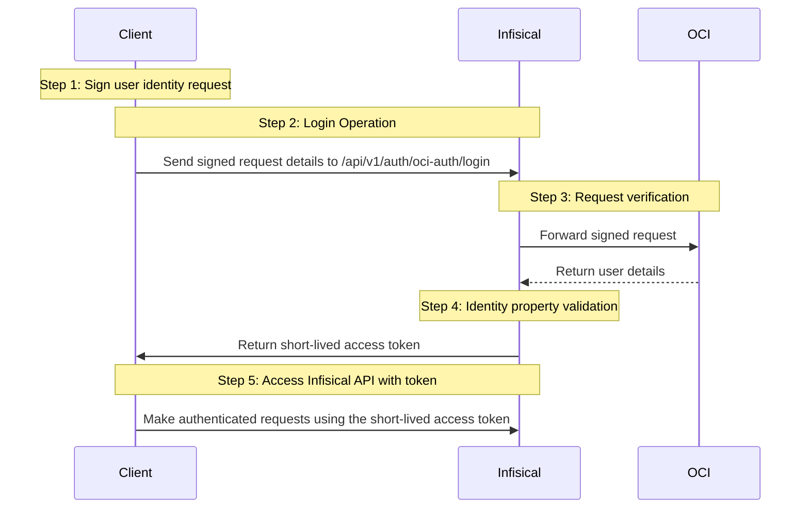

**OCI Auth** is an OCI-native authentication method that verifies Oracle Cloud Infrastructure users through signature validation, allowing secure access to Infisical resources.

## Diagram

The following sequence diagram illustrates the OCI Auth workflow for authenticating OCI users with Infisical.



## Concept

At a high level, Infisical authenticates an OCI user by verifying its identity and checking that it meets specific requirements (e.g., its username is authorized, its part of a tenancy) at the `/api/v1/auth/oci-auth/login` endpoint. If successful,
then Infisical returns a short-lived access token that can be used to make authenticated requests to the Infisical API.

To be more specific:
1. The client [signs](https://docs.oracle.com/en-us/iaas/Content/API/Concepts/signingrequests.htm) a `/20160918/users/{userId}` request using an OCI user's [private key](https://docs.oracle.com/en-us/iaas/Content/API/Concepts/apisigningkey.htm#Required_Keys_and_OCIDs); this is done using the [OCI SDK](https://infisical.com/docs/documentation/platform/identities/oci-auth#accessing-the-infisical-api-with-the-identity) or API.
2. The client sends the signed request's headers and their user OCID to Infisical at the `/api/v1/auth/oci-auth/login` endpoint.
3. Infisical reconstructs the request and sends it to OCI via the [Get User](https://docs.oracle.com/en/engineered-systems/private-cloud-appliance/3.0-latest/ceapi/op-20160918-users-user_id-get.html) endpoint for verification and obtains the identity associated with the OCI user.
4. Infisical checks the user's properties against set criteria such as **Allowed Usernames** and **Tenancy OCID**.
5. If all checks pass, Infisical returns a short-lived access token that the client can use to make authenticated requests to the Infisical API.

## Prerequisite

In order to sign requests, you must have an OCI user with credentials such as the private key. If you're unaware of how to create a user and obtain the needed credentials, expand the menu below.

<Accordion title="Creating an OCI user">
    <Steps>
        <Step title="Search for 'Domains' and click as shown">
            
        </Step>
        <Step title="Select domain">
            Select the domain in which you want to create the Infisical user account.

            
        </Step>
        <Step title="Navigate to 'Users'">
            
        </Step>
        <Step title="Click 'Create user'">
            
        </Step>
        <Step title="Create user">
            The name, email, and username can be anything.

            
        </Step>
        <Step title="Navigate to 'API keys'">
            After you've created a user, you'll be redirected to the user's page. Navigate to 'API keys'.

            
        </Step>
        <Step title="Add API key">
            Click on 'Add API key' and then download or import the private key. After you've obtained the private key, click 'Add'.

            

            <Note>
              At the end of the downloaded private key file, you'll see `OCI_API_KEY`. This is not apart of the private key, and should not be included when you use the private key to sign requests.
            </Note>

        </Step>
        <Step title="Store configuration">
            After creating the API key, you'll be shown a modal with relevant information. Save the highlighted values (and the private key) for later steps.

            
        </Step>
    </Steps>
</Accordion>

## Guide

In the following steps, we explore how to create and use identities for your workloads and applications on OCI to
access the Infisical API using the OCI request signing authentication method.

### Creating an identity

To create an identity, head to your Organization Settings > Access Control > [Identities](https://app.infisical.com/organization/access-management?selectedTab=identities) and press **Create identity**.


When creating an identity, you specify an organization-level [role](/documentation/platform/access-controls/role-based-access-controls) for it to assume; you can configure roles in Organization Settings > Access Control > [Organization Roles](https://app.infisical.com/organization/access-management?selectedTab=roles).


Input some details for your new identity:
- **Name (required):** A friendly name for the identity.
- **Role (required):** A role from the [**Organization Roles**](https://app.infisical.com/organization/access-management?selectedTab=roles) tab for the identity to assume. The organization role assigned will determine what organization-level resources this identity can have access to.

Once you've created an identity, you'll be redirected to a page where you can manage the identity.


Since the identity has been configured with [Universal Auth](https://infisical.com/docs/documentation/platform/identities/universal-auth) by default, you should reconfigure it to use OCI Auth instead. To do this, click the cog next to **Universal Auth** and then select **Delete** in the options dropdown.


Now create a new OCI Auth Method.


Here's some information about each field:
- **Tenancy OCID:** The OCID of your tenancy. All users authenticating must be part of this Tenancy.
- **Allowed Usernames:** A comma-separated list of trusted OCI users that are allowed to authenticate with Infisical.
- **Access Token TTL (default is `2592000` equivalent to 30 days):** The lifetime for an access token in seconds. This value will be referenced at renewal time.
- **Access Token Max TTL (default is `2592000` equivalent to 30 days):** The maximum lifetime for an access token in seconds. This value will be referenced at renewal time.
- **Access Token Max Number of Uses (default is `0`):** The maximum number of times that an access token can be used; a value of `0` implies an infinite number of uses.
- **Access Token Trusted IPs:** The IPs or CIDR ranges that access tokens can be used from. By default, each token is given the `0.0.0.0/0`, allowing usage from any network address.

### Adding an identity to a project

In order to allow an identity to access project-level resources such as secrets, you must add it to the relevant projects.

To do this, head over to the project you want to add the identity to and navigate to Project Settings > Access Control > Machine Identities and press **Add Identity**.


Select the identity you want to add to the project and the project-level role you want it to assume. The project role given to the identity will determine what project-level resources this identity can access.


### Accessing the Infisical API with the identity

To access the Infisical API as the identity, you need to construct a signed [Get User](https://docs.oracle.com/en/engineered-systems/private-cloud-appliance/3.0-latest/ceapi/op-20160918-users-user_id-get.html) request using [OCI Signature v1](https://docs.oracle.com/en-us/iaas/Content/API/Concepts/signingrequests.htm#Request_Signatures) and then make a request to the `/api/v1/auth/oci-auth/login` endpoint passing the signed header data and user OCID.

Below is an example of how you can authenticate with Infisical using the `oci-sdk` for NodeJS.

```typescript
import { common } from "oci-sdk";

// Change these credentials to match your OCI user
const tenancyId = "ocid1.tenancy.oc1..example";
const userId = "ocid1.user.oc1..example";
const fingerprint = "00:00:00:00:00:00:00:00:00:00:00:00:00:00:00:00";
const region = "us-ashburn-1";
const privateKey = "..."; // Must be PEM format

const provider = new common.SimpleAuthenticationDetailsProvider(
  tenancyId,
  userId,
  fingerprint,
  privateKey,
  null,
  common.Region.fromRegionId(region),
);

// Build request
const headers = new Headers({
  host: `identity.${region}.oraclecloud.com`,
});

const request: common.HttpRequest = {
  method: "GET",
  uri: `/20160918/users/${userId}`,
  headers,
  body: null,
};

// Sign request
const signer = new common.DefaultRequestSigner(provider);
await signer.signHttpRequest(request);

// Forward signed request to Infisical
const requestAsJson = {
  identityId: "2dd11664-68e3-471d-b366-907206ab1bff",
  userOcid: userId,
  headers: Object.fromEntries(request.headers.entries()),
};

const res = await fetch("https://app.infisical.com/api/v1/auth/oci-auth/login", {
  method: "POST",
  headers: {
    "Content-Type": "application/json",
  },
  body: JSON.stringify(requestAsJson),
});

const json = await res.json();

console.log("Infisical Response:", json);
```

<Note>
    Each identity access token has a time-to-live (TTL) which you can infer from the response of the login operation; the default TTL is `7200` seconds, which can be adjusted.

    If an identity access token expires, it can no longer access the Infisical API. A new access token should be obtained by performing another login operation.
</Note>
