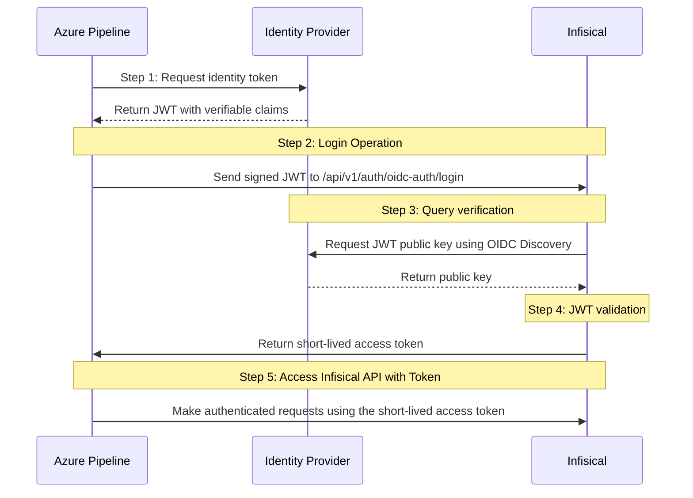

**OIDC Auth** is a platform-agnostic JWT-based authentication method that can be used to authenticate from any platform or environment using an identity provider with OpenID Connect.

## Diagram

The following sequence diagram illustrates the OIDC Auth workflow for authenticating Azure pipelines with Infisical.



## Concept

At a high-level, Infisical authenticates a client by verifying the JWT and checking that it meets specific requirements (e.g. it is issued by a trusted identity provider) at the `/api/v1/auth/oidc-auth/login` endpoint. If successful,
then Infisical returns a short-lived access token that can be used to make authenticated requests to the Infisical API.

To be more specific:

1. The Azure pipeline requests an identity token from Azure's identity provider.
2. The fetched identity token is sent to Infisical at the `/api/v1/auth/oidc-auth/login` endpoint.
3. Infisical fetches the public key that was used to sign the identity token from Azure's identity provider using OIDC Discovery.
4. Infisical validates the JWT using the public key provided by the identity provider and checks that the subject, audience, and claims of the token matches with the set criteria.
5. If all is well, Infisical returns a short-lived access token that the Azure pipeline can use to make authenticated requests to the Infisical API.

<Note>
  Infisical needs network-level access to Azure's identity provider endpoints.
</Note>

## Guide

In the following steps, we explore how to create and use identities to access the Infisical API using the OIDC Auth authentication method.

<Steps>
    <Step title="Creating an identity">
    To create an identity, head to your Organization Settings > Access Control > Identities and press **Create identity**.

    

    When creating an identity, you specify an organization level [role](/documentation/platform/access-controls/role-based-access-controls) for it to assume; you can configure roles in Organization Settings > Access Control > Organization Roles.

    

    Now input a few details for your new identity. Here's some guidance for each field:

    - Name (required): A friendly name for the identity.
    - Role (required): A role from the **Organization Roles** tab for the identity to assume. The organization role assigned will determine what organization level resources this identity can have access to.

    Once you've created an identity, you'll be redirected to a page where you can manage the identity.

    

    Since the identity has been configured with Universal Auth by default, you should re-configure it to use OIDC Auth instead. To do this, press to edit the **Authentication** section,
    remove the existing Universal Auth configuration, and add a new OIDC Auth configuration onto the identity.

    

    

    <Warning>Restrict access by configuring the Subject, Audiences, and Claims fields</Warning>

    Here's some more guidance on each field:
    - <div style={{ textAlign: 'justify' }}>**OIDC Discovery URL**: The URL used to retrieve the OpenID Connect configuration from the identity provider. This is used to fetch the public keys needed to verify the JWT. For Azure, set this to `https://login.microsoftonline.com/{tenant-id}/v2.0` (replace `{tenant-id}` with your Azure AD tenant ID).</div>
    - <div style={{ textAlign: 'justify' }}>**Issuer**: The value of the `iss` claim that the token must match. For Azure, this should be `https://login.microsoftonline.com/{tenant-id}/v2.0`.</div>
    - **Subject**: This must match the `sub` claim in the JWT.
    - **Audiences**: Values that must match the `aud` claim.
    - **Claims**: Additional claims that must be present. Refer to [Azure DevOps docs](https://learn.microsoft.com/en-us/azure/devops/pipelines/library/connect-to-azure?view=azure-devops#workload-identity-federation) for available claims.
    - **Access Token TTL**: Lifetime of the issued token (in seconds), e.g., `2592000` (30 days)
    - **Access Token Max TTL**: Maximum allowed lifetime of the token
    - **Access Token Max Number of Uses**: Max times the token can be used (`0` = unlimited)
    - **Access Token Trusted IPs**: List of allowed IP ranges (defaults to `0.0.0.0/0`)

    <Tip>If you are unsure about what to configure for the subject, audience, and claims fields, you can inspect the JWT token from your Azure DevOps pipeline by adding a debug step that outputs the token claims.</Tip>
    <Info>The `subject`, `audiences`, and `claims` fields support glob pattern matching; however, we highly recommend using hardcoded values whenever possible.</Info>
    </Step>
    <Step title="Adding an identity to a project">
    To enable the identity to access project-level resources such as secrets within a specific project, you should add it to that project.

    To do this, head over to the project you want to add the identity to and go to Project Settings > Access Control > Machine Identities and press **Add identity**.

    Next, select the identity you want to add to the project and the project level role you want to allow it to assume. The project role assigned will determine what project level resources this identity can have access to.

    

    
    </Step>
    <Step title="Accessing the Infisical API with the identity">
    In Azure DevOps, to authenticate with Infisical using OIDC, you must configure a service connection that enables workload identity federation.

    Once set up, the OIDC token can be fetched automatically within the pipeline job context. Here's an example:

    ```yaml
    trigger:
    - main

    pool:
      vmImage: ubuntu-latest

    steps:
    - task: AzureCLI@2
      displayName: 'Retrieve secrets from Infisical using OIDC'
      inputs:
        azureSubscription: 'your-azure-service-connection-name'
        scriptType: 'bash'
        scriptLocation: 'inlineScript'
        addSpnToEnvironment: true
        inlineScript: |
          # Get OIDC access token
          OIDC_TOKEN=$(az account get-access-token --resource "api://AzureADTokenExchange" --query accessToken -o tsv)
          
          [ -z "$OIDC_TOKEN" ] && { echo "Failed to get access token"; exit 1; }
          
          # Exchange for Infisical access token
          ACCESS_TOKEN=$(curl -s -X POST "<YOUR-INFISICAL-INSTANCE-URL>/api/v1/auth/oidc-auth/login" \
            -H "Content-Type: application/json" \
            -d "{\"identityId\":\"{your-identity-id}\",\"jwt\":\"$OIDC_TOKEN\"}" \
            | jq -r '.accessToken')
          
          # Fetch secrets
          curl -s -H "Authorization: Bearer $ACCESS_TOKEN" \
            "<YOUR-INFISICAL-INSTANCE-URL>/api/v3/secrets/raw?environment={your-environment-slug}&workspaceSlug={your-workspace-slug}"
    ```

    Make sure the service connection is properly configured for workload identity federation and linked to your Azure AD app registration with appropriate claims.

    <Note>
        Each identity access token has a time-to-live (TTL) which you can infer from the response of the login operation;
        the default TTL is `7200` seconds which can be adjusted.

        If an identity access token expires, it can no longer authenticate with the Infisical API. In this case,
        a new access token should be obtained by performing another login operation.
    </Note>

    </Step>
</Steps>
