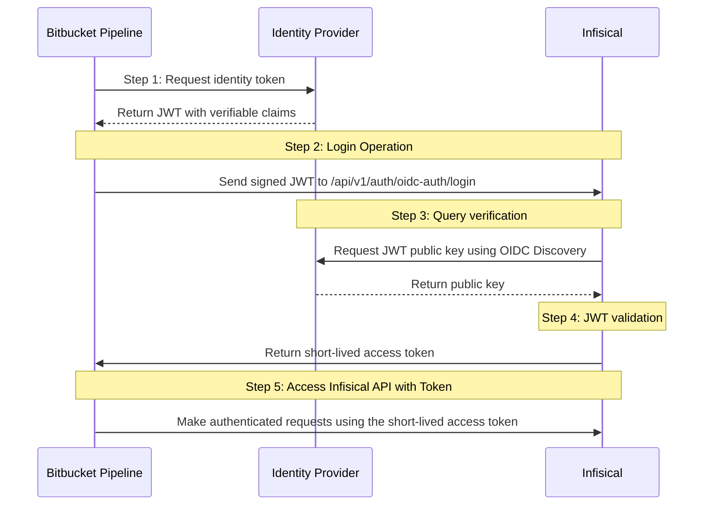

**OIDC Auth** is a platform-agnostic JWT-based authentication method that can be used to authenticate from any platform or environment using an identity provider with OpenID Connect.

## Diagram

The following sequence diagram illustrates the OIDC Auth workflow for authenticating Bitbucket Pipelines with Infisical.



## Concept

At a high level, Infisical authenticates a client by verifying the JWT and checking that it meets specific requirements (e.g. it is issued by a trusted identity provider) at the `/api/v1/auth/oidc-auth/login` endpoint. If successful, Infisical returns a short-lived access token that can be used to make authenticated requests to the Infisical API.

To be more specific:

1. The Bitbucket pipeline step requests an identity token from Bitbucket's identity provider. When `oidc: true` is set on the step, Bitbucket exposes the token as the `$BITBUCKET_STEP_OIDC_TOKEN` environment variable.
2. The fetched identity token is sent to Infisical at the `/api/v1/auth/oidc-auth/login` endpoint.
3. Infisical fetches the public key that was used to sign the identity token from Bitbucket's identity provider using OIDC Discovery.
4. Infisical validates the JWT using the public key provided by the identity provider and checks that the subject, audience, and claims of the token match with the set criteria.
5. If all is well, Infisical returns a short-lived access token that the Bitbucket pipeline can use to make authenticated requests to the Infisical API.

<Note>
  Infisical needs network-level access to Bitbucket's identity provider endpoints.
</Note>

## Guide

In the following steps, we explore how to create and use identities to access the Infisical API using the OIDC Auth authentication method.

<Steps>
    <Step title="Creating an identity">
    To create an identity, head to your Organization Settings > Access Control > Identities and press **Create identity**.

    

    When creating an identity, you specify an organization level [role](/documentation/platform/access-controls/role-based-access-controls) for it to assume; you can configure roles in Organization Settings > Access Control > Organization Roles.

    

    Now input a few details for your new identity. Here's some guidance for each field:

    - Name (required): A friendly name for the identity.
    - Role (required): A role from the **Organization Roles** tab for the identity to assume. The organization role assigned will determine what organization level resources this identity can have access to.

    Once you've created an identity, you'll be redirected to a page where you can manage the identity.

    

    Since the identity has been configured with Universal Auth by default, you should re-configure it to use OIDC Auth instead. To do this, press to edit the **Authentication** section,
    remove the existing Universal Auth configuration, and add a new OIDC Auth configuration onto the identity.

    

    

    <Warning>Restrict access by configuring the Subject, Audiences, and Claims fields</Warning>

    Here's some more guidance on each field:
    - OIDC Discovery URL: The URL used to retrieve the OpenID Connect configuration from the identity provider. This is used to fetch the public key needed for verifying the provided JWT. Set this to the Identity Provider URL from your Bitbucket repository's OpenID Connect settings. The format is `https://api.bitbucket.org/2.0/workspaces/<WORKSPACE>/pipelines-config/identity/oidc`. To find this value, go to your Bitbucket repository's **Repository Settings > Pipelines > OpenID Connect** page.
    - Issuer: The unique identifier of the identity provider issuing the JWT. This value is used to verify the `iss` (issuer) claim in the JWT to ensure the token is issued by a trusted provider. Set this to the same value as the OIDC Discovery URL: `https://api.bitbucket.org/2.0/workspaces/<WORKSPACE>/pipelines-config/identity/oidc`.
    - CA Certificate: The PEM-encoded CA cert for establishing secure communication with the Identity Provider endpoints. For Bitbucket Cloud, leave this blank.
    - Subject: The expected principal that is the subject of the JWT. The format of the `sub` field for Bitbucket Pipelines OIDC tokens is `{REPOSITORY_UUID}:{ENVIRONMENT_UUID}:{STEP_UUID}`. If the step is not assigned to a deployment environment, the format is `{REPOSITORY_UUID}:{STEP_UUID}`. Use a glob pattern such as `{REPOSITORY_UUID}:*` to match all environments and steps for a specific repository.
    - Audiences: A list of intended recipients. This value is checked against the `aud` (audience) claim in the token. By default, Bitbucket sets the audience to the workspace identifier. You can find this value on your repository's **Repository Settings > Pipelines > OpenID Connect** page. You can also configure custom audiences in your `bitbucket-pipelines.yml` file (max 10 audiences, max 150 characters each).
    - Claims: Additional information or attributes that should be present in the JWT for it to be valid. Available Bitbucket OIDC token claims include: `repositoryUuid`, `workspaceUuid`, `pipelineUuid`, `stepUuid`, `deploymentEnvironment`, and `branchName`.
    - Access Token TTL (default is `2592000` equivalent to 30 days): The lifetime for an access token in seconds. This value is referenced at renewal time.
    - Access Token Max TTL (default is `2592000` equivalent to 30 days): The maximum lifetime for an access token in seconds. This value is referenced at renewal time.
    - Access Token Max Number of Uses (default is `0`): The maximum number of times that an access token can be used; a value of `0` implies infinite number of uses.
    - Access Token Trusted IPs: The IPs or CIDR ranges that access tokens can be used from. By default, each token is given the `0.0.0.0/0`, allowing usage from any network address.

    <Tip>To find the values for OIDC Discovery URL, Issuer, Subject, and Audiences, go to your Bitbucket repository's **Repository Settings > Pipelines > OpenID Connect** page. Copy the Identity Provider URL and Audience values directly from this page.</Tip>

    <Info>The `subject`, `audiences`, and `claims` fields support glob pattern matching; however, we highly recommend using hardcoded values whenever possible.</Info>
    </Step>
    <Step title="Adding an identity to a project">
    To enable the identity to access project-level resources such as secrets within a specific project, you should add it to that project.

    To do this, head over to the project you want to add the identity to and go to Project Settings > Access Control > Machine Identities and press **Add identity**.

    Next, select the identity you want to add to the project and the project level role you want to allow it to assume. The project role assigned will determine what project level resources this identity can have access to.

    

    
    </Step>
    <Step title="Accessing the Infisical API with the identity">
    To access the Infisical API as the identity, set `oidc: true` on your Bitbucket pipeline step. This makes the OIDC identity token available as the `$BITBUCKET_STEP_OIDC_TOKEN` environment variable.

    Below is an example of a `bitbucket-pipelines.yml` that uses the Infisical CLI to authenticate via OIDC and inject secrets into a build command:

    ```yaml
    image: atlassian/default-image:3

    pipelines:
      default:
        - step:
            name: Build application with secrets from Infisical
            oidc: true
            script:
              - apt-get update && apt-get install -y curl bash
              - curl -1sLf 'https://artifacts-cli.infisical.com/setup.deb.sh' | bash
              - apt-get update && apt-get install -y infisical
              - export INFISICAL_TOKEN=$(infisical login --method=oidc-auth --machine-identity-id=<your-machine-identity-id> --oidc-jwt=$BITBUCKET_STEP_OIDC_TOKEN --silent --plain)
              - infisical run --projectId=<your-project-id> --env=dev -- <your-application-start-command>
    ```

    Replace `<your-machine-identity-id>` with the identity ID from Step 1, `<your-project-id>` with your Infisical project ID, and `<your-application-start-command>` with the command to run your application.

    You can also authenticate directly via the API if you prefer not to use the CLI:

    ```bash
    curl -X POST https://app.infisical.com/api/v1/auth/oidc-auth/login \
      -H "Content-Type: application/x-www-form-urlencoded" \
      -d "identityId=<your-identity-id>&jwt=$BITBUCKET_STEP_OIDC_TOKEN"
    ```

    This returns a JSON response containing an `accessToken` that you can use for subsequent API requests.

    To configure custom audiences for the OIDC token, add an `options` block to your pipeline configuration:

    ```yaml
    options:
      oidc:
        audiences:
          - https://your.custom.audience
    ```

    <Note>
    Each identity access token has a time-to-live (TTL) which you can infer from the response of the login operation;
    the default TTL is `7200` seconds which can be adjusted.

    If an identity access token expires, it can no longer authenticate with the Infisical API. In this case,
    a new access token should be obtained by performing another login operation.
    </Note>
    </Step>
</Steps>

## Troubleshooting

| Issue | Cause | Resolution |
|-------|-------|------------|
| `JWT issuer does not match` | The Issuer field in Infisical does not match the `iss` claim in the Bitbucket OIDC token. | Copy the Identity Provider URL from **Repository Settings > Pipelines > OpenID Connect** in Bitbucket and paste it into both the OIDC Discovery URL and Issuer fields in Infisical. |
| `JWT subject does not match` | The Subject field in Infisical does not match the `sub` claim in the token. The Bitbucket subject format is `{REPOSITORY_UUID}:{ENVIRONMENT_UUID}:{STEP_UUID}` or `{REPOSITORY_UUID}:{STEP_UUID}`. | Check the subject format in the Bitbucket OIDC token. Use a glob pattern like `{REPOSITORY_UUID}:*` if you need to match multiple environments or steps. |
| `JWT audience does not match` | The Audiences field in Infisical does not match the `aud` claim in the token. | Check the audience value on the **Repository Settings > Pipelines > OpenID Connect** page in Bitbucket. If you configured custom audiences in your pipeline YAML, ensure they match the Audiences field in Infisical. |
| `$BITBUCKET_STEP_OIDC_TOKEN` is empty | The `oidc: true` flag is missing from the pipeline step. | Add `oidc: true` to the step in your `bitbucket-pipelines.yml` file. |
| `Unable to fetch OIDC discovery document` | Infisical cannot reach Bitbucket's OIDC endpoints. | Verify that your Infisical instance has network access to `https://api.bitbucket.org`. For self-hosted Infisical, check firewall rules and DNS resolution. |
| `Access token expired` | The Infisical access token TTL has elapsed. | Increase the Access Token TTL in the OIDC Auth configuration, or perform a new login operation to obtain a fresh token. |

## Related resources

- [OIDC Auth](/documentation/platform/identities/oidc-auth/general)
- [Machine identities](/documentation/platform/identities/machine-identities)
- [Infisical CLI login](/cli/commands/login)
- [GitHub OIDC Auth](/documentation/platform/identities/oidc-auth/github)
- [GitLab OIDC Auth](/documentation/platform/identities/oidc-auth/gitlab)
- [Bitbucket OIDC for Pipelines (Atlassian documentation)](https://support.atlassian.com/bitbucket-cloud/docs/integrate-pipelines-with-resource-servers-using-oidc/)
