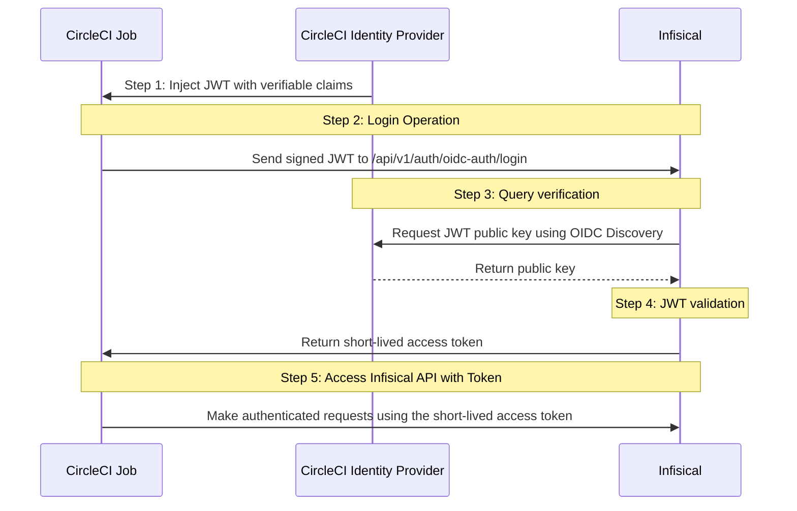

**OIDC Auth** is a platform-agnostic JWT-based authentication method that can be used to authenticate from any platform or environment using an identity provider with OpenID Connect.

## Diagram

The following sequence diagram illustrates the OIDC Auth workflow for authenticating CircleCI jobs with Infisical.



## Concept

At a high-level, Infisical authenticates a client by verifying the JWT and checking that it meets specific requirements (e.g. it is issued by a trusted identity provider) at the `/api/v1/auth/oidc-auth/login` endpoint. If successful,
then Infisical returns a short-lived access token that can be used to make authenticated requests to the Infisical API.

To be more specific:

1. CircleCI provides the running job with a valid OIDC token specific to the execution.
2. The CircleCI OIDC token is sent to Infisical at the `/api/v1/auth/oidc-auth/login` endpoint.
3. Infisical fetches the public key that was used to sign the identity token provided by CircleCI.
4. Infisical validates the JWT using the public key provided by the identity provider and checks that the subject, audience, and claims of the token matches with the set criteria.
5. If all is well, Infisical returns a short-lived access token that CircleCI jobs can use to make authenticated requests to the Infisical API.

<Note>Infisical needs network-level access to the CircleCI servers.</Note>

## Guide

In the following steps, we explore how to create and use identities to access the Infisical API using the OIDC Auth authentication method.

<Steps>
    <Step title="Creating an identity">
    To create an identity, head to your Organization Settings > Access Control > Identities and press **Create identity**.

    

    When creating an identity, you specify an organization level [role](/documentation/platform/access-controls/role-based-access-controls) for it to assume; you can configure roles in Organization Settings > Access Control > Organization Roles.

    

    Now input a few details for your new identity. Here's some guidance for each field:

    - Name (required): A friendly name for the identity.
    - Role (required): A role from the **Organization Roles** tab for the identity to assume. The organization role assigned will determine what organization level resources this identity can have access to.

    Once you've created an identity, you'll be redirected to a page where you can manage the identity.

    

    Since the identity has been configured with Universal Auth by default, you should re-configure it to use OIDC Auth instead. To do this, press to edit the **Authentication** section,
    remove the existing Universal Auth configuration, and add a new OIDC Auth configuration onto the identity.

    

    

    <Warning>Restrict access by configuring the Subject, Audiences, and Claims fields</Warning>

    Here's some more guidance on each field:
    - OIDC Discovery URL:  The URL used to retrieve the OpenID Connect configuration from the identity provider. This will be used to fetch the public key needed for verifying the provided JWT. This should be set to `https://oidc.circleci.com/org/<organization_id>` where `organization_id` refers to the CircleCI organization where the job is being run.
    - Issuer: The unique identifier of the identity provider issuing the JWT. This value is used to verify the iss (issuer) claim in the JWT to ensure the token is issued by a trusted provider. This should be set to `https://oidc.circleci.com/org/<organization_id>` as well.
    - CA Certificate: The PEM-encoded CA cert for establishing secure communication with the Identity Provider endpoints. This can be left as blank.
    - Subject: The expected principal that is the subject of the JWT. The format of the sub field for CircleCI OIDC tokens is `org/<organization_id>/project/<project_id>/user/<user_id>` where organization_id, project_id, and user_id are UUIDs that identify the CircleCI organization, project, and user, respectively. The user is the CircleCI user that caused this job to run.
    - Audiences: A list of intended recipients. This value is checked against the aud (audience) claim in the token. Set this to the CircleCI `organization_id` corresponding to where the job is running.
    - Claims: Additional information or attributes that should be present in the JWT for it to be valid. Refer to CircleCI's [documentation](https://circleci.com/docs/openid-connect-tokens) for the complete list of supported claims.
    - Access Token TTL (default is `2592000` equivalent to 30 days): The lifetime for an acccess token in seconds. This value will be referenced at renewal time.
    - Access Token Max TTL (default is `2592000`  equivalent to 30 days): The maximum lifetime for an acccess token in seconds. This value will be referenced at renewal time.
    - Access Token Max Number of Uses (default is `0`): The maximum number of times that an access token can be used; a value of `0` implies infinite number of uses.
    - Access Token Trusted IPs: The IPs or CIDR ranges that access tokens can be used from. By default, each token is given the `0.0.0.0/0`, allowing usage from any network address.
    <Tip>For more details on the appropriate values for the OIDC fields, refer to CircleCI's [documentation](https://circleci.com/docs/openid-connect-tokens). </Tip>
    <Info>The `subject`, `audiences`, and `claims` fields support glob pattern matching; however, we highly recommend using hardcoded values whenever possible.</Info>
    </Step>
    <Step title="Adding an identity to a project">
    To enable the identity to access project-level resources such as secrets within a specific project, you should add it to that project.

    To do this, head over to the project you want to add the identity to and go to Project Settings > Access Control > Machine Identities and press **Add identity**.

    Next, select the identity you want to add to the project and the project level role you want to allow it to assume. The project role assigned will determine what project level resources this identity can have access to.

    

    
    </Step>
    <Step title="Using CircleCI OIDC token to authenticate with Infisical">
        The following is an example of how to use the `$CIRCLE_OIDC_TOKEN` with the Infisical [terraform provider](https://registry.terraform.io/providers/Infisical/infisical/latest/docs) to manage resources in a CircleCI pipeline.

        ```yml config.yml
        version: 2.1

        jobs:
        terraform-apply:
            docker:
            - image: hashicorp/terraform:latest

            steps:
            - checkout
            - run:
                command: |
                    export INFISICAL_AUTH_JWT="$CIRCLE_OIDC_TOKEN"
                    terraform init
                    terraform apply -auto-approve

        workflows:
        version: 2
        build-and-test:
            jobs:
            - terraform-apply
        ```
        The Infisical terraform provider expects the  `INFISICAL_AUTH_JWT` environment variable to be set to the CircleCI OIDC token.
        ```hcl main.tf
        terraform {
            required_providers {
                infisical = {
                    source = "infisical/infisical"
                }
            }
        }

        provider "infisical" {
            host = "https://app.infisical.com"
            auth = {
                oidc = {
                    identity_id = "f2f5ee4c-6223-461a-87c3-406a6b481462"
                }
            }
        }

        resource "infisical_access_approval_policy" "prod-access-approval" {
            project_id = "09eda1f8-85a3-47a9-8a6f-e27f133b2a36"
            name = "my-approval-policy"
            environment_slug = "prod"
            secret_path = "/"
            approvers = [
            {
                type = "user"
                username = "sheen+200@infisical.com"
            },
            ]
            required_approvals = 1
            enforcement_level =  "soft"
        }
        ```
        <Note>
            Each identity access token has a time-to-live (TTL) which you can infer from the response of the login operation;
            the default TTL is `7200` seconds which can be adjusted.

            If an identity access token expires, it can no longer authenticate with the Infisical API. In this case,
            a new access token should be obtained by performing another login operation.
        </Note>
    </Step>

</Steps>
