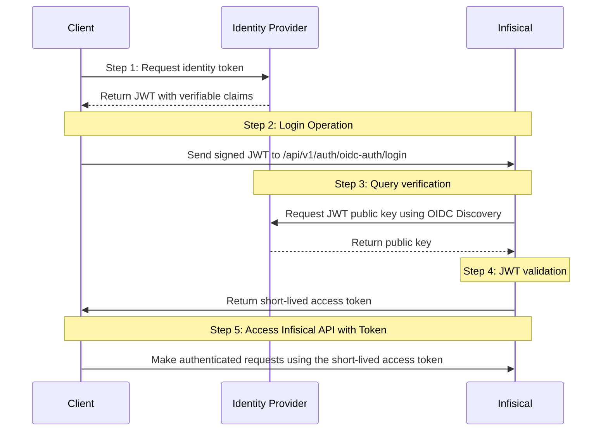

**OIDC Auth** is a platform-agnostic JWT-based authentication method that can be used to authenticate from any platform or environment using an identity provider with OpenID Connect.

## Diagram

The following sequence diagram illustrates the OIDC Auth workflow for authenticating clients with Infisical.



## Concept

At a high-level, Infisical authenticates a client by verifying the JWT and checking that it meets specific requirements (e.g. it is issued by a trusted identity provider) at the `/api/v1/auth/oidc-auth/login` endpoint. If successful,
then Infisical returns a short-lived access token that can be used to make authenticated requests to the Infisical API.

To be more specific:

1. The client requests an identity token from its identity provider.
2. The client sends the identity token to Infisical at the `/api/v1/auth/oidc-auth/login` endpoint.
3. Infisical fetches the public key that was used to sign the identity token from the identity provider using OIDC Discovery.
4. Infisical validates the JWT using the public key provided by the identity provider and checks that the subject, audience, and claims of the token matches with the set criteria.
5. If all is well, Infisical returns a short-lived access token that the client can use to make authenticated requests to the Infisical API.

<Note>
  Infisical needs network-level access to the identity provider configuration
  endpoints.
</Note>

## Guide

In the following steps, we explore how to create and use identities to access the Infisical API using the OIDC Auth authentication method.

<Steps>
    <Step title="Creating an identity">
    You can create an identity either at the organization level or directly at the project level. For more details on the differences between these scopes, see [Machine Identities](/documentation/platform/identities/machine-identities).

    <Tabs>
        <Tab title="Organization Level">
        To create an organization-level identity, head to your Organization Settings > Access Control > Identities and press **Create identity**.

        

        When creating an identity, you specify an organization level [role](/documentation/platform/access-controls/role-based-access-controls) for it to assume; you can configure roles in Organization Settings > Access Control > Organization Roles.

        

        Now input a few details for your new identity. Here's some guidance for each field:

        - Name (required): A friendly name for the identity.
        - Role (required): A role from the **Organization Roles** tab for the identity to assume. The organization role assigned will determine what organization level resources this identity can have access to.

        Once you've created an identity, you'll be redirected to a page where you can manage the identity.
        </Tab>
        <Tab title="Project Level">
        To create a project-level identity, navigate to your Project > Access Control > Machine Identities and press **Create identity**.

        Project-level identities are scoped to a single project and are useful for teams that manage their own workloads independently.

        When creating a project-level identity, you specify a project-level role for it to assume.
        </Tab>
    </Tabs>

    

    Since the identity has been configured with Universal Auth by default, you should re-configure it to use OIDC Auth instead. To do this, press to edit the **Authentication** section,
    remove the existing Universal Auth configuration, and add a new OIDC Auth configuration onto the identity.

    

    

    <Tip>Restrict access by configuring the Subject, Audiences, and Claims fields</Tip>

    Here's some more guidance on each field:
    - OIDC Discovery URL:  The URL used to retrieve the OpenID Connect configuration from the identity provider. This will be used to fetch the public key needed for verifying the provided JWT.
    - Issuer: The unique identifier of the identity provider issuing the JWT. This value is used to verify the iss (issuer) claim in the JWT to ensure the token is issued by a trusted provider.
    - CA Certificate: The PEM-encoded CA cert for establishing secure communication with the Identity Provider endpoints.
    - Subject: The expected principal that is the subject of the JWT. The `sub` (subject) claim in the JWT should match this value.
    - Audiences: A list of intended recipients. This value is checked against the aud (audience) claim in the token. The token's aud claim should match at least one of the audiences for it to be valid.
    - Claims: Additional information or attributes that should be present in the JWT for it to be valid.
    - Access Token TTL (default is `2592000` equivalent to 30 days): The lifetime for an acccess token in seconds. This value will be referenced at renewal time.
    - Access Token Max TTL (default is `2592000`  equivalent to 30 days): The maximum lifetime for an acccess token in seconds. This value will be referenced at renewal time.
    - Access Token Max Number of Uses (default is `0`): The maximum number of times that an access token can be used; a value of `0` implies infinite number of uses.
    - Access Token Trusted IPs: The IPs or CIDR ranges that access tokens can be used from. By default, each token is given the `0.0.0.0/0`, allowing usage from any network address.
    <Info>
        The `subject`, `audiences`, and `claims` fields support glob pattern matching; however, we highly recommend using hardcoded values whenever possible.
    </Info>

    </Step>

    <Step title="Adding an identity to a project (Organization-level identities only)">
    <Note>
    If you created a project-level identity in the previous step, you can skip this step as the identity is already scoped to your project.
    </Note>

    To enable an organization-level identity to access project-level resources such as secrets within a specific project, you should add it to that project.

    To do this, head over to the project you want to add the identity to and go to Project Settings > Access Control > Machine Identities and press **Add identity**.

    Next, select the identity you want to add to the project and the project level role you want to allow it to assume. The project role assigned will determine what project level resources this identity can have access to.

    

    
    </Step>
    <Step title="Accessing the Infisical API with the identity">
        To access the Infisical API as the identity, you need to fetch an identity token from an identity provider and make a request to the `/api/v1/auth/oidc-auth/login` endpoint in exchange for an access token.

        We provide an example below of how authentication is done with Infisical using OIDC. It is a snippet from the [official Github secrets action](https://github.com/Infisical/secrets-action).

        #### Sample usage
        ```javascript
        export const oidcLogin = async ({ identityId, domain, oidcAudience }) => {
            const idToken = await core.getIDToken(oidcAudience);

            const loginData = querystring.stringify({
                identityId,
                jwt: idToken,
            });

            try {
                const response = await axios({
                method: "post",
                url: `${domain}/api/v1/auth/oidc-auth/login`,
                headers: {
                    "Content-Type": "application/x-www-form-urlencoded",
                },
                data: loginData,
                });

                return response.data.accessToken;
            } catch (err) {
                core.error("Error:", err.message);
                throw err;
            }
        };
        ```

        #### Sample OIDC login response

        ```bash Response
        {
        "accessToken": "...",
        "expiresIn": 7200,
        "accessTokenMaxTTL": 43244
        "tokenType": "Bearer"
        }
        ```

        <Tip>
            We recommend using one of Infisical's clients like SDKs or the Infisical Agent to authenticate with Infisical using OIDC Auth as they handle the authentication process including the fetching of identity tokens for you.
        </Tip>

        <Note>
        Each identity access token has a time-to-live (TTL) which you can infer from the response of the login operation;
        the default TTL is `7200` seconds which can be adjusted.

        If an identity access token expires, it can no longer authenticate with the Infisical API. In this case,
        a new access token should be obtained by performing another login operation.
        </Note>
    </Step>

</Steps>
