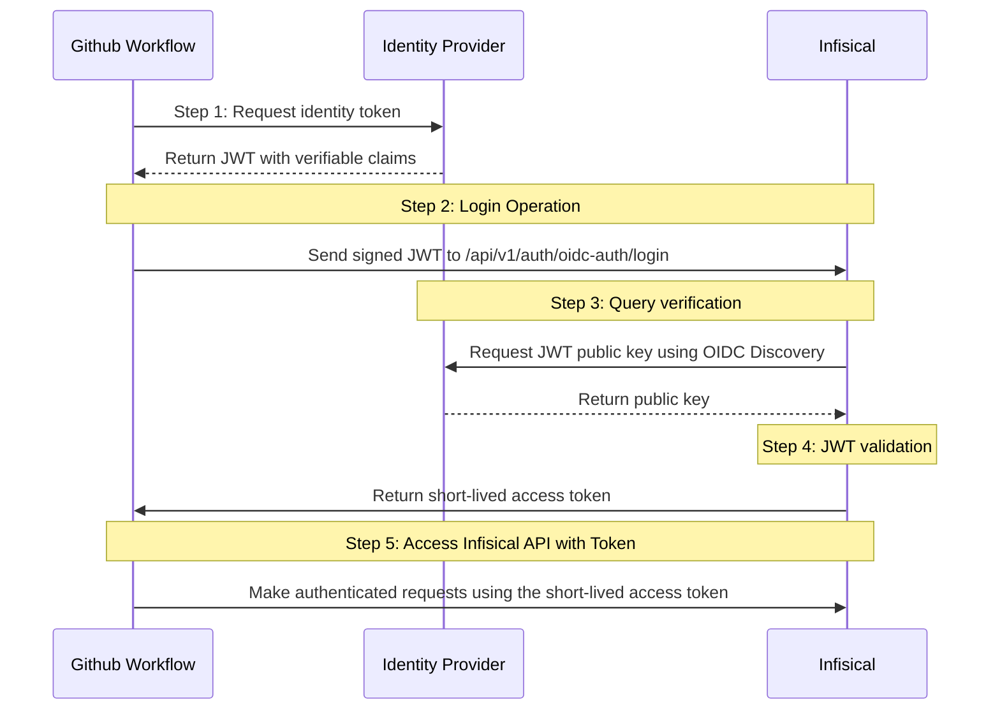

**OIDC Auth** is a platform-agnostic JWT-based authentication method that can be used to authenticate from any platform or environment using an identity provider with OpenID Connect.

## Diagram

The following sequence diagram illustrates the OIDC Auth workflow for authenticating Github workflows with Infisical.



## Concept

At a high-level, Infisical authenticates a client by verifying the JWT and checking that it meets specific requirements (e.g. it is issued by a trusted identity provider) at the `/api/v1/auth/oidc-auth/login` endpoint. If successful,
then Infisical returns a short-lived access token that can be used to make authenticated requests to the Infisical API.

To be more specific:

1. The Github workflow requests an identity token from Github's identity provider.
2. The fetched identity token is sent to Infisical at the `/api/v1/auth/oidc-auth/login` endpoint.
3. Infisical fetches the public key that was used to sign the identity token from Github's identity provider using OIDC Discovery.
4. Infisical validates the JWT using the public key provided by the identity provider and checks that the subject, audience, and claims of the token matches with the set criteria.
5. If all is well, Infisical returns a short-lived access token that the Github workflow can use to make authenticated requests to the Infisical API.

<Note>
  Infisical needs network-level access to Github's identity provider endpoints.
</Note>

## Guide

In the following steps, we explore how to create and use identities to access the Infisical API using the OIDC Auth authentication method.

<Steps>
    <Step title="Creating an identity">
    To create an identity, head to your Organization Settings > Access Control > Machine Identities and press **Create organization machine identity**.

    

    When creating an identity, you specify an organization level [role](/documentation/platform/access-controls/role-based-access-controls) for it to assume; you can configure roles in Organization Settings > Access Control > Organization Roles.

    

    Now input a few details for your new identity. Here's some guidance for each field:

    - Name (required): A friendly name for the identity.
    - Role (required): A role from the **Organization Roles** tab for the identity to assume. The organization role assigned will determine what organization level resources this identity can have access to.

    Once you've created an identity, you'll be redirected to a page where you can manage the identity.

    

    Since the identity has been configured with Universal Auth by default, you should re-configure it to use OIDC Auth instead. To do this, press to edit the **Authentication** section,
    remove the existing Universal Auth configuration, and add a new OIDC Auth configuration onto the identity.

    

    

    <Warning>Restrict access by configuring the Subject, Audiences, and Claims fields</Warning>

    Here's some more guidance on each field:
    - OIDC Discovery URL:  The URL used to retrieve the OpenID Connect configuration from the identity provider. This will be used to fetch the public key needed for verifying the provided JWT. This should be set to `https://token.actions.githubusercontent.com`
    - Issuer: The unique identifier of the identity provider issuing the JWT. This value is used to verify the iss (issuer) claim in the JWT to ensure the token is issued by a trusted provider. This should be set to `https://token.actions.githubusercontent.com`
    - CA Certificate: The PEM-encoded CA cert for establishing secure communication with the Identity Provider endpoints. For Github workflows, this can be left as blank.
    - Subject: The expected principal that is the subject of the JWT. The format of the sub field for GitHub workflow OIDC tokens is as follows: `"repo:<owner>/<repo>:<environment>"`. The environment can be where the GitHub workflow is running, such as `environment`, `ref`, or `job_workflow_ref`. For example, if you have a repository owned by octocat named example-repo, and the GitHub workflow is running on the main branch, the subject field might look like this: `repo:octocat/example-repo:ref:refs/heads/main`
    - Audiences: A list of intended recipients. This value is checked against the aud (audience) claim in the token. By default, set this to the URL of the repository owner, such as the organization that owns the repository (e.g. `https://github.com/octo-org`).
    - Claims: Additional information or attributes that should be present in the JWT for it to be valid. You can refer to Github's [documentation](https://docs.github.com/en/actions/deployment/security-hardening-your-deployments/about-security-hardening-with-openid-connect#understanding-the-oidc-token) for the complete list of supported claims.
    - Access Token TTL (default is `2592000` equivalent to 30 days): The lifetime for an acccess token in seconds. This value will be referenced at renewal time.
    - Access Token Max TTL (default is `2592000`  equivalent to 30 days): The maximum lifetime for an acccess token in seconds. This value will be referenced at renewal time.
    - Access Token Max Number of Uses (default is `0`): The maximum number of times that an access token can be used; a value of `0` implies infinite number of uses.
    - Access Token Trusted IPs: The IPs or CIDR ranges that access tokens can be used from. By default, each token is given the `0.0.0.0/0`, allowing usage from any network address.
    <Tip>If you are unsure about what to configure for the subject, audience, and claims fields you can use [github/actions-oidc-debugger](https://github.com/github/actions-oidc-debugger) to get the appropriate values. Alternatively, you can fetch the JWT from the workflow and inspect the fields manually.</Tip>
    <Info>The `subject`, `audiences`, and `claims` fields support glob pattern matching; however, we highly recommend using hardcoded values whenever possible.</Info>
    </Step>
    <Step title="Adding an identity to a project">
    To enable the identity to access project-level resources such as secrets within a specific project, you should add it to that project.

    To do this, head over to the project you want to add the identity to and go to Project Settings > Access Control > Machine Identities and press **Add identity**.

    Next, select the identity you want to add to the project and the project level role you want to allow it to assume. The project role assigned will determine what project level resources this identity can have access to.

    

    
    </Step>
    <Step title="Accessing the Infisical API with the identity">
        As a prerequisite, you will need to set `id-token:write` permissions for the Github workflow. This setting allows the JWT to be requested from Github's OIDC provider.

        ```yaml
        permissions:
            id-token: write # This is required for requesting the JWT
        ...
        ```

        To access the Infisical API as the identity, you need to fetch an identity token from Github's identity provider and make a request to the `/api/v1/auth/oidc-auth/login` endpoint in exchange for an access token.
        The identity token can be fetched using either of the following approaches:
        - Using environment variables on the runner (`ACTIONS_ID_TOKEN_REQUEST_URL` and `ACTIONS_ID_TOKEN_REQUEST_TOKEN`).
        ```yaml
        steps:
            - name: Request OIDC Token
                run: |
                echo "Requesting OIDC token..."
                TOKEN=$(curl -s -H "Authorization: Bearer $ACTIONS_ID_TOKEN_REQUEST_TOKEN" "$ACTIONS_ID_TOKEN_REQUEST_URL" | jq -r '.value')
                echo "TOKEN=$TOKEN" >> $GITHUB_ENV
        ```

        - Using `getIDToken()` from the Github Actions toolkit.

        Below is an example of how a Github workflow can be configured to fetch secrets from Infisical using the [Infisical Secrets Action](https://github.com/Infisical/secrets-action) with OIDC Auth.
        ```yaml
        name: Manual workflow

        on:
            workflow_dispatch:

        permissions:
            id-token: write # This is required for requesting the JWT

        jobs:
            build:
                runs-on: ubuntu-latest
                steps:
                    - uses: Infisical/secrets-action@v1.0.7
                    with:
                        method: "oidc"
                        env-slug: "dev"
                        project-slug: "ggggg-9-des"
                        identity-id: "6b579c00-5c85-4b44-aabe-f8a
        ...
        ```

        Preceding steps can then use the secret values injected onto the workflow's environment.

        <Tip>
            We recommend using [Infisical Secrets Action](https://github.com/Infisical/secrets-action) to authenticate with Infisical using OIDC Auth as it handles the authentication process including the fetching of identity tokens for you.
        </Tip>

        <Note>
        Each identity access token has a time-to-live (TTL) which you can infer from the response of the login operation;
        the default TTL is `7200` seconds which can be adjusted.

        If an identity access token expires, it can no longer authenticate with the Infisical API. In this case,
        a new access token should be obtained by performing another login operation.
        </Note>
    </Step>

</Steps>
