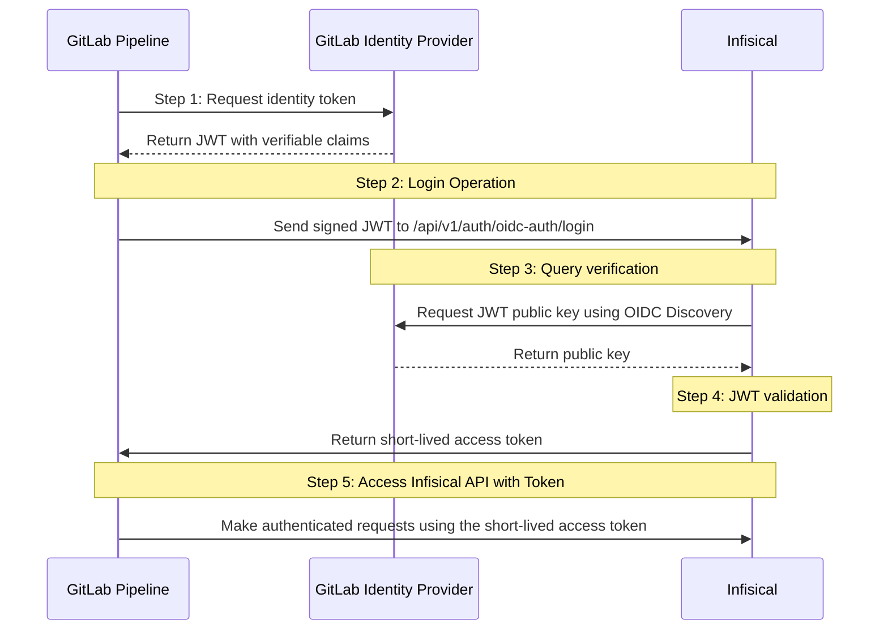

**OIDC Auth** is a platform-agnostic JWT-based authentication method that can be used to authenticate from any platform or environment using an identity provider with OpenID Connect.

## Diagram

The following sequence diagram illustrates the OIDC Auth workflow for authenticating GitLab pipelines with Infisical.



## Concept

At a high-level, Infisical authenticates a client by verifying the JWT and checking that it meets specific requirements (e.g. it is issued by a trusted identity provider) at the `/api/v1/auth/oidc-auth/login` endpoint. If successful,
then Infisical returns a short-lived access token that can be used to make authenticated requests to the Infisical API.

To be more specific:

1. The GitLab pipeline requests an identity token from GitLab's identity provider.
2. The fetched identity token is sent to Infisical at the `/api/v1/auth/oidc-auth/login` endpoint.
3. Infisical fetches the public key that was used to sign the identity token from GitLab's identity provider using OIDC Discovery.
4. Infisical validates the JWT using the public key provided by the identity provider and checks that the subject, audience, and claims of the token matches with the set criteria.
5. If all is well, Infisical returns a short-lived access token that the GitLab pipeline can use to make authenticated requests to the Infisical API.

<Note>
  Infisical needs network-level access to GitLab's identity provider endpoints.
</Note>

## Guide

In the following steps, we explore how to create and use identities to access the Infisical API using the OIDC Auth authentication method.

<Steps>
    <Step title="Creating an identity">
        To create an identity, head to your Organization Settings > Access Control > Identities and press **Create identity**. 
        
        
        
        When creating an identity, you specify an organization level [role](/documentation/platform/access-controls/role-based-access-controls) for it to assume; you can configure roles in Organization Settings > Access Control > Organization Roles.

        

        Now input a few details for your new identity. Here's some guidance for each field:

        - Name (required): A friendly name for the identity.
        - Role (required): A role from the **Organization Roles** tab for the identity to assume. The organization role assigned will determine what organization level resources this identity can have access to.

        Once you've created an identity, you'll be redirected to a page where you can manage the identity.

        

        Since the identity has been configured with Universal Auth by default, you should re-configure it to use OIDC Auth instead. To do this, press to edit the **Authentication** section,
        remove the existing Universal Auth configuration, and add a new OIDC Auth configuration onto the identity.

        

        

        <Warning>Restrict access by configuring the Subject, Audiences, and Claims fields</Warning>

        Here's some more guidance on each field:
        - OIDC Discovery URL: The URL used to retrieve the OpenID Connect configuration from the identity provider. This will be used to fetch the public key needed for verifying the provided JWT. For GitLab SaaS (GitLab.com), this should be set to `https://gitlab.com`. For self-hosted GitLab instances, use the domain of your GitLab instance.
        - Issuer: The unique identifier of the identity provider issuing the JWT. This value is used to verify the iss (issuer) claim in the JWT to ensure the token is issued by a trusted provider. This should also be set to the domain of the Gitlab instance.
        - CA Certificate: The PEM-encoded CA cert for establishing secure communication with the Identity Provider endpoints. For GitLab.com, this can be left blank.
        - Subject: The expected principal that is the subject of the JWT. For GitLab pipelines, this should be set to a string that uniquely identifies the pipeline and its context, in the format `project_path:{group}/{project}:ref_type:{type}:ref:{branch_name}` (e.g., `project_path:example-group/example-project:ref_type:branch:ref:main`).
        - Claims: Additional information or attributes that should be present in the JWT for it to be valid. You can refer to GitLab's [documentation](https://docs.gitlab.com/ee/ci/secrets/id_token_authentication.html#token-payload) for the list of supported claims.
        - Access Token TTL (default is `2592000` equivalent to 30 days): The lifetime for an acccess token in seconds. This value will be referenced at renewal time.
        - Access Token Max TTL (default is `2592000`  equivalent to 30 days): The maximum lifetime for an acccess token in seconds. This value will be referenced at renewal time.
        - Access Token Max Number of Uses (default is `0`): The maximum number of times that an access token can be used; a value of `0` implies infinite number of uses.
        - Access Token Trusted IPs: The IPs or CIDR ranges that access tokens can be used from. By default, each token is given the `0.0.0.0/0`, allowing usage from any network address.
        <Tip>For more details on the appropriate values for the OIDC fields, refer to GitLab's [documentation](https://docs.gitlab.com/ee/ci/secrets/id_token_authentication.html#token-payload). </Tip>
        <Info>The `subject`, `audiences`, and `claims` fields support glob pattern matching; however, we highly recommend using hardcoded values whenever possible.</Info>
    </Step>
    <Step title="Adding an identity to a project">
        To enable the identity to access project-level resources such as secrets within a specific project, you should add it to that project.

        To do this, head over to the project you want to add the identity to and go to Project Settings > Access Control > Machine Identities and press **Add identity**.

        Next, select the identity you want to add to the project and the project level role you want to allow it to assume. The project role assigned will determine what project level resources this identity can have access to.

        

        
    </Step>

    <Step title="Accessing the Infisical API with the identity">
        As demonstration, we will be using the Infisical CLI to fetch Infisical secrets and utilize them within a GitLab pipeline.

        To access Infisical secrets as the identity, you need to use an identity token from GitLab which matches the OIDC configuration defined for the machine identity.
        This can be done by defining the `id_tokens` property. The resulting token would then be used to login with OIDC like the following: `infisical login --method=oidc-auth --oidc-jwt=$GITLAB_TOKEN`

        Below is a complete example of how a GitLab pipeline can be configured to work with secrets from Infisical using the Infisical CLI with OIDC Auth:

        ```yaml
        image: ubuntu

        stages:
        - build

        build-job:
        stage: build
        id_tokens:
            INFISICAL_ID_TOKEN:
                aud: infisical-aud-test
        script:
            - apt update && apt install -y curl
            - curl -1sLf 'https://artifacts-cli.infisical.com/setup.deb.sh' | bash
            - apt-get update && apt-get install -y infisical
            - export INFISICAL_TOKEN=$(infisical login --method=oidc-auth --machine-identity-id=4e807a78-1b1c-4bd6-9609-ef2b0cf4fd54 --oidc-jwt=$INFISICAL_ID_TOKEN --silent --plain)
            - infisical run --projectId=1d0443c1-cd43-4b3a-91a3-9d5f81254a89 --env=dev -- npm run build
        ```

        The `id_tokens` keyword is used to request an ID token for the job. In this example, an ID token named `INFISICAL_ID_TOKEN` is requested with the audience (`aud`) claim set to "infisical-aud-test". This ID token will be used to authenticate with Infisical.
        <Note>
        Each identity access token has a time-to-live (TTL) which you can infer from the response of the login operation; the default TTL is `7200` seconds, which can be adjusted.

        If an identity access token expires, it can no longer authenticate with the Infisical API. In this case, a new access token should be obtained by performing another login operation.
        </Note>

    </Step>

</Steps>
