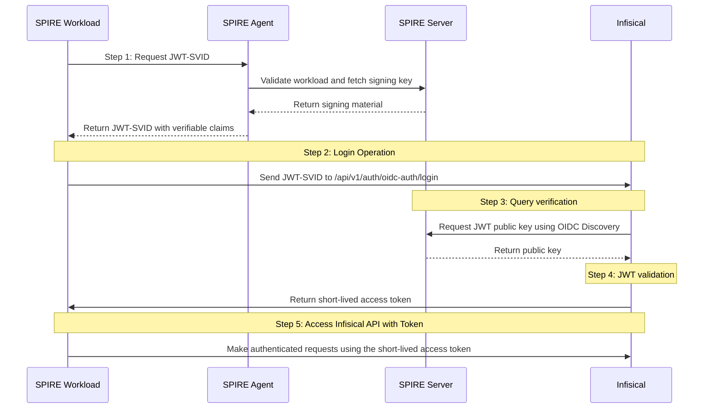

**OIDC Auth** is a platform-agnostic JWT-based authentication method that can be used to authenticate from any platform or environment using an identity provider with OpenID Connect.

## Diagram

The following sequence diagram illustrates the OIDC Auth workflow for authenticating SPIRE workloads with Infisical.



## Concept

At a high-level, Infisical authenticates a SPIRE workload by verifying the JWT-SVID and checking that it meets specific requirements (e.g. it is issued by a trusted SPIRE server) at the `/api/v1/auth/oidc-auth/login` endpoint. If successful,
then Infisical returns a short-lived access token that can be used to make authenticated requests to the Infisical API.

To be more specific:

1. The SPIRE workload requests a JWT-SVID from the local SPIRE Agent.
2. The SPIRE Agent validates the workload's identity and requests signing material from the SPIRE Server.
3. The SPIRE Agent returns a JWT-SVID containing the workload's SPIFFE ID and other claims.
4. The JWT-SVID is sent to Infisical at the `/api/v1/auth/oidc-auth/login` endpoint.
5. Infisical fetches the public key that was used to sign the JWT-SVID from the SPIRE Server using OIDC Discovery.
6. Infisical validates the JWT-SVID using the public key provided by the SPIRE Server and checks that the subject, audience, and claims of the token matches with the set criteria.
7. If all is well, Infisical returns a short-lived access token that the workload can use to make authenticated requests to the Infisical API.

<Note>Infisical needs network-level access to the SPIRE Server's OIDC Discovery endpoint.</Note>

## Prerequisites

Before following this guide, ensure you have:

- A running SPIRE deployment with both SPIRE Server and SPIRE Agent configured
- OIDC Discovery Provider deployed alongside your SPIRE Server
- Workload registration entries created in SPIRE for the workloads that need to access Infisical
- Network connectivity between Infisical and your OIDC Discovery Provider endpoint

For detailed SPIRE setup instructions, refer to the [SPIRE documentation](https://spiffe.io/docs/latest/spire-about/).

## OIDC Discovery Provider Setup

To enable JWT-SVID verification with Infisical, you need to deploy the OIDC Discovery Provider alongside your SPIRE Server. The OIDC Discovery Provider runs as a separate service that exposes the necessary OIDC endpoints.

In Kubernetes deployments, this is typically done by adding an `oidc-discovery-provider` container to your SPIRE Server StatefulSet:

```yaml
- name: spire-oidc
  image: ghcr.io/spiffe/oidc-discovery-provider:1.12.2
  args:
    - -config
    - /run/spire/oidc/config/oidc-discovery-provider.conf
  ports:
    - containerPort: 443
      name: spire-oidc-port
```

The OIDC Discovery Provider will expose the OIDC Discovery endpoint at `https://<spire-oidc-host>/.well-known/openid_configuration`, which Infisical will use to fetch the public keys for JWT-SVID verification.

<Note>For detailed setup instructions, refer to the [SPIRE OIDC Discovery Provider documentation](https://github.com/spiffe/spire/tree/main/support/oidc-discovery-provider).</Note>

## Guide

In the following steps, we explore how to create and use identities to access the Infisical API using the OIDC Auth authentication method with SPIFFE/SPIRE.

<Steps>
    <Step title="Creating an identity">
    To create an identity, head to your Organization Settings > Access Control > Identities and press **Create identity**.

    

    When creating an identity, you specify an organization level [role](/documentation/platform/access-controls/role-based-access-controls) for it to assume; you can configure roles in Organization Settings > Access Control > Organization Roles.

    

    Now input a few details for your new identity. Here's some guidance for each field:

    - Name (required): A friendly name for the identity.
    - Role (required): A role from the **Organization Roles** tab for the identity to assume. The organization role assigned will determine what organization level resources this identity can have access to.

    Once you've created an identity, you'll be redirected to a page where you can manage the identity.

    

    Since the identity has been configured with Universal Auth by default, you should re-configure it to use OIDC Auth instead. To do this, press to edit the **Authentication** section,
    remove the existing Universal Auth configuration, and add a new OIDC Auth configuration onto the identity.

    

    

    <Warning>Restrict access by configuring the Subject, Audiences, and Claims fields</Warning>

    Here's some more guidance on each field:
    - OIDC Discovery URL: The URL used to retrieve the OpenID Connect configuration from the SPIRE Server. This will be used to fetch the public key needed for verifying the provided JWT-SVID. This should be set to your SPIRE Server's OIDC Discovery endpoint, typically `https://<spire-server-host>:<port>/.well-known/openid_configuration`
    - Issuer: The unique identifier of the SPIRE Server issuing the JWT-SVID. This value is used to verify the iss (issuer) claim in the JWT-SVID to ensure the token is issued by a trusted SPIRE Server. This should match your SPIRE Server's configured issuer, typically `https://<spire-server-host>:<port>`
    - CA Certificate: The PEM-encoded CA certificate for establishing secure communication with the SPIRE Server endpoints. This should contain the CA certificate that signed your SPIRE Server's TLS certificate.
    - Subject: The expected SPIFFE ID that is the subject of the JWT-SVID. The format of the sub field for SPIRE JWT-SVIDs follows the SPIFFE ID format: `spiffe://<trust-domain>/<workload-path>`. For example: `spiffe://example.org/workload/api-server`
    - Audiences: A list of intended recipients for the JWT-SVID. This value is checked against the aud (audience) claim in the token. When workloads request JWT-SVIDs from SPIRE, they specify an audience (e.g., `infisical` or your service name). Configure this to match what your workloads use.
    - Claims: Additional information or attributes that should be present in the JWT-SVID for it to be valid. Standard SPIRE JWT-SVID claims include `sub` (SPIFFE ID), `aud` (audience), `exp` (expiration), and `iat` (issued at). You can also configure custom claims if your SPIRE Server includes additional metadata.
    - Access Token TTL (default is `2592000` equivalent to 30 days): The lifetime for an access token in seconds. This value will be referenced at renewal time.
    - Access Token Max TTL (default is `2592000` equivalent to 30 days): The maximum lifetime for an access token in seconds. This value will be referenced at renewal time.
    - Access Token Max Number of Uses (default is `0`): The maximum number of times that an access token can be used; a value of `0` implies infinite number of uses.
    - Access Token Trusted IPs: The IPs or CIDR ranges that access tokens can be used from. By default, each token is given the `0.0.0.0/0`, allowing usage from any network address.
    <Tip>SPIRE JWT-SVIDs contain standard claims like `sub` (SPIFFE ID), `aud` (audience), `exp`, and `iat`. The audience is typically specified when requesting the JWT-SVID (e.g., `spire-agent api fetch jwt -audience infisical`).</Tip>
    <Info>The `subject`, `audiences`, and `claims` fields support glob pattern matching; however, we highly recommend using hardcoded SPIFFE IDs whenever possible for better security.</Info>
    </Step>
    <Step title="Adding an identity to a project">
    To enable the identity to access project-level resources such as secrets within a specific project, you should add it to that project.

    To do this, head over to the project you want to add the identity to and go to Project Settings > Access Control > Machine Identities and press **Add identity**.

    Next, select the identity you want to add to the project and the project level role you want to allow it to assume. The project role assigned will determine what project level resources this identity can have access to.

    

    
    </Step>
    <Step title="Using JWT-SVID to authenticate with Infisical">
    Here's an example of how a workload can use its JWT-SVID to authenticate with Infisical and retrieve secrets:

    ```bash
    #!/bin/bash

    # Obtain JWT-SVID from SPIRE Agent
    JWT_SVID=$(spire-agent api fetch jwt -audience infisical -socketPath /run/spire/sockets/agent.sock | grep -A1 "token(" | tail -1)

    # Authenticate with Infisical using the JWT-SVID
    ACCESS_TOKEN=$(curl -s -X POST \
        -H "Content-Type: application/json" \
        -d "{\"identityId\":\"<your-identity-id>\",\"jwt\":\"$JWT_SVID\"}" \
        https://app.infisical.com/api/v1/auth/oidc-auth/login | jq -r '.accessToken')

    # Use the access token to retrieve secrets
    curl -s -H "Authorization: Bearer $ACCESS_TOKEN" \
        "https://app.infisical.com/api/v3/secrets/raw?workspaceSlug=<project-slug>&environment=<env-slug>&secretPath=/"
    ```

    <Note>
        Each identity access token has a time-to-live (TTL) which you can infer from the response of the login operation;
        the default TTL is `7200` seconds which can be adjusted.

        If an identity access token expires, it can no longer authenticate with the Infisical API. In this case,
        a new access token should be obtained by performing another login operation.
    </Note>

    <Tip>
        JWT-SVIDs from SPIRE have their own expiration time (typically short-lived). Ensure your application handles both JWT-SVID renewal from SPIRE and access token renewal from Infisical appropriately.
    </Tip>
    </Step>

</Steps>