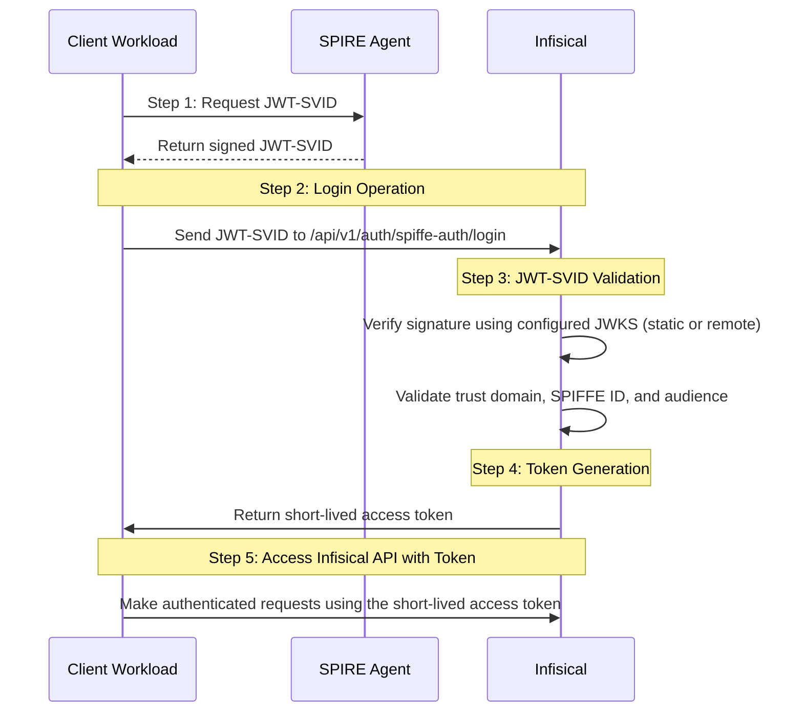

**SPIFFE Auth** is a SPIFFE-native authentication method that validates JWT-SVIDs issued by [SPIRE](https://spiffe.io/docs/latest/spire-about/) or other SPIFFE-compliant workload identity providers, allowing workloads with SPIFFE identities to securely authenticate with Infisical.

## Diagram

The following sequence diagram illustrates the SPIFFE Auth workflow for authenticating with Infisical.



## Concept

At a high level, Infisical authenticates a workload by verifying its JWT-SVID and checking that it meets specific requirements (e.g. its SPIFFE ID matches an allowed pattern, it belongs to the expected trust domain) at the `/api/v1/auth/spiffe-auth/login` endpoint. If successful, Infisical returns a short-lived access token that can be used to make authenticated requests to the Infisical API.

To be more specific:

1. The workload requests a JWT-SVID from its local SPIRE Agent (via the SPIFFE Workload API).
2. The JWT-SVID is sent to Infisical at the `/api/v1/auth/spiffe-auth/login` endpoint.
3. Infisical verifies the JWT-SVID signature using either:
   - Pre-configured JWKS (Static configuration)
   - JWKS fetched from a SPIRE bundle endpoint (Remote configuration)
4. Infisical validates that the token's trust domain matches the configured trust domain, the SPIFFE ID (`sub` claim) matches at least one of the allowed SPIFFE ID patterns, and the audience (`aud` claim) is in the allowed audiences list.
5. If all checks pass, Infisical returns a short-lived access token that the workload can use to make authenticated requests to the Infisical API.

<Note>
  For Remote configuration, Infisical needs network-level access to the configured SPIRE bundle endpoint. The trust bundle is fetched on-demand at login time and cached. If the cache is older than the configured refresh interval (default: 1 hour), Infisical fetches a fresh bundle before verifying the JWT-SVID. You can also force an immediate refresh via the API without waiting for the cache to expire.
</Note>

## Guide

In the following steps, we explore how to create and use identities to access the Infisical API using the SPIFFE authentication method.

<Steps>
  <Step title="Creating an identity">
    To create an identity, head to your Organization Settings > Access Control > [Identities](https://app.infisical.com/organization/access-management?selectedTab=identities) and press **Create identity**.

    

    When creating an identity, you specify an organization-level [role](/documentation/platform/access-controls/role-based-access-controls) for it to assume; you can configure roles in Organization Settings > Access Control > [Organization Roles](https://app.infisical.com/organization/access-management?selectedTab=roles).

    

    Input some details for your new identity:

    - **Name (required):** A friendly name for the identity.
    - **Role (required):** A role from the [**Organization Roles**](https://app.infisical.com/organization/access-management?selectedTab=roles) tab for the identity to assume. The organization role assigned will determine what organization-level resources this identity can have access to.

    Once you've created an identity, you'll be redirected to a page where you can manage the identity.

    

    Since the identity has been configured with [Universal Auth](https://infisical.com/docs/documentation/platform/identities/universal-auth) by default, you should reconfigure it to use SPIFFE Auth instead. To do this, click the cog next to **Universal Auth** and then select **Delete** in the options dropdown.

    

    

    Now create a new SPIFFE Auth Method.

    <Warning>Restrict access by properly configuring the trust domain, allowed SPIFFE IDs, and allowed audiences.</Warning>

    Here's some information about each field:

    **Configuration Type:**
    - **Static:** You provide the SPIRE JWKS JSON directly. Best for environments where the trust bundle is managed externally or does not change frequently.
    - **Remote:** Infisical automatically fetches and caches the trust bundle from a SPIRE bundle endpoint. Best for dynamic environments where keys rotate regularly.

    **Static configuration fields:**
    - **CA Bundle JWKS (required):** The JWKS JSON containing the public keys used to verify JWT-SVID signatures. You can obtain this from your SPIRE server's bundle endpoint or via `spire-server bundle show -format jwks`.

    **Remote configuration fields:**
    - **Bundle Endpoint URL (required):** The URL of the SPIRE bundle endpoint (e.g. `https://spire-server:8443`). Must use HTTPS. Infisical fetches the trust bundle on-demand at login time and caches it for the configured refresh interval.
    - **Bundle Endpoint Profile:** The authentication profile for the bundle endpoint.
      - `HTTPS Web` — Standard HTTPS with publicly trusted certificates.
      - `HTTPS SPIFFE` — HTTPS with a custom CA certificate for mTLS-secured endpoints.
    - **Bundle Endpoint CA Certificate:** The PEM-encoded CA certificate for verifying the bundle endpoint TLS connection. Required when using the `HTTPS SPIFFE` profile.
    - **Bundle Refresh Hint (seconds):** How long the cached trust bundle is considered fresh before Infisical re-fetches it on the next login. Defaults to `3600` (1 hour). You can force an immediate refresh at any time using the [refresh bundle API endpoint](/api-reference/endpoints/machine-identities/spiffe-auth/refresh-bundle).

    **Common fields for both configurations:**
    - **Trust Domain (required):** The SPIFFE trust domain that authenticating workloads must belong to (e.g. `example.org` or `prod.example.com`).
    - **Allowed SPIFFE IDs (required):** A comma-separated list of SPIFFE ID patterns that are permitted to authenticate. Supports [picomatch](https://github.com/micromatch/picomatch) glob patterns (e.g. `spiffe://example.org/ns/production/**`, `spiffe://example.org/ns/*/sa/my-service`).
    - **Allowed Audiences (required):** A comma-separated list of allowed audience values. The JWT-SVID's `aud` claim must contain at least one of these values.
    - **Access Token TTL (default is `2592000` equivalent to 30 days):** The lifetime for an access token in seconds. This value will be referenced at renewal time.
    - **Access Token Max TTL (default is `2592000` equivalent to 30 days):** The maximum lifetime for an access token in seconds. This value will be referenced at renewal time.
    - **Access Token Max Number of Uses (default is `0`):** The maximum number of times that an access token can be used; a value of `0` implies an infinite number of uses.
    - **Access Token Trusted IPs:** The IPs or CIDR ranges that access tokens can be used from. By default, each token is given the `0.0.0.0/0`, allowing usage from any network address.

  </Step>
  <Step title="Adding an identity to a project">
    To enable the identity to access project-level resources such as secrets within a specific project, you should add it to that project.

    To do this, head over to the project you want to add the identity to and go to Project Settings > Access Control > Machine Identities and press **Add identity**.

    Next, select the identity you want to add to the project and the project-level role you want to allow it to assume. The project role assigned will determine what project-level resources this identity can have access to.

    

    
  </Step>
  <Step title="Accessing the Infisical API with the identity">
    To access the Infisical API as the identity, you need to obtain a JWT-SVID from your SPIRE Agent that meets the validation requirements configured in the previous step.

    The JWT-SVID must:
    - Be signed by a key present in the configured JWKS (static or remote).
    - Have a `sub` claim containing a valid SPIFFE ID that matches one of the allowed SPIFFE ID patterns.
    - Have an `aud` claim containing at least one of the allowed audiences.
    - Belong to the configured trust domain.

    Once you have a valid JWT-SVID, use it to authenticate with Infisical at the `/api/v1/auth/spiffe-auth/login` endpoint.

    <Accordion title="Sample code for obtaining a JWT-SVID and authenticating">
      The following example uses Node.js, but you can use any language that supports the SPIFFE Workload API or can obtain a JWT-SVID from your SPIRE Agent.

      ```javascript
      const axios = require("axios");

      // Obtain JWT-SVID from SPIRE Agent via the Workload API,
      // or from your SPIFFE-compatible identity provider.
      const jwtSvid = "<your-jwt-svid>";

      const infisicalUrl = "https://app.infisical.com"; // or your self-hosted Infisical URL
      const identityId = "<your-identity-id>";

      const { data } = await axios.post(
        `${infisicalUrl}/api/v1/auth/spiffe-auth/login`,
        {
          identityId,
          jwt: jwtSvid,
        }
      );

      console.log("Access token:", data.accessToken);
      // Use data.accessToken for subsequent Infisical API requests
      ```
    </Accordion>

    <Accordion title="Using go-spiffe to fetch and authenticate">
      If your workload uses the [go-spiffe](https://github.com/spiffe/go-spiffe) library, you can fetch a JWT-SVID directly from the Workload API.

      ```go
      package main

      import (
        "bytes"
        "context"
        "encoding/json"
        "fmt"
        "io"
        "net/http"

        "github.com/spiffe/go-spiffe/v2/workloadapi"
      )

      func main() {
        ctx := context.Background()

        // Connect to the SPIRE Agent Workload API
        client, err := workloadapi.New(ctx, workloadapi.WithAddr("unix:///tmp/spire-agent/public/api.sock"))
        if err != nil {
          panic(err)
        }
        defer client.Close()

        // Fetch a JWT-SVID with the required audience
        svid, err := client.FetchJWTSVID(ctx, workloadapi.JWTSVIDParams{
          Audience: "infisical",
        })
        if err != nil {
          panic(err)
        }

        // Authenticate with Infisical
        payload, _ := json.Marshal(map[string]string{
          "identityId": "<your-identity-id>",
          "jwt":        svid.Marshal(),
        })

        resp, err := http.Post(
          "https://app.infisical.com/api/v1/auth/spiffe-auth/login",
          "application/json",
          bytes.NewReader(payload),
        )
        if err != nil {
          panic(err)
        }
        defer resp.Body.Close()

        body, _ := io.ReadAll(resp.Body)
        fmt.Println("Response:", string(body))
      }
      ```
    </Accordion>

    <Tip>
      We recommend using one of Infisical's clients like SDKs or the Infisical Agent to authenticate with Infisical using SPIFFE Auth as they handle the authentication process for you.
    </Tip>

    <Note>
      Each identity access token has a time-to-live (TTL) which you can infer from the response of the login operation;
      the default TTL is `2592000` seconds (30 days) which can be adjusted in the configuration.

      If an identity access token exceeds its max TTL or maximum number of uses, it can no longer authenticate with the Infisical API. In this case,
      a new access token should be obtained by performing another login operation with a valid JWT-SVID.
    </Note>
  </Step>
</Steps>
