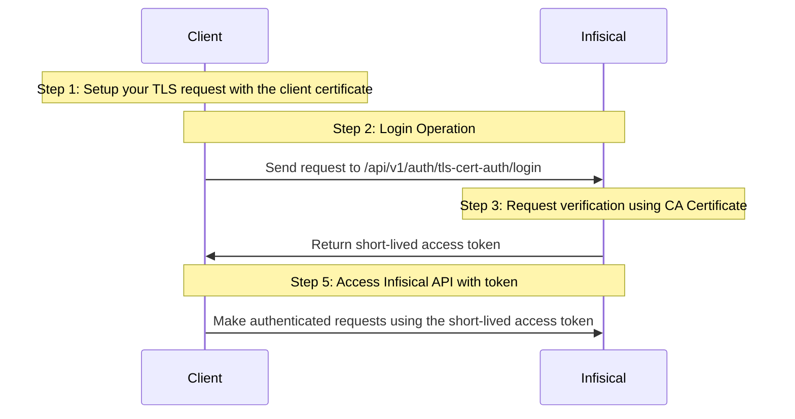

**TLS Certificate Auth** is an authentication method that verifies a user's TLS Client certificate using the provided CA Certificate, allowing secure access to Infisical resources.

## Diagram

The following sequence diagram illustrates the TLS Certificate Auth workflow for authenticating users with Infisical.



## Concept

At a high level, Infisical authenticates the client's TLS Certificate by verifying its identity and checking that it meets specific requirements (e.g., it is bound to the allowed common names) at the `/api/v1/auth/tls-cert-auth/login` endpoint. If successful, Infisical returns a short-lived access token that can be used to make authenticated requests to the Infisical API.

To be more specific:

1. The client sends a TLS request with the client certificate to Infisical at the `/api/v1/auth/tls-cert-auth/login` endpoint.
2. Infisical verifies the incoming request using the provided CA certificate.
3. Infisical checks the user's properties against set criteria such as Allowed Common Names.
4. If all checks pass, Infisical returns a short-lived access token that the client can use to make authenticated requests to the Infisical API.

<Accordion title="TLS with Load Balancer/Proxy">
  Most of the time, the Infisical server will be behind a load balancer or
  proxy. To propagate the TLS certificate from the load balancer to the
  instance, you can configure the TLS to send the client certificate as a header
  that is set as an [environment variable](/self-hosting/configuration/envars#param-identity-tls-cert-auth-client-certificate-header-key).
</Accordion>

<Note>
  Infisical US/EU and dedicated instances are deployed with AWS ALB. TLS Certificate Auth must flow through our ALB mTLS pass-through in order to authenticate.
  When you are authenticating with TLS Certificate Auth, you must use the port `8443` instead of the default `443`. Example: `https://app.infisical.com:8443/api/v1/auth/tls-cert-auth/login`
</Note>

## Guide

In the following steps, we explore how to create and use identities for your workloads and applications on TLS Certificate to
access the Infisical API using request signing.

<Warning>
  **Self-Hosted Users:** Before using TLS Certificate Auth, please review the
  [Security Requirements for Self-Hosted
  Deployments](#security-requirements-for-self-hosted-deployments) section below
  to ensure proper configuration and avoid security vulnerabilities.
</Warning>

### Creating an identity

To create an identity, head to your Organization Settings > Access Control > [Identities](https://app.infisical.com/organization/access-management?selectedTab=identities) and press **Create identity**.


When creating an identity, you specify an organization-level [role](/documentation/platform/access-controls/role-based-access-controls) for it to assume; you can configure roles in Organization Settings > Access Control > [Organization Roles](https://app.infisical.com/organization/access-management?selectedTab=roles).


Input some details for your new identity:

- **Name (required):** A friendly name for the identity.
- **Role (required):** A role from the [**Organization Roles**](https://app.infisical.com/organization/access-management?selectedTab=roles) tab for the identity to assume. The organization role assigned will determine what organization-level resources this identity can have access to.

Once you've created an identity, you'll be redirected to a page where you can manage the identity.


Since the identity has been configured with [Universal Auth](https://infisical.com/docs/documentation/platform/identities/universal-auth) by default, you should reconfigure it to use TLS Certificate Auth instead. To do this, click the cog next to **Universal Auth** and then select **Delete** in the options dropdown.


Now create a new TLS Certificate Auth Method.


Here's some information about each field:

- **CA Certificate:** A PEM encoded CA Certificate used to validate incoming TLS request client certificate.
- **Allowed Common Names:** A comma separated list of client certificate common names allowed.
- **Access Token TTL (default is `2592000` equivalent to 30 days):** The lifetime for an access token in seconds. This value will be referenced at renewal time.
- **Access Token Max TTL (default is `2592000` equivalent to 30 days):** The maximum lifetime for an access token in seconds. This value will be referenced at renewal time.
- **Access Token Max Number of Uses (default is `0`):** The maximum number of times that an access token can be used; a value of `0` implies an infinite number of uses.
- **Access Token Trusted IPs:** The IPs or CIDR ranges that access tokens can be used from. By default, each token is given the `0.0.0.0/0`, allowing usage from any network address.

### Adding an identity to a project

In order to allow an identity to access project-level resources such as secrets, you must add it to the relevant projects.

To do this, head over to the project you want to add the identity to and navigate to Project Settings > Access Control > Machine Identities and press **Add Identity**.


Select the identity you want to add to the project and the project-level role you want it to assume. The project role given to the identity will determine what project-level resources this identity can access.


### Accessing the Infisical API with the identity

To access the Infisical API as the identity, you need to send a TLS request to `/api/v1/auth/tls-cert-auth/login` endpoint.

Below is an example of how you can authenticate with Infisical using NodeJS.

```javascript
const fs = require("fs");
const https = require("https");
const axios = require("axios");

try {
  const clientCertificate = fs.readFileSync("client-cert.pem", "utf8");
  const clientKeyCertificate = fs.readFileSync("client-key.pem", "utf8");

  const infisicalUrl = "https://app.infisical.com:8443"; // or your self-hosted Infisical URL
  const identityId = "<your-identity-id>";

  // Create HTTPS agent with client certificate and key
  const httpsAgent = new https.Agent({
    cert: clientCertificate,
    key: clientKeyCertificate,
  });

  const { data } = await axios.post(
    `${infisicalUrl}/api/v1/auth/tls-cert-auth/login`,
    {
      identityId,
    },
    {
      httpsAgent: httpsAgent, // Pass the HTTPS agent with client cert
    }
  );

  console.log("result data: ", data); // access token here
} catch (err) {
  console.error(err);
}
```

<Note>
    Each identity access token has a time-to-live (TTL) which you can infer from the response of the login operation; the default TTL is `7200` seconds, which can be adjusted.

    If an identity access token expires, it can no longer access the Infisical API. A new access token should be obtained by performing another login operation.

</Note>

## Security Requirements for Self-Hosted Deployments

ALL TLS cert [login](/api-reference/endpoints/tls-cert-auth/login) requests **MUST** go through a load balancer/proxy that verifies certificate ownership:

- **REQUIRED:** Configure your load balancer/proxy to **require a proper TLS handshake with client certificate presentation**
- **REQUIRED:** Ensure the load balancer **verifies the client possesses the private key** corresponding to the certificate (standard TLS behavior)
- **NEVER** allow direct connections to Infisical for TLS cert auth - this enables header injection attacks
- **NEVER** forward certificate headers without requiring proper TLS certificate presentation

### Load Balancer Configuration Examples

- **AWS ALB:** Use mTLS listeners which require client certificate presentation during the TLS handshake
- **NGINX/HAProxy:** Configure SSL client certificate requirement with proper TLS handshake verification

<Note>
  Infisical will handle the actual certificate validation against the configured
  CA certificate and determine authentication permissions. The load balancer's
  role is to ensure certificate ownership, not certificate trust validation.
</Note>
