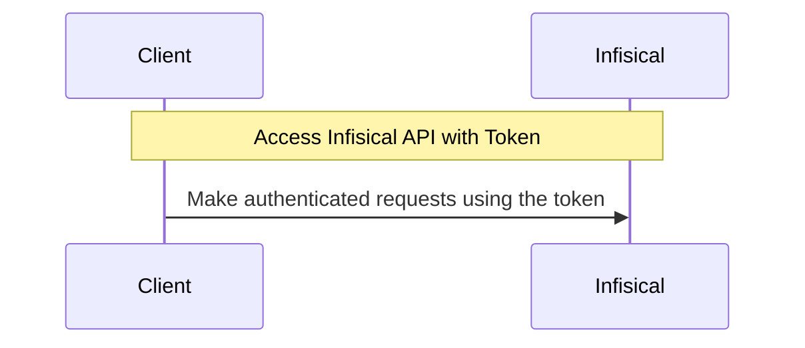

**Token Auth** is a platform-agnostic, simple authentication method that can be configured for a [machine identity](/documentation/platform/identities/machine-identities) to authenticate from any platform/environment using a token.

## Diagram

The following sequence diagram illustrates the Token Auth workflow for authenticating clients with Infisical.

## Concept

Token Auth is the simplest authentication method that a client can use to authenticate with Infisical.

Unlike other authentication methods where a client must exchange credential(s) for a short-lived access token to access the Infisical API,
Token Auth allows a client to make authenticated requests to the Infisical API directly using a token. Conceptually, this is similar to using an API Key.

To be more specific:

1. An operator creates an access token in the Infisical UI.
2. The operator shares the access token with the client which it can then use to make authenticated requests to the Infisical API.

## Guide

In the following steps, we explore how to create and use identities for your workloads and applications to access the Infisical API
using the Token Auth authentication method.

<Steps>
  <Step title="Creating an identity">
    To create an identity, head to your Organization Settings > Access Control > Identities and press **Create identity**.

    

    When creating an identity, you specify an organization level [role](/documentation/platform/access-controls/role-based-access-controls) for it to assume; you can configure roles in Organization Settings > Access Control > Organization Roles.

    

    Now input a few details for your new identity. Here's some guidance for each field:

    - Name (required): A friendly name for the identity.
    - Role (required): A role from the **Organization Roles** tab for the identity to assume. The organization role assigned will determine what organization level resources this identity can have access to.

    Once you've created an identity, you'll be redirected to a page where you can manage the identity.

    

    Since the identity has been configured with Universal Auth by default, you should re-configure it to use Token Auth instead. To do this, press to edit the **Authentication** section,
    remove the existing Universal Auth configuration, and add a new Token Auth configuration onto the identity.

    

    

    Here's some more guidance on each field:

    - Access Token TTL (default is `2592000` equivalent to 30 days): The lifetime for an acccess token in seconds. This value will be referenced at renewal time.
    - Access Token Max TTL (default is `2592000`  equivalent to 30 days): The maximum lifetime for an acccess token in seconds. This value will be referenced at renewal time.
    - Access Token Max Number of Uses (default is `0`): The maximum number of times that an access token can be used; a value of `0` implies infinite number of uses.
    - Access Token Trusted IPs: The IPs or CIDR ranges that access tokens can be used from. By default, each token is given the `0.0.0.0/0`, allowing usage from any network address.

    <Warning>
    Restricting access token usage to specific trusted IPs is a paid feature.

    If you’re using Infisical Cloud, then it is available under the Pro Tier. If you’re self-hosting Infisical, then you should contact sales@infisical.com to purchase an enterprise license to use it.
    </Warning>

  </Step>
  <Step title="Creating a Token">
    In order to use the identity with Token Auth, you'll need to create an (access) token; you can think of this token akin
    to an API Key used to authenticate with the Infisical API. With that, press **Create Token**.

    

    

    

    Copy the token and keep it handy as you'll need it to authenticate with the Infisical API.

  </Step>
  <Step title="Adding an identity to a project">
    To enable the identity to access project-level resources such as secrets within a specific project, you should add it to that project.

    To do this, head over to the project you want to add the identity to and go to Project Settings > Access Control > Machine Identities and press **Add identity**.

    Next, select the identity you want to add to the project and the project level role you want to allow it to assume. The project role assigned will determine what project level resources this identity can have access to.

    

    

  </Step>
  <Step title="Accessing the Infisical API with the identity">
    To access the Infisical API as the identity, you can use the generated access token from step 2
    to authenticate with the [Infisical API](/api-reference/overview/introduction).

    <Note>
      Each identity access token has a time-to-live (TTL) which you can infer from the response of the login operation;
      the default TTL is `7200` seconds which can be adjusted in the Token Auth configuration.

      If an identity access token expires, it can no longer authenticate with the Infisical API. In this case,
      a new access token should be obtained.
    </Note>

  </Step>
</Steps>

**FAQ**

<AccordionGroup>
<Accordion title="Why is the Infisical API rejecting my access token?">
  There are a few reasons for why this might happen:

  - The access token has expired. If this is the case, you should obtain a new access token or consider extending the token's TTL.
  - The identity is insufficiently permissioned to interact with the resources you wish to access.
  - The access token is being used from an untrusted IP.
</Accordion>
<Accordion title="What is access token renewal and TTL/Max TTL?">
  A identity access token can have a time-to-live (TTL) or incremental lifetime after which it expires.

  In certain cases, you may want to extend the lifespan of an access token; to do so, you must set a max TTL parameter.

A token can be renewed any number of times where each call to renew it can extend the token's lifetime by increments of the access token's TTL.
Regardless of how frequently an access token is renewed, its lifespan remains bound to the maximum TTL determined at its creation.

</Accordion>
</AccordionGroup>
