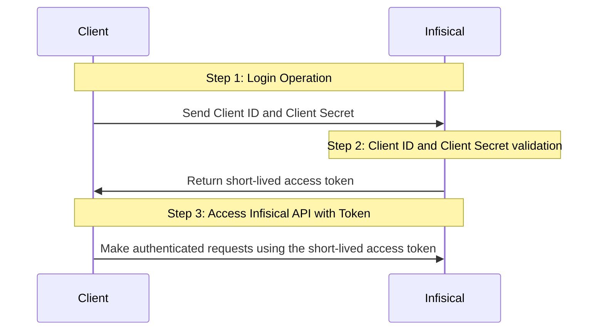

**Universal Auth** is a platform-agnostic authentication method that can be configured for a [machine identity](/documentation/platform/identities/machine-identities) to authenticate from any platform/environment using a Client ID and Client Secret.

## Diagram

The following sequence diagram illustrates the Universal Auth workflow for authenticating clients with Infisical.



## Concept

In this method, Infisical authenticates a client by verifying the credentials issued for it at the `/api/v1/auth/universal-auth/login` endpoint. If successful,
then Infisical returns a short-lived access token that can be used to make authenticated requests to the Infisical API.

To be more specific:

1. The client submits a **Client ID** and **Client Secret** to Infisical at the `/api/v1/auth/universal-auth/login` endpoint.
2. Infisical verifies the credential pair.
3. If all is well, Infisical returns a short-lived access token that the client can use to make authenticated requests to the Infisical API.

## Guide

In the following steps, we explore how to create and use identities for your workloads and applications to access the Infisical API
using the Universal Auth authentication method.

<Steps>
  <Step title="Creating an identity">
    To create an identity, head to your Organization Settings > Access Control > Identities and press **Create identity**.

    

    When creating an identity, you specify an organization level [role](/documentation/platform/role-based-access-controls) for it to assume; you can configure roles in Organization Settings > Access Control > Organization Roles.

    

    Now input a few details for your new identity. Here's some guidance for each field:

    - Name (required): A friendly name for the identity.
    - Role (required): A role from the **Organization Roles** tab for the identity to assume. The organization role assigned will determine what organization level resources this identity can have access to.

    Once you've created an identity, you'll be redirected to a page where you can manage the identity.

    

    Once you've created an identity, you'll be prompted to configure the **Universal Auth** authentication method for it.

    By default, the identity has been configured with Universal Auth. If you wish, you can edit the Universal Auth configuration
    details by pressing to edit the **Authentication** section.

    

    Here's some more guidance on each field:

    - Access Token TTL (default is `2592000` equivalent to 30 days): The lifetime for an acccess token in seconds. This value will be referenced at renewal time.
    - Access Token Max TTL (default is `2592000`  equivalent to 30 days): The maximum lifetime for an acccess token in seconds. This value will be referenced at renewal time.
    - Access Token Max Number of Uses (default is `0`): The maximum number of times that an access token can be used; a value of `0` implies infinite number of uses.
    - Client Secret Trusted IPs: The IPs or CIDR ranges that the **Client Secret** can be used from together with the **Client ID** to get back an access token. By default, **Client Secrets** are given the `0.0.0.0/0`, allowing usage from any network address.
    - Access Token Trusted IPs: The IPs or CIDR ranges that access tokens can be used from. By default, each token is given the `0.0.0.0/0`, allowing usage from any network address.

    <Warning>
    Restricting **Client Secret** and access token usage to specific trusted IPs is a paid feature.

    If you’re using Infisical Cloud, then it is available under the Pro Tier. If you’re self-hosting Infisical, then you should contact sales@infisical.com to purchase an enterprise license to use it.
    </Warning>

  </Step>
  <Step title="Creating a Client Secret">
    In order to use the identity, you'll need the non-sensitive **Client ID**
    of the identity and a **Client Secret** for it; you can think of these credentials akin to a username
    and password used to authenticate with the Infisical API.
    With that, press **Create Client Secret**.

    
    
    

    Feel free to input any (optional) details for the **Client Secret** configuration:

    - Description: A description for the **Client Secret**.
    - TTL (default is `0`): The time-to-live for the **Client Secret**. By default, the TTL will be set to 0 which implies that the **Client Secret** will never expire; a value of `0` implies an infinite lifetime.
    - Max Number of Uses (default is `0`): The maximum number of times that the **Client Secret** can be used together with the **Client ID** to get back an access token; a value of `0` implies infinite number of uses.
  </Step>
  <Step title="Adding an identity to a project">
    To enable the identity to access project-level resources such as secrets within a specific project, you should add it to that project.

    To do this, head over to the project you want to add the identity to and go to Project Settings > Access Control > Machine Identities and press **Add identity**.

    Next, select the identity you want to add to the project and the project level role you want to allow it to assume. The project role assigned will determine what project level resources this identity can have access to.

    

    

  </Step>
  <Step title="Accessing the Infisical API with the identity">
    To access the Infisical API as the identity, you should first perform a login operation
    that is to exchange the **Client ID** and **Client Secret** of the identity for an access token
    by making a request to the `/api/v1/auth/universal-auth/login` endpoint.

    <Tip>
      Choose the correct base URL based on your region:

      - For Infisical Cloud US users: `https://app.infisical.com`
      - For Infisical Cloud EU users: `https://eu.infisical.com`
    </Tip>

    #### Sample request

    ```bash Request
    curl --location --request POST 'https://app.infisical.com/api/v1/auth/universal-auth/login' \
      --header 'Content-Type: application/x-www-form-urlencoded' \
      --data-urlencode 'clientId=...' \
      --data-urlencode 'clientSecret=...'
    ```

    #### Sample response

    ```bash Response
    {
      "accessToken": "...",
      "expiresIn": 7200,
      "accessTokenMaxTTL": 43244
      "tokenType": "Bearer"
    }
    ```

    Next, you can use the access token to authenticate with the [Infisical API](/api-reference/overview/introduction)

    <Note>
      Each identity access token has a time-to-live (TTL) which you can infer from the response of the login operation;
      the default TTL is `7200` seconds which can be adjusted in the Universal Auth configuration.

      If an identity access token expires, it can no longer authenticate with the Infisical API. In this case,
      a new access token should be obtained by performing another login operation.
    </Note>

  </Step>
</Steps>

**FAQ**

<AccordionGroup>
<Accordion title="Why is the Infisical API rejecting my identity credentials?">
  There are a few reasons for why this might happen:

  - The client secret or access token has expired.
  - The identity is insufficiently permissioned to interact with the resources you wish to access.
  - The client secret/access token is being used from an untrusted IP.
</Accordion>
<Accordion title="What is access token renewal and TTL/Max TTL?">
  A identity access token can have a time-to-live (TTL) or incremental lifetime after which it expires.

  In certain cases, you may want to extend the lifespan of an access token; to do so, you must set a max TTL parameter.

A token can be renewed any number of times where each call to renew it can extend the token's lifetime by increments of the access token's TTL.
Regardless of how frequently an access token is renewed, its lifespan remains bound to the maximum TTL determined at its creation.

</Accordion>
</AccordionGroup>
