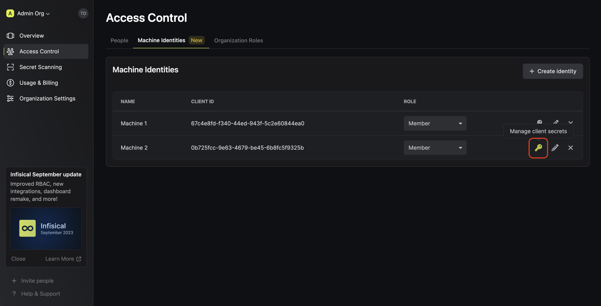
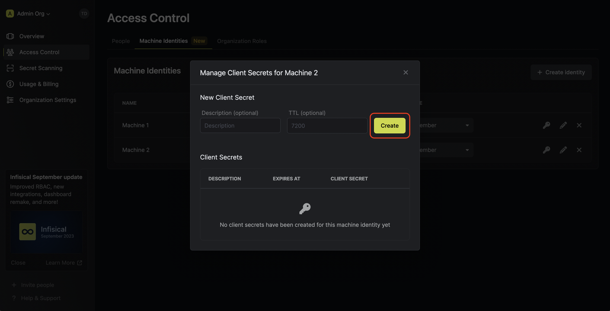
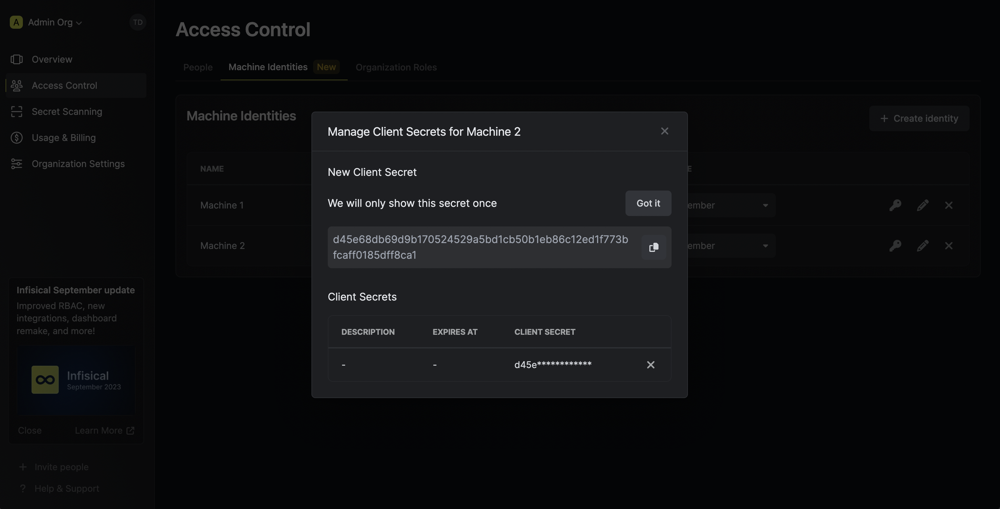

A (machine) identity is an entity that you can create in Infisical. 
Each identity represents a workload that wishes to access the Infisical API via an authentication method; this is similar to an IAM user in AWS or service account in GCP.

An identity can be provisioned scoped access to resources at the organization or project-level via [role-based access controls (RBAC)](/documentation/platform/role-based-access-controls). For instance, you may create a identity with scoped access to
fetch secrets back from the `/` path of the `development` environment in some project.

<Note>
  The identity feature is in beta.
  
  Currently, an identity can only be used to make authenticated requests to the Infisical API and does not work with any clients such as [Node SDK](https://github.com/Infisical/infisical-node)
  , [Python SDK](https://github.com/Infisical/infisical-python), CLI, K8s operator, Terraform Provider, etc.

  We will be releasing compatibility with it across clients in the coming quarter.
</Note>

Each identity can be configured an authentication method. The only supported method at the moment is **Universal Auth (UA)**
which has the following properties:

- In UA, each identity is assigned a **Client ID** for which you can generate one or more **Client Secret(s)**. Together, a **Client ID** and **Client Secret** can be exchanged for an access token (i.e. login operation) to authenticate with the Infisical API.
- UA supports restrictions on the number of times that the **Client Secret(s)** and access token(s) can be used.
- UA supports token renewal that is the ability to extend the lifetime of a token by its TTL up to its maximum TTL since its creation.
- UA supports IP allowlisting; this means you can restrict the usage of **Client Secret(s)** and access token to a specific IP or CIDR range.
- UA support expiration, so, if specified, the client secret of the identity will automatically be defunct after a period of time.
- UA tracks most recent usage of their client secrets and access tokens; it also keeps track of each token's usage count.

## Using identities

In the following steps, we explore how to create and use identities for your applications to access the Infisical API.

<Steps>
  <Step title="Creating an identity">
    To create an identity, head to your Organization Settings > Access Control > Machine Identities and press **Create identity**.

    
    
    

    Now input a few details for your new identity. Here's some guidance for each field:

    - Name (required): A friendly name for the identity.
    - Role (required): A role from the **Organization Roles** tab to permit the identity to access certain resources.
    
    Once you've created an identity, you'll be prompted to configure the **Universal Auth** authentication method for it.

    - Access Token TTL (default is `7200`): The incremental lifetime for an acccess token in seconds; a value of `0` implies an infinite incremental lifetime.
    - Access Token Max TTL (default is `7200`): The maximum lifetime for an acccess token in seconds; a value of `0` implies an infinite maximum lifetime.
    - Access Token Max Number of Uses (default is `0`): The maximum number of times that an access token can be used; a value of `0` implies infinite number of uses.
    - Client Secret Trusted IPs: The IPs or CIDR ranges that the **Client Secret** can be used from together with the **Client ID** to get back an access token. By default, **Client Secrets** are given the `0.0.0.0/0` entry representing all possible IPv4 addresses.
    - Access Token Trusted IPs: The IPs or CIDR ranges that access tokens can be used from. By default, each token is given the `0.0.0.0/0` entry representing all possible IPv4 addresses.

    <Warning>
    Restricting **Client Secret** and access token usage to specific trusted IPs is a paid feature.

    If you’re using Infisical Cloud, then it is available under the Pro Tier. If you’re self-hosting Infisical, then you should contact team@infisical.com to purchase an enterprise license to use it.
    </Warning>

  </Step>
  <Step title="Creating a Client Secret">
    In order to use the identity, you'll need the non-sensitive **Client ID**
    of the identity and a **Client Secret** for it; you can think of these credentials akin to a username
    and password used to authenticate with the Infisical API. With that, press on the key icon on the identity to generate a **Client Secret**
    for it.
    
    
    
    
    
    Feel free to input any (optional) details for the **Client Secret** configuration:
    
    - Description: A description for the **Client Secret**.
    - TTL (default is `0`): The time-to-live for the **Client Secret**. By default, the TTL will be set to 0 which implies that the **Client Secret** will never expire; a value of `0` implies an infinite lifetime.
    - Max Number of Uses (default is `0`): The maximum number of times that the **Client Secret** can be used together with the **Client ID** to get back an access token; a value of `0` implies infinite number of uses.
  </Step>
  <Step title="Adding an identity to a project">
    To enable the identity to access project-level resources such as secrets within a specific project, you should add it to that project.

    To do this, head over to the project you want to add the identity to and go to Project Settings > Access Control > Machine Identities and press **Add identity**.

    Next, select the identity you want to add to the project and the role you want to assign it.

    
    
    
  </Step>
  <Step title="Accessing the Infisical API with the identity">
    To access the Infisical API as the identity, you should first perform a login operation
    that is to exchange the **Client ID** and **Client Secret** of the MI for an access token
    by making a request to the `/api/v1/auth/universal-auth/login` endpoint.
    
    #### Sample request

    ```
    curl --location --request POST 'https://app.infisical.com/api/v1/auth/universal-auth/login' \
      --header 'Content-Type: application/x-www-form-urlencoded' \
      --data-urlencode 'clientSecret=...' \
      --data-urlencode 'clientId=...'
    ```
    
    #### Sample response
    
    ```
    {
      "accessToken": "...",
      "expiresIn": 7200,
      "tokenType": "Bearer"
    }
    ```

    Next, you can use the access token to authenticate with the [Infisical API](/api-reference/overview/introduction)
    
    <Note>
      Each identity access token has a time-to-live (TLL) which you can infer from the response of the login operation;
      the default TTL is `7200` seconds which can be adjusted.

      If an identity access token expires, it can no longer authenticate with the Infisical API. In this case,
      a new access token should be obtained from the aforementioned login operation.
    </Note>
  </Step>
</Steps>

**FAQ**

<AccordionGroup>
<Accordion title="What is the difference between an identity and service token?">
  A service token is a project-level authentication method that is being phased out in favor of identities.
  
  Amongst many differences, identities provide broader access over the Infisical API, utilizes the same role-based
  permission system used by users, and comes with ample more configurable security measures.
</Accordion>
<Accordion title="Why is the Infisical API rejecting my identity credentials?">
  There are a few reasons for why this might happen:
  
  - The client secret or access token has expired.
  - The identity is insufficently permissioned to interact with the resources you wish to access.
  - You are attempting to access a `/raw` secrets endpoint that requires your project to disable E2EE.
  - The client secret/access token is being used from an untrusted IP.
</Accordion>
<Accordion title="What is token renewal and TTL/Max TTL?">
  A identity access token can have a time-to-live (TTL) or incremental lifetime afterwhich it expires.
  
  In certain cases, you may want to extend the lifespan of an access token; to do so, you must use the max TTL parameter.
  When TTL and max TTL are equal, a token is not renewable; when max TTL is greater than TTL, a token is renewable.
  In the latter case, a token still expires at its TTL but its lifetime can be extended/renewed up until its max TLL.
  
  Note that the max TTL cannot be less than the TTL for an access token.
</Accordion>
<Accordion title="Why can I not create, read, update, or delete an identity?">
  There are a few reasons for why this might happen:
  
  - You have insufficient organization permissions to create, read, update, delete identities.
  - The identity you are trying to read, update, or delete is more privileged than yourself.
  - The role you are trying to create an identity for or update an identity to is more privileged than yours.
</Accordion>
<Accordion title="Can you provide examples for using glob patterns?">
  1. `/**`: This pattern matches all folders at any depth in the directory structure. For example, it would match folders like `/folder1/`, `/folder1/subfolder/`, and so on.

  2. `/*`: This pattern matches all immediate subfolders in the current directory. It does not match any folders at a deeper level. For example, it would match folders like `/folder1/`, `/folder2/`, but not `/folder1/subfolder/`.

  3. `/*/*`: This pattern matches all subfolders at a depth of two levels in the current directory. It does not match any folders at a shallower or deeper level. For example, it would match folders like `/folder1/subfolder/`, `/folder2/subfolder/`, but not `/folder1/` or `/folder1/subfolder/subsubfolder/`.

  4. `/folder1/*`: This pattern matches all immediate subfolders within the `/folder1/` directory. It does not match any folders outside of `/folder1/`, nor does it match any subfolders within those immediate subfolders. For example, it would match folders like `/folder1/subfolder1/`, `/folder1/subfolder2/`, but not `/folder2/subfolder/`.
</Accordion>
</AccordionGroup>