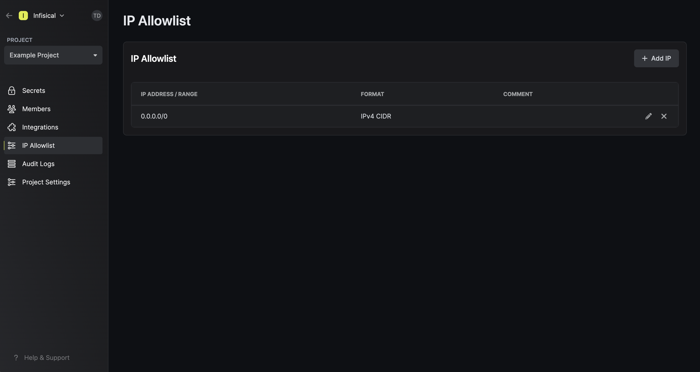
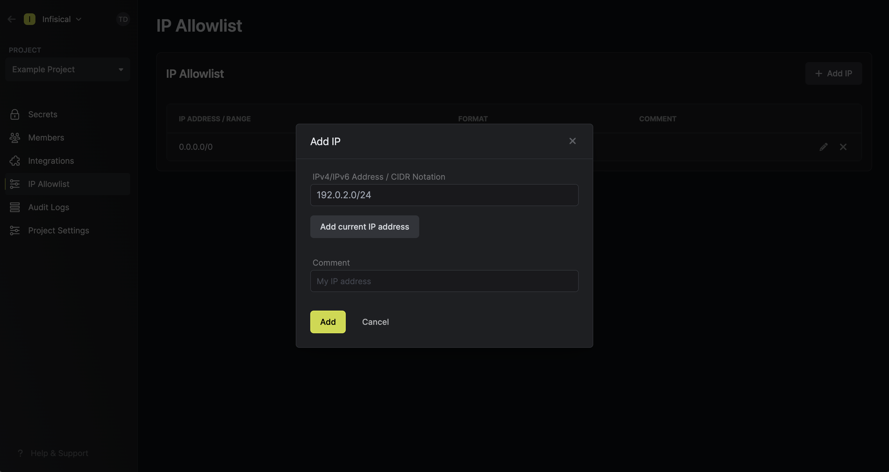

<Warning>
  IP allowlisting at the project-level is being replaced with IP allowlisting at the token-level now available with the Service Token V3 authentication method.
  
  Instead of providing trusted IPs (specific IPs and CIDR ranges) to be applied across all service tokens, 
  you can now specify trusted IPs at the token-level.
  
</Warning>
<Info>
  Note that IP Allowlisting is a paid feature.

  If you're using Infisical Cloud, then it is available under the **Pro Tier**. If you're self-hosting Infisical,
  then you should contact team@infisical.com to purchase an enterprise license to use it.
</Info>

Projects in Infisical can be configured to restrict client access to specific IP addresses or CIDR ranges. This applies to any client using service tokens and
can be useful, for example, for limiting access to traffic coming from corporate networks.

By default, each project is initialized with the `0.0.0.0/0` entry, representing all possible IPv4 addresses.
For enhanced security, we strongly recommend replacing the default entry with your client IPs to tighten access to your secrets.

<Note>
  You must be a project `admin` to manage your project's IP whitelist.
</Note>

## Creating a trusted IP entry

To create a trusted IP entry, head over to the **IP Whitelist** tab in your project. When creating an entry,
you can specify either a specific IP address like `192.0.2.1` or a CIDR range like `2001:db8::/32`; both IPv4 and IPv6
formats are accepted.

