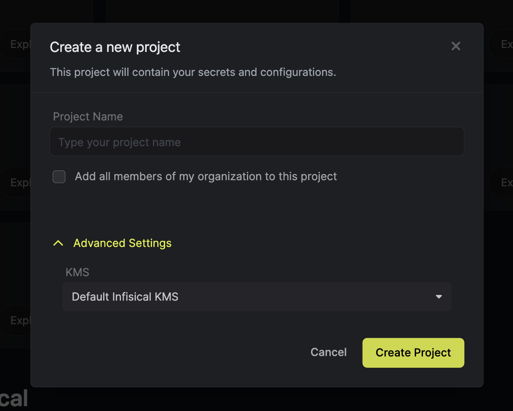
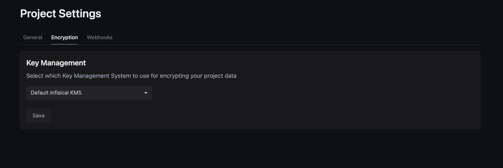

## Introduction

Infisical leverages a Key Management Service (KMS) to securely encrypt and decrypt secrets in your projects.

## Overview

Infisical's KMS ensures the security of your project's secrets through the following mechanisms:

- Each project is assigned a unique workspace key, which is responsible for encrypting and decrypting secret values.
- The workspace key itself is encrypted using the project's configured KMS.
- When secrets are requested, the workspace key is derived from the configured KMS. This key is then used to decrypt the secret values on-demand before sending them to the requesting client.

## Configuration

You can set the KMS for new projects during project creation.

For existing projects, you can configure the KMS from the Project Settings page.

## External KMS

Infisical supports the use of external KMS solutions to enhance security and compliance. You can configure your project to use services like [AWS Key Management Service](./aws-kms) for managing encryption.