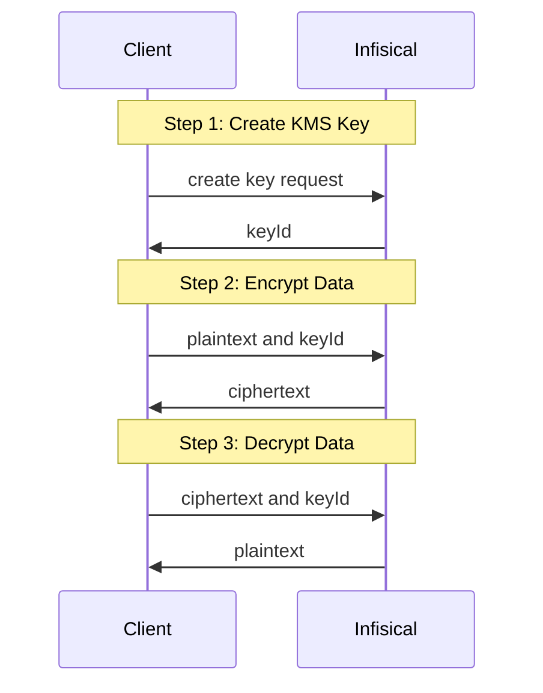

## Diagram

The following sequence diagram illustrates the KMS workflow for creating and using a cryptographic key.

<div align="center">

</div>

## Concept

At a high-level, Infisical generates a KMS key when requested, returning the `keyId` to the client. This `keyId` can then be used
to perform cryptographic operations such as encrypting and decrypting data.

To be more specific:

1. The client requests to create a key using the `/api/v1/kms/keys` endpoint.
2. Infisical generates a KMS key and returns the `keyId` to the client.
3. The client requests to encrypt `plaintext` data (base64 encoded) with the specified `keyId` using the `/api/v1/kms/keys/<key-id>/encrypt` endpoint.
4. Infisical returns the encrypted data or `ciphertext` (base64 encoded).
3. The client requests to decrypt the `ciphertext` data with the original `keyId` using the `/api/v1/kms/keys/<key-id>/decrypt` endpoint.
4. Infisical returns the decrypted `plaintext` data (base64 encoded).

<Note>
    Your keys will never be used or viewable outside of Infisical KMS.
    In addition, no data is stored when performing cryptographic operations.
</Note>

## Guide to Encrypting Data

In the following steps, we'll explore how to generate a cryptographic key and encrypt data.

<Tabs>
    <Tab title="Infisical UI">
        <Steps>
            <Step title="Creating a key">
                Navigate to Project > Key Management and tap on the Add Key button.
                

                Specify your key details. Here's some guidance on each field:

                - Name: A slug-friendly name for the key.
                - Type: The encryption algorithm associated with this key. By default symmetric `AES-GCM-256` is
                selected,
                but
                Infisical will continue to add more options down the road.
                - Description: An optional description of what this key is used for.

                
            </Step>
            <Step title="Encrypting your data">
                Once your key is generated, open the options menu for the newly created key and select encrypt data.
                

                Populate the text area with your data and tap on the Encrypt button.
                

                <Note>
                    If your data is already Base64 encoded make sure to toggle the respective switch on to avoid
                    redundant encoding.
                </Note>

                Copy and store the encrypted data.
                
            </Step>
        </Steps>
    </Tab>
    <Tab title="API">
        <Steps>
            <Step title="Creating a key">
                To create a cryptographic key, make an API request to the [Create KMS
                Key](/api-reference/endpoints/kms/keys/create) API endpoint.

                ### Sample request

                ```bash Request
                curl --request POST \
                --url https://app.infisical.com/api/v1/kms/keys \
                --header 'Content-Type: application/json' \
                --data '{
                    "projectId": "<project-id>",
                    "name": "my-secret-key",
                    "description": "...",
                    "encryptionAlgorithm": "aes-256-gcm"
                }'
                ```

                ### Sample response

                ```bash Response
                {
                    "key": {
                        "id": "<key-id>",
                        "description": "...",
                        "isDisabled": false,
                        "isReserved": false,
                        "orgId": "<org-id>",
                        "name": "my-secret-key",
                        "createdAt": "2023-11-07T05:31:56Z",
                        "updatedAt": "2023-11-07T05:31:56Z",
                        "projectId": "<project-id>"
                    }
                }
                ```
            </Step>
            <Step title="Encrypting data">
                To encrypt data, make an API request to the [Encrypt
                Data](/api-reference/endpoints/kms/keys/encrypt) API endpoint,
                specifying the key to use.

                <Note>
                    Make sure your data is Base64 encoded
                </Note>

                ### Sample request

                ```bash Request
                curl --request POST \
                --url https://app.infisical.com/api/v1/kms/keys/<key-id>/encrypt \
                --header 'Content-Type: application/json' \
                --data '{
                    "plaintext": "lUFHM5Ggwo6TOfpuN1S==" // base64 encoded plaintext
                }'
                ```

                ### Sample response

                ```bash Response
                {
                    "ciphertext": "HwFHwSFHwlMF6TOfp==" // base64 encoded ciphertext
                }
                ```
            </Step>
        </Steps>
    </Tab>
</Tabs>

## Guide to Decrypting Data

In the following steps, we'll explore how to decrypt data.

<Tabs>
    <Tab title="Infisical UI">
        <Steps>
            <Step title="Accessing your key">
                Navigate to Project > Key Management and open the options menu for the key used to encrypt the data
                you want to decrypt.
                


            </Step>
            <Step title="Decrypting your data">
                Paste your encrypted data into the text area and tap on the Decrypt button. Optionally, if your data was
                originally plain text, enable the decode Base64 switch.
                

                Your decrypted data will be displayed and can be copied for use.
                

            </Step>
        </Steps>
    </Tab>
    <Tab title="API">
        <Steps>
            <Step title="Decrypting data">
                To decrypt data, make an API request to the [Decrypt
                Data](/api-reference/endpoints/kms/keys/decrypt) API endpoint,
                specifying the key to use.

                ### Sample request

                ```bash Request
                curl --request POST \
                --url https://app.infisical.com/api/v1/kms/keys/<key-id>/decrypt \
                --header 'Content-Type: application/json' \
                --data '{
                    "ciphertext": "HwFHwSFHwlMF6TOfp==" // base64 encoded ciphertext
                }'
                ```

                ### Sample response

                ```bash Response
                {
                    "plaintext": "lUFHM5Ggwo6TOfpuN1S==" // base64 encoded plaintext
                }
                ```
            </Step>
        </Steps>

    </Tab>
</Tabs>

## FAQ

<AccordionGroup>
    <Accordion title="Is my data stored in Infisical KMS?">
        No. Infisical's KMS only provides cryptographic services and does not store any encrypted or decrypted data.
    </Accordion>
    <Accordion title="Can key material be accessed outside of Infisical KMS?">
        No. Infisical's KMS will never expose your keys, encrypted or decrypted, to external sources.
    </Accordion>
    <Accordion title="What algorithms does Infisical KMS support?">
        Currently, Infisical only supports AES-128-GCM and AES-256-GCM for encryption operations. We anticipate
        supporting more algorithms and cryptographic operations in the coming months.
    </Accordion>
</AccordionGroup>
