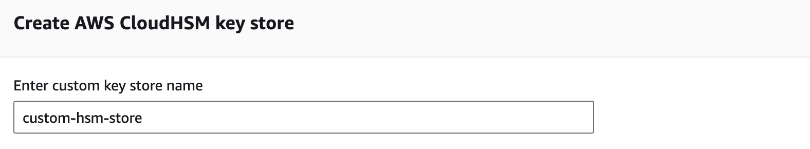
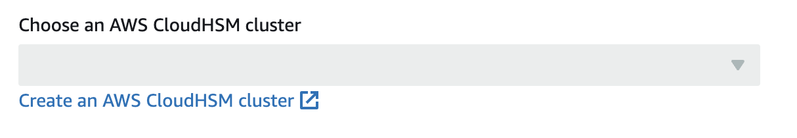
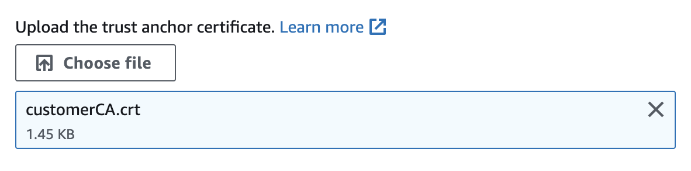
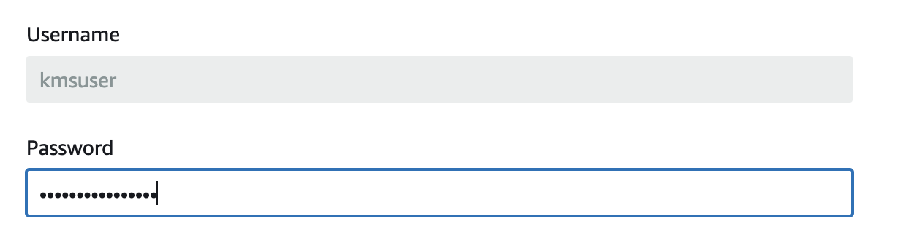
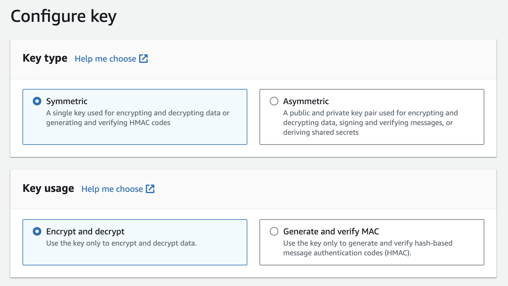
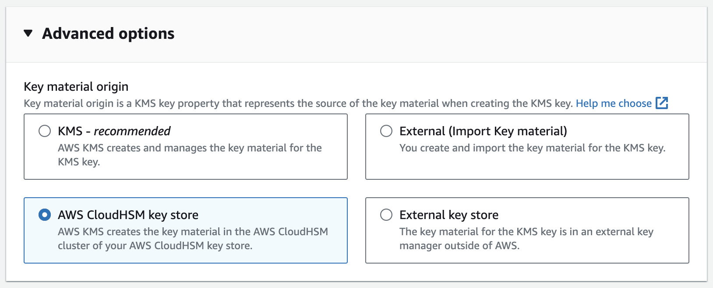
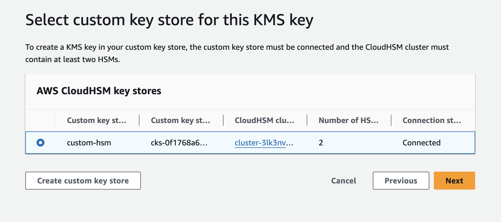

This guide provides instructions on securing Infisical project secrets using AWS CloudHSM. 
Integration with AWS CloudHSM is achieved by configuring it as a custom key store for AWS KMS. 
Follow the steps below to set up AWS KMS with AWS CloudHSM as the custom key store.

## Prepare AWS CloudHSM Cluster

Before you get started, you'll need to configure a AWS CloudHSM cluster which meets the following criteria:

- The cluster must be active.
- The cluster must not be associated with any other AWS KMS custom key store.
- The cluster must be configured with private subnets in at least two Availability Zones in the Region.
- The security group for the cluster must include inbound and outbound rules that allow TCP traffic on ports 2223-2225.
- The cluster must contain at least two active HSMs in different Availability Zones.

For more details on setting up your cluster, refer to the following [AWS documentation](https://docs.aws.amazon.com/kms/latest/developerguide/create-keystore.html#before-keystore).

## Set Up AWS KMS Custom Key Store

To set up an AWS KMS custom key store with AWS CloudHSM, you will need the following:

- The trust anchor certificate of your AWS CloudHSM cluster.
- A `kmsuser` user in the AWS CloudHSM cluster with the crypto-user role.

<Steps>
  <Step title="Navigate to Key store creation page">
    In the AWS console, head over to `AWS KMS` > `AWS CloudHSM key stores` and click **Create key store**.
  </Step>
  <Step title="Add key store name">
    Input the custom key store name. 
  </Step>
  <Step title="Select HSM cluster">
    Select the AWS CloudHSM cluster. You should be able to select the cluster if it meets the required criteria mentioned above. 
    
  </Step>
  <Step title="Upload trust anchor certificate">
    Upload your CloudHSM's cluster trust anchor certificate file. 
    
  </Step>
  <Step title="Provide cluster user password">
    Input the password of the `kmsuser` crypto-user in your cluster. 
    
  </Step>
  <Step title="Finish key store creation">
    Proceed with creating the AWS CloudHSM key store.
  </Step>
</Steps>

For more details, refer to the following [AWS documentation](https://docs.aws.amazon.com/kms/latest/developerguide/create-keystore.html#create-keystore-console).

## Create AWS KMS Key
Next, you'll need to create a AWS KMS key where you will set the key store you created previously. 

<Steps>
  <Step title="Navigate to AWS KMS key creation page">
    In your AWS console, proceed to `AWS KMS` > `Customer managed keys` and click **Create**.
  </Step>
  <Step title="Set key options">
    Set Key type to `Symmetric` and Key usage to `Encrypt and decrypt`. 
    
  </Step>
  <Step title="Select key material origin">
    In the advanced options, for the Key material origin field, select `AWS CloudHSM key store`. Then, click next. 
    
  </Step>
  <Step title="Choose key store">
    Select the AWS CloudHSM key store you created earlier. 
    
  </Step>
  <Step title="Finish KMS key creation">
    Proceed with creating the AWS KMS Key.
  </Step>
</Steps>

## Connect Infisical to AWS KMS Key

You should now have an AWS KMS that has a custom key store set to AWS CloudHSM. 
To secure project resources, you will need to add this AWS KMS to your Infisical organization. To learn how, refer to the documentation [here](./aws-kms).