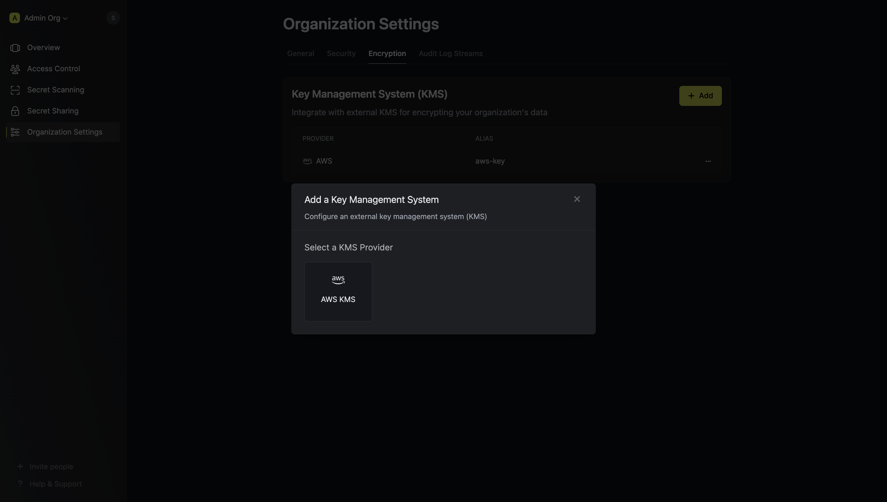

To enhance the security of your Infisical projects, you can now encrypt your secrets using an external Key Management Service (KMS).
When external KMS is configured for your project, all encryption and decryption operations will be handled by the chosen KMS.
This guide will walk you through the steps needed to configure external KMS support with AWS KMS.

## Prerequisites

Before you begin, you'll first need to choose a method of authentication with AWS from below.

<Tabs>
  <Tab title="Method 1: Assume Role (Recommended)">
  <Steps>
    <Step title="Create the Managing User IAM Role">
      1. Navigate to the [Create IAM Role](https://console.aws.amazon.com/iamv2/home#/roles/create?step=selectEntities) page in your AWS Console.
        

      2. Select **AWS Account** as the **Trusted Entity Type**.
      3. Choose **Another AWS Account** and enter **381492033652** (Infisical AWS Account ID). This restricts the role to be assumed only by Infisical. If you are self-hosting, provide the AWS account number where Infisical is hosted.
      4. Optionally, enable **Require external ID** and enter your Infisical **project ID** to further enhance security.
    </Step>
    <Step title="Add Required Permissions for the IAM Role">
      Use the following custom policy to grant the minimum permissions required by Infisical to integrate with AWS KMS

      ```json
      {
        "Version": "2012-10-17",
        "Statement": [
          {
            "Sid": "AllowKMSAccess",
            "Effect": "Allow",
              "Action": [
                "kms:Decrypt",
                "kms:Encrypt",
                "kms:DescribeKey"
            ],
            "Resource": "*"
          }
        ]
      }
      ```
    </Step>

  </Steps>
  </Tab>
  <Tab title="Method 2: Access Key">
      Navigate to your IAM user and add a policy to grant the following permissions:
      ```json
      {
        "Version": "2012-10-17",
        "Statement": [
          {
            "Sid": "AllowKMSAccess",
            "Effect": "Allow",
              "Action": [
                "kms:Decrypt",
                "kms:Encrypt",
                "kms:DescribeKey"
            ],
            "Resource": "*"
          }
        ]
      }
      ```
  </Tab>
</Tabs>

## Setup AWS KMS in the Organization Settings

Next, you will need to follow the steps listed below to add AWS KMS for your organization.

<Steps>
  <Step title="Navigate to the organization settings and select the 'Encryption' tab.">
	
  </Step>
  <Step title="Click on the 'Add' button">
	
    Click the 'Add' button to begin adding a new external KMS.
  </Step>
  <Step title="Select 'AWS KMS'">
	
     Choose 'AWS KMS' from the list of encryption providers.
  </Step>
  <Step title="Provide the inputs for AWS KMS">
    Selecting AWS as the provider will require you input the following fields. 

	<ParamField path="Alias" type="string" required>
		Name for referencing the AWS KMS key within the organization.
	</ParamField>

    <ParamField path="Description" type="string">
        Short description of the AWS KMS key.
    </ParamField>

    <ParamField path="Authentication Mode" type="string" required>
    	Authentication mode for AWS, either "AWS Assume Role" or "Access Key".
    </ParamField>

    <ParamField path="IAM Role ARN For Role Assumption" type="string">
        ARN of the AWS role to assume for providing Infisical access to the AWS KMS Key (required if Authentication Mode is "AWS Assume Role")
    </ParamField>

    <ParamField path="Assume Role External ID" type="string">
    	Custom identifier for additional validation during role assumption.
    </ParamField>

    <ParamField path="Access Key ID" type="string">
    	AWS IAM Access Key ID for authentication (required if Authentication Mode is "Access Key").
    </ParamField>

    <ParamField path="Secret Access Key" type="string">
        AWS IAM Secret Access Key for authentication (required if Authentication Mode is "Access Key").
    </ParamField>

    <ParamField path="AWS Region" type="string" required>
    	AWS region where the AWS KMS Key is located.
    </ParamField>
    <ParamField path="AWS KMS Key ID" type="string">
    	Key ID of the AWS KMS Key. If left blank, Infisical will generate and use a new AWS KMS Key in the specified region.
        
    </ParamField>

  </Step>
  <Step title="Click Save">
    Save your configuration to apply the settings.
  </Step>
</Steps>

You now have an AWS KMS Key configured at the organization level. You can assign these AWS KMS keys to existing Infisical projects by visiting the 'Project Settings' page.

## Assign AWS KMS Key to an Existing Project

To assign the AWS KMS key you added to your organization, follow the steps below.

<Steps>
  <Step title="Open Project Settings and select to the Encryption Tab">
    
  </Step>
  <Step title="Under the Key Management section, select your newly added AWS KMS key from the dropdown">
    
    Choose the AWS KMS key you configured earlier.
  </Step>
  <Step title="Click Save">
    Once you have selected the KMS of choice, click save.
  </Step>
</Steps>
