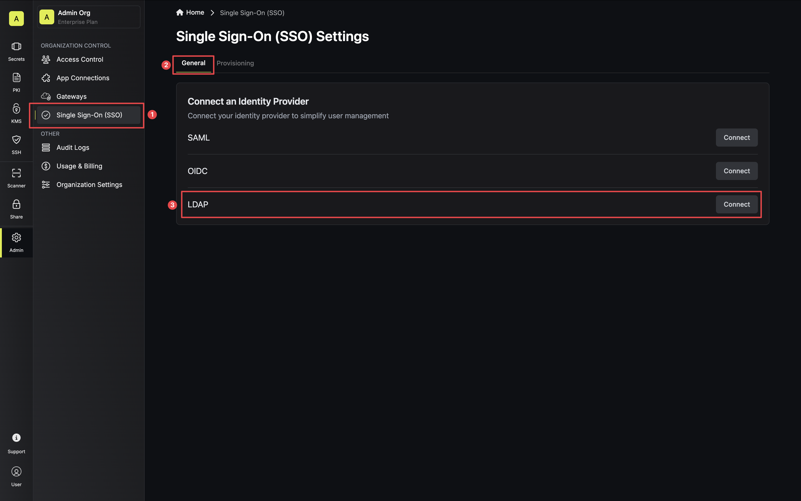

<Info>
  LDAP is a paid feature. If you're using Infisical Cloud, then it is available
  under the **Enterprise Tier**. If you're self-hosting Infisical, then you
  should contact sales@infisical.com to purchase an enterprise license to use
  it.
</Info>

Prerequisites:

- You must have an email address to use LDAP, regardless of whether or not you use that email address to sign in.

<Steps>
    <Step title="Prepare LDAP in JumpCloud">
        In JumpCloud, head to USER MANAGEMENT > Users and create a new user via the **Manual user entry** option. This user
        will be used as a privileged service account to facilitate Infisical's ability to bind/search the LDAP directory.

        When creating the user, input their **First Name**, **Last Name**, **Username** (required), **Company Email** (required), and **Description**.
        Also, create a password for the user.

        Next, under User Security Settings and Permissions > Permission Settings, check the box next to **Enable as LDAP Bind DN**.

        
    </Step>
    <Step title="Prepare the LDAP configuration in Infisical">
            In Infisical, head to the **Single Sign-On (SSO)** page and select the **General** tab. Select **Connect** for **LDAP**.

            

            Next, input your JumpCloud LDAP server settings.

            

            Here's some guidance for each field:

            - URL: The LDAP server to connect to (`ldaps://ldap.jumpcloud.com:636`).
            - Bind DN: The distinguished name of object to bind when performing the user search (`uid=<ldap-user-username>,ou=Users,o=<your-org-id>,dc=jumpcloud,dc=com`).
            - Bind Pass: The password to use along with `Bind DN` when performing the user search.
            - User Search Base / User DN: Base DN under which to perform user search (`ou=Users,o=<your-org-id>,dc=jumpcloud,dc=com`).
            - Unique User Attribute: The attribute to use as the unique identifier of LDAP users such as `sAMAccountName`, `cn`, `uid`, `objectGUID` ... If left blank, defaults to `uidNumber`
            - User Search Filter (optional): Template used to construct the LDAP user search filter (`(uid={{username}})`).
            - Group Search Base / Group DN (optional): LDAP search base to use for group membership search (`ou=Users,o=<your-org-id>,dc=jumpcloud,dc=com`).
            - Group Filter (optional): Template used when constructing the group membership query (`(&(objectClass=groupOfNames)(member=uid={{.Username}},ou=Users,o=<your-org-id>,dc=jumpcloud,dc=com))`)
            - CA Certificate: The CA certificate to use when verifying the LDAP server certificate (instructions to obtain the certificate for JumpCloud [here](https://jumpcloud.com/support/connect-to-ldap-with-tls-ssl)).

            <Tip>
                When filling out the **Bind DN** and **Bind Pass** fields, refer to the username and password of the user created in Step 1.

                Also, for the **Bind DN** and **Search Base / User DN** fields, you'll want to use the organization ID that appears
                in your LDAP instance **ORG DN**.
            </Tip>
    </Step>
    <Step title="Test the LDAP connection">
      Once you've filled out the LDAP configuration, you can test that part of the configuration is correct by pressing the **Test Connection** button.

      Infisical will attempt to bind to the LDAP server using the provided **URL**, **Bind DN**, and **Bind Pass**. If the operation is successful, then Infisical will display a success message; if not, then Infisical will display an error message and provide a fuller error in the server logs.

        
    </Step>
    <Step title="Define mappings from LDAP groups to groups in Infisical">
     In order to sync LDAP groups to Infisical, head to the **LDAP Group Mappings** section to define mappings from LDAP groups to groups in Infisical.

     

     Group mappings ensure that users who log into Infisical via LDAP are added to or removed from the Infisical group(s) that corresponds to the LDAP group(s) they are a member of.

     

     Each group mapping consists of two parts:
     - LDAP Group CN: The common name of the LDAP group to map.
     - Infisical Group: The Infisical group to map the LDAP group to.

     For example, suppose you want to automatically add a user who is part of the LDAP group with CN `Engineers` to the Infisical group `Engineers` when the user sets up their account with Infisical.

     In this case, you would specify a mapping from the LDAP group with CN `Engineers` to the Infisical group `Engineers`.
     Now when the user logs into Infisical via LDAP, Infisical will check the LDAP groups that the user is a part of whilst referencing the group mappings you created earlier. Since the user is a member of the LDAP group with CN `Engineers`, they will be added to the Infisical group `Engineers`.
     In the future, if the user is no longer part of the LDAP group with CN `Engineers`, they will be removed from the Infisical group `Engineers` upon their next login.
     <Note>
          Prior to defining any group mappings, ensure that you've created the Infisical groups that you want to map the LDAP groups to.
          You can read more about creating (user) groups in Infisical [here](/documentation/platform/groups).
     </Note>

   </Step>
    <Step title="Enable LDAP in Infisical">
            Enabling LDAP allows members in your organization to log into Infisical via LDAP.
            
    </Step>

</Steps>

Resources:

- [JumpCloud Cloud LDAP Guide](https://jumpcloud.com/support/use-cloud-ldap)
