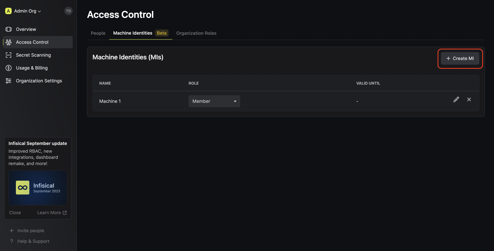
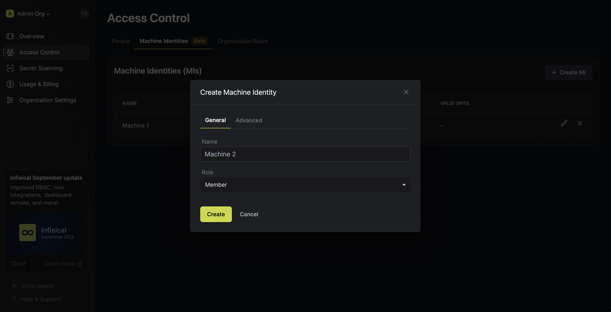
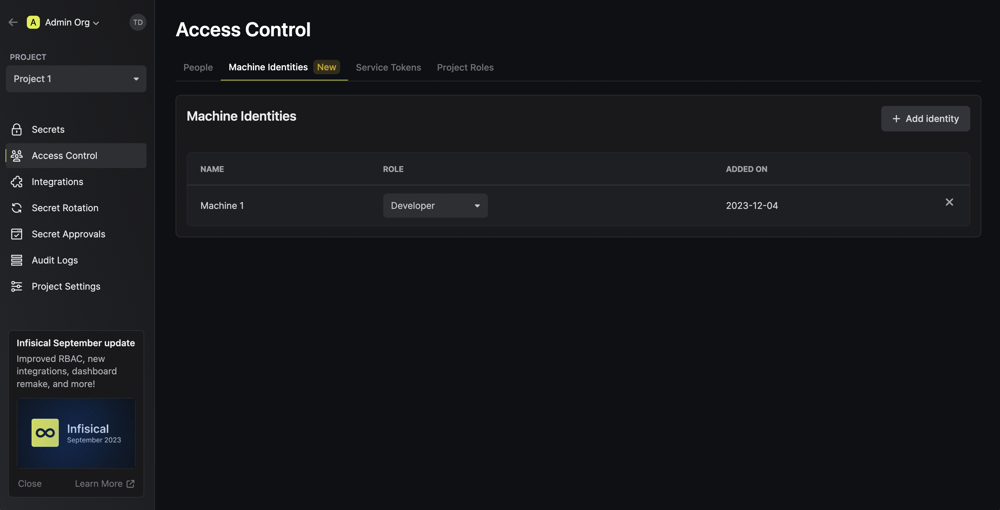
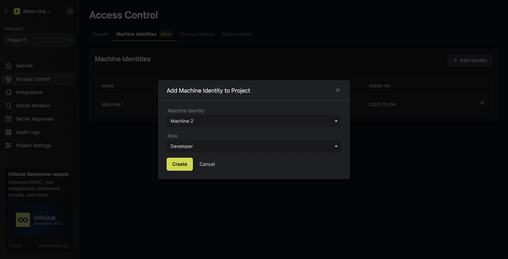

A machine identity (MI) is an entity that you can create in Infisical. The MI represents a workload that wishes to access the Infisical API and comes with its own authentication credential.

Similar to a user, a MI can be provisioned scoped access to resources at the organization or project-level. For instance, you may create a MI with scoped access to
fetch secrets back from the `/` path of the `development` environment in some project.

<Note>
  The MI feature is in beta.
  
  Currently, a MI can only be used to make authenticated requests to the Infisical API and does not work with any clients such as [Node SDK](https://github.com/Infisical/infisical-node)
  , [Python SDK](https://github.com/Infisical/infisical-python), CLI, K8s operator, Terraform Provider, etc.

  We will be releasing compatibility with it across clients in the coming quarter.
</Note>

Here's a few pointers to get you acquainted with MIs:

- When you create a MI, you get issued a refresh token that can be exchanged for an access token to authenticate with the Infisical API.
- MIs support IP allowlisting; this means you can restrict the usage of a MI access token to a specific IP or CIDR range.
- MIs rely on the role-based permission system to provision access to resources like secrets.
- MIs support expiration, so, if specified, the refresh token of the MI will automatically be defunct after a period of time.
- MIs tracks most recent usage of their refresh and access tokens; they also keeps track of each token's usage count.
- MIs are editable.

## Using machine identities

In the following steps, we explore how to create and use MIs for your applications to access the Infisical API.

<Steps>
  <Step title="Creating a MI">
    To create a machine identity, head to your Organization Settings > Access Control > Machine Identities and press **Create MI**.

    
    
    

    Now input a few details for your new MI; note that only the fields in the **General** tab are required. Here's some guidance for each field:

    - Name (required): A friendly name for the MI
    - Role (required): A role from the **Organization Roles** tab to permit the MI to access certain resources.
    - Refresh Token Expires In: The number of days from now to deactivate the MI refresh token
    - Trusted IPs: The IPs or CIDR ranges that the refresh and access tokens can be used from. By default, each token is given the `0.0.0.0/0` entry representing all possible IPv4 addresses.
    - Access Token TTL: The time-to-live for each acccess token in seconds.
    - Refresh Token Rotation: Whether or not to return a new refresh token when exchanging an existing refresh token; if enabled, the existing refresh token is invalidated upon the refresh operation.

    <Warning>
    Restricting token usage to specific trusted IPs is a paid feature.

    If you’re using Infisical Cloud, then it is available under the Pro Tier. If you’re self-hosting Infisical, then you should contact team@infisical.com to purchase an enterprise license to use it.
    </Warning>

    Once you've created the MI, you'll be issued a refresh token for it; copy the token and keep it handy.
  </Step>
  <Step title="Adding a MI to a project">
    If you intend the MI access project-level resources such as secrets within a specific project, you should add it to that project.

    To do this, head over to the project you want to add the MI to and go to Project Settings > Access Control > Machine Identities and press **Add MI**.

    Next, select the MI you want to add to the project and the role you want to assign it.

    
    
    
  </Step>
  <Step title="Accessing the Infisical API with the MI">
    To access the Infisical API as the MI, you should first exchange the MI refresh token from **Step 1** for an access token
    by making a request to the `/api/v3/machines/me/token` endpoint.
    
    #### Sample request

    ```
    curl --location --request POST 'http://localhost:8080/api/v3/machines/me/token' \
      --header 'Content-Type: application/x-www-form-urlencoded' \
      --data-urlencode 'refreshToken=<token>'
    ```
    
    #### Sample response
    
    ```
    {
      "refreshToken": "...",
      "accessToken": "...",
      "expiresIn": 7200,
      "tokenType": "Bearer"
    }
    ```

    Next, you can use the access token to authenticate with the [Infisical API](/api-reference/overview/introduction)
    
    <Note>
      Each MI access token has a time-to-live (TLL) which you can infer from the response of the refresh token exchange;
      the default TTL is `7200` seconds which can be adjusted in the **Advanced** settings of the MI.

      If a MI access token expires, it can no longer authenticate with the Infisical API. In this case,
      a new access token should be obtained from the refresh token exchange.
    </Note>
  </Step>
</Steps>

**FAQ**

<AccordionGroup>
<Accordion title="What is the difference between a machine identity and service token?">
  A service token is a project-level authentication method that is being phased out in favor of MIs.
  
  Amongst many differences, MIs provide broader access over the Infisical API with the same role-based
  permission system used by users.
</Accordion>
<Accordion title="Why is the Infisical API rejecting my machine identity credentials?">
  There are a few reasons for why this might happen:
  
  - The refresh/access token has expired.
  - The MI is insufficently permissioned to interact with the resources you wish to access.
  - You are attempting to access a `/raw` secrets endpoint that requires your project to disable E2EE.
  - The refresh/access token is being used from an untrusted IP.
</Accordion>
<Accordion title="Can you provide examples for using glob patterns?">
  1. `/**`: This pattern matches all folders at any depth in the directory structure. For example, it would match folders like `/folder1/`, `/folder1/subfolder/`, and so on.

  2. `/*`: This pattern matches all immediate subfolders in the current directory. It does not match any folders at a deeper level. For example, it would match folders like `/folder1/`, `/folder2/`, but not `/folder1/subfolder/`.

  3. `/*/*`: This pattern matches all subfolders at a depth of two levels in the current directory. It does not match any folders at a shallower or deeper level. For example, it would match folders like `/folder1/subfolder/`, `/folder2/subfolder/`, but not `/folder1/` or `/folder1/subfolder/subsubfolder/`.

  4. `/folder1/*`: This pattern matches all immediate subfolders within the `/folder1/` directory. It does not match any folders outside of `/folder1/`, nor does it match any subfolders within those immediate subfolders. For example, it would match folders like `/folder1/subfolder1/`, `/folder1/subfolder2/`, but not `/folder2/subfolder/`.
</Accordion>
</AccordionGroup>