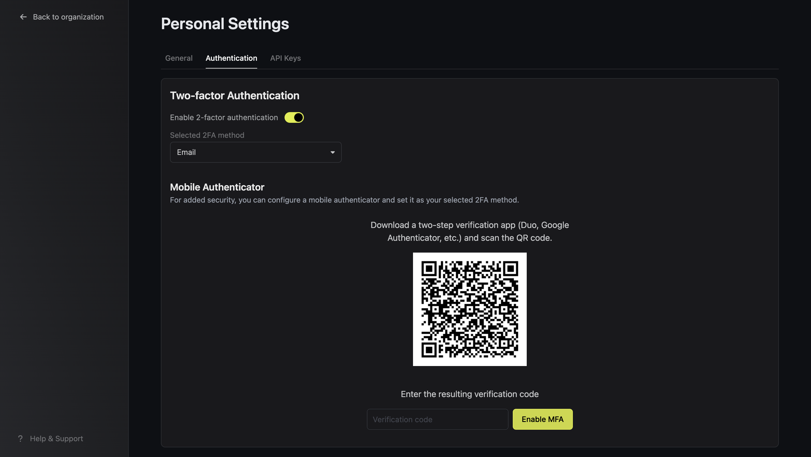
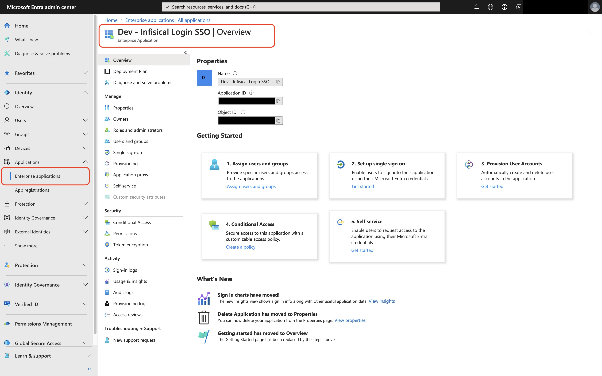
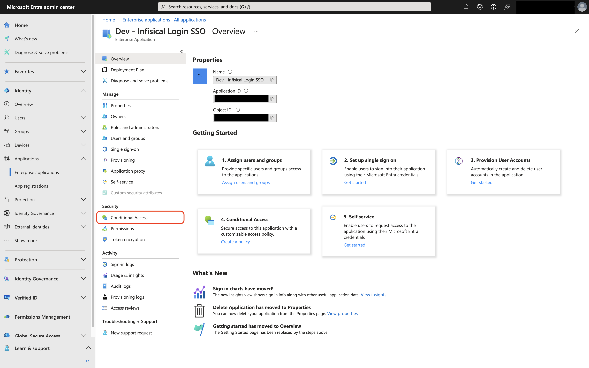
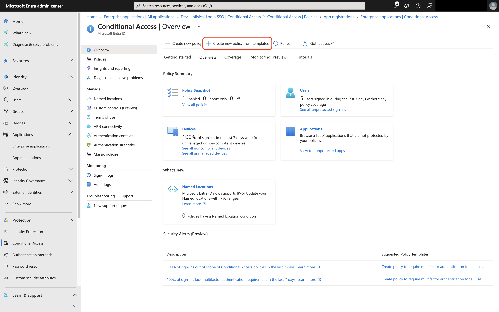
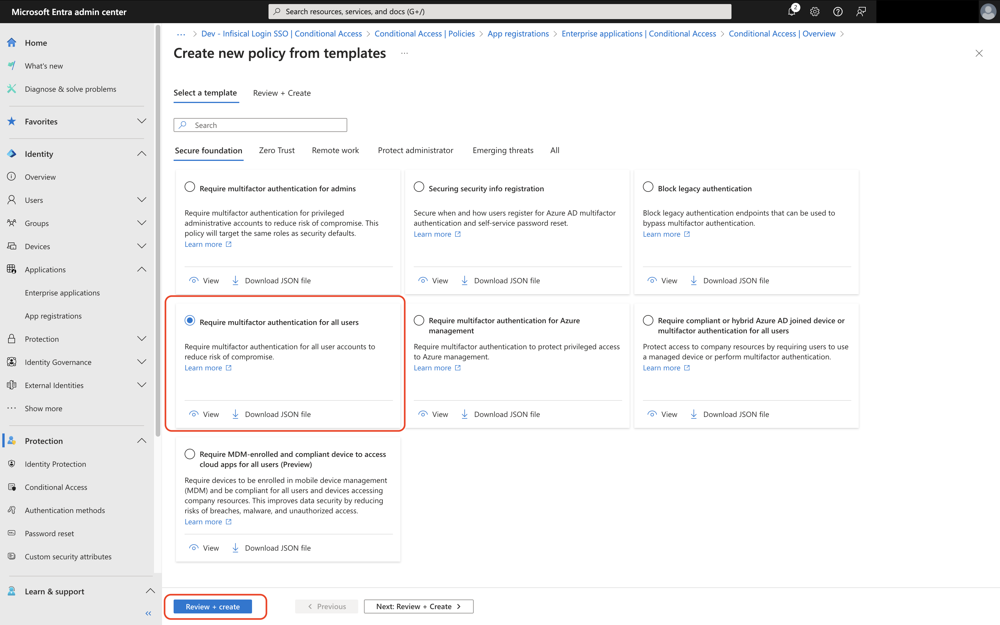
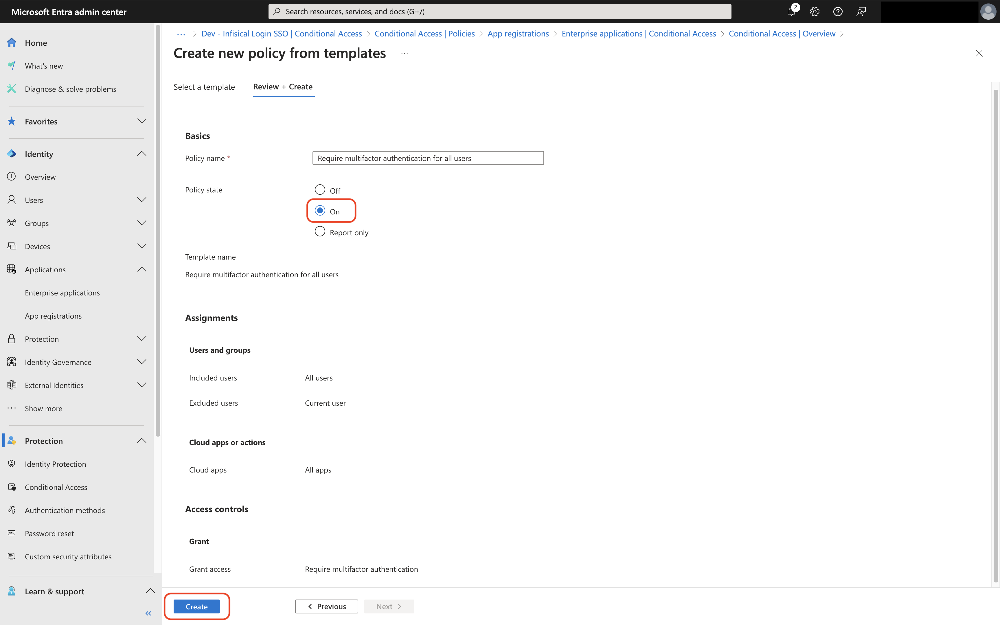
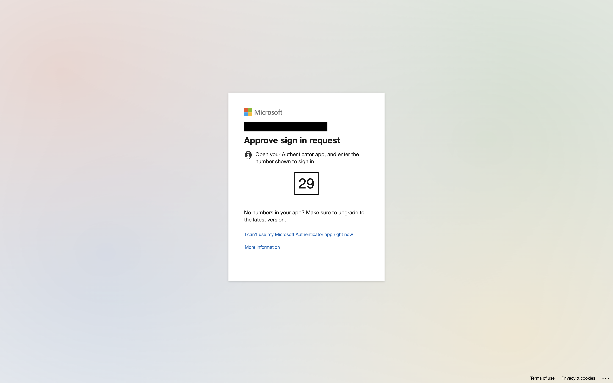

MFA requires users to provide multiple forms of identification to access their account. Currently, this means logging in with your password and a 6-digit code sent to your email.

## Email 2FA

Check the box in Personal Settings > Two-factor Authentication to enable email-based 2FA.

<Note>
  Infisical currently supports email-based 2FA. We're actively working on
  building support for other forms of identification via SMS and Authenticator
  App.
</Note>

## Entra ID / Azure AD MFA

<Note>
    Before proceeding make sure you've enabled [SAML SSO for Entra ID / Azure AD](./sso/azure).

    We also encourage you to have your team download and setup the
    [Microsoft Authenticator App](https://www.microsoft.com/en-us/security/mobile-authenticator-app) prior to enabling MFA.
</Note>

<Steps>
    <Step title="Open your Infisical Application in the Microsoft Entra Admin Center">
        
    </Step>
    <Step title="Tap on Conditional Access under the Security Tab">
        
    </Step>
    <Step title="Tap on Create New Policy from Templates">
        
    </Step>
    <Step title="Select Require MFA for All Users and Tap on Review + Create">
        
        <Note>
            By default all users except the configuring admin will be setup to require MFA.
            Microsoft encourages keeping at least one admin excluded from MFA to prevent accidental lockout.
        </Note>
    </Step>
    <Step title="Set Policy State to Enabled and Tap on Create">
        
    </Step>
    <Step title="MFA is now Required When Accessing Infisical">
        
        <Note>
            If users have not setup MFA for Entra / Azure they will be prompted to do so at this time.
        </Note>
    </Step>
</Steps>