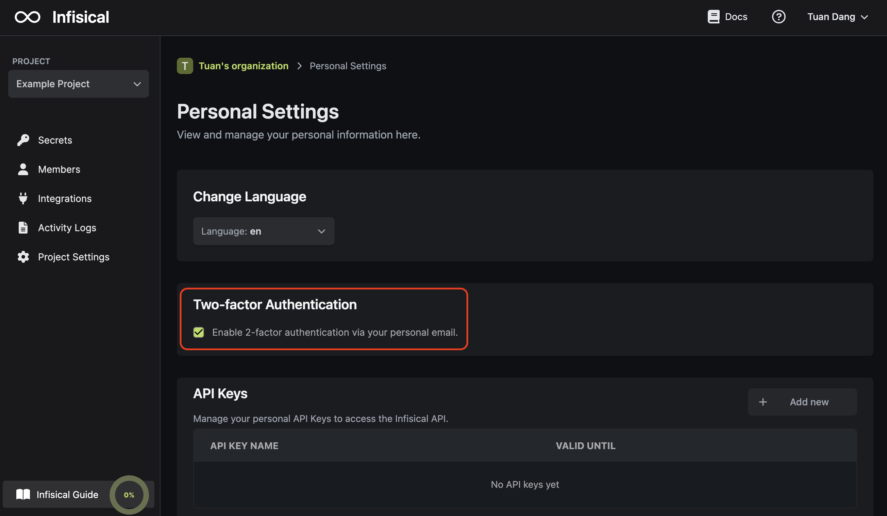

MFA requires users to provide multiple forms of identification to access their account. Currently, this means logging in with your password and a 6-digit code sent to your email.

## Email 2FA

Check the box in Personal Settings > Two-factor Authentication to enable email-based 2FA.

<Note>
  Infisical currently supports email-based 2FA. We're actively working on
  building support for other forms of identification via SMS and Authenticator
  App.
</Note>
