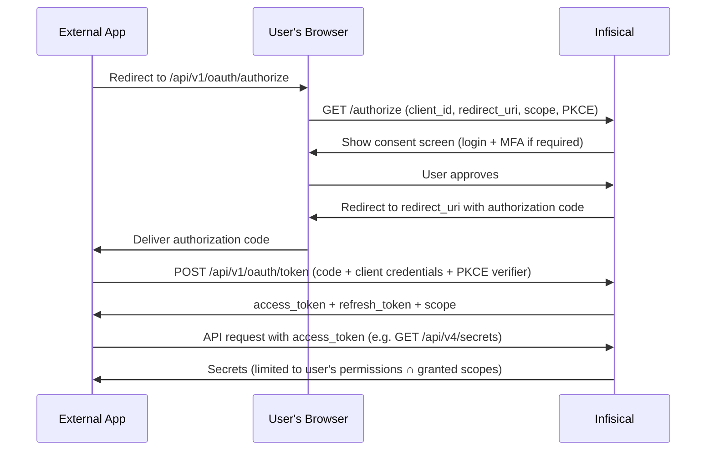

**OAuth Applications** let you register an external platform as an OAuth 2.0 client so it can request **delegated access** to Infisical on behalf of one of your users. The platform never sees the user's password or session; instead it runs a standard authorization code flow, the user reviews and approves the request on an Infisical consent screen, and the platform receives short-lived access and refresh tokens scoped to that user.

A common use case is wiring Infisical into a developer platform as an External Auth provider, so that `infisical run` can fetch secrets at runtime inside a remote development environment using the developer's own permissions.

<Note>
  A delegated OAuth token can never do more than the user who authorized it. Scopes only **narrow** what the token can do; they never grant access the user does not already have. When the user's access changes or their session is revoked, every token issued for them through OAuth is affected immediately.
</Note>

## Concept

OAuth Applications turn Infisical into an OAuth 2.0 authorization server. The model has three parties:

- **OAuth application (client)** - the external platform you register in Infisical. It holds a client ID and client secret.
- **User (resource owner)** - the Infisical user who authorizes the application to act on their behalf.
- **Infisical (authorization + resource server)** - issues the tokens and serves the protected API.

Tokens issued through this flow are marked as delegated OAuth tokens. They are accepted **only** on the small set of read-only endpoints that opt into OAuth, and the granted scopes are intersected with the user's existing permissions on every request.

### Flow



## Scopes

Scopes are a coarse, named contract for what a delegated token is allowed to do. The requested scopes are passed as a space-delimited `scope` parameter on the authorization request and are shown to the user on the consent screen.

| Scope          | Grants                          |
| -------------- | ------------------------------- |
| `secrets:read` | Read secrets, folders, and imports |

<Note>
  `secrets:read` is the only scope available today, supporting the read-only `infisical run` use case. Requesting an unrecognized scope rejects the authorization request rather than silently dropping it.
</Note>

## Creating an OAuth application

OAuth applications are managed at the organization level. You need permission to manage OAuth applications in the organization.

<Steps>
  <Step title="Open the OAuth Applications settings">
    Head to **Organization Settings** and open **OAuth Applications** from the sidebar.
  </Step>
  <Step title="Add an application">
    Press **Add OAuth application** and fill in the details:

    - **Name** (required): A friendly name shown to users on the consent screen.
    - **Description** (optional): A short note about what the application is used for. Also shown on the consent screen.
    - **Redirect URIs** (required): One URI per line. The authorization flow will only ever redirect to one of these exact URIs. Each must use `https://`; `http://` is allowed only for loopback addresses such as `localhost`, `127.0.0.1`, and `::1`.
    - **Require PKCE (S256)**: When enabled, authorization requests that do not include a PKCE code challenge are rejected. Recommended for public clients.
  </Step>
  <Step title="Store the credentials">
    On creation, Infisical shows the **Client ID** and **Client Secret**.

    <Warning>
      The client secret is shown only once. Store it securely. If it is lost, you can rotate it from the application's menu, but you cannot retrieve the original value.
    </Warning>

    Register these credentials with the external platform as its OAuth provider configuration.
  </Step>
</Steps>

## OAuth 2.0 endpoints

All endpoints are served under the `/api/v1/oauth` prefix.

### Authorization endpoint

```
GET /api/v1/oauth/authorize
```

Query parameters:

- `response_type` (required): Must be `code`.
- `client_id` (required): The application's client ID.
- `redirect_uri` (required): Must exactly match one of the application's registered redirect URIs.
- `scope` (optional): Space-delimited list of requested scopes (for example, `secrets:read`).
- `state` (optional but recommended): Opaque value echoed back on the callback to prevent CSRF.
- `code_challenge` / `code_challenge_method` (optional, `S256`): PKCE parameters. Required if the application has **Require PKCE** enabled.

Infisical validates the client and redirect URI, then presents the consent screen. After the user approves, Infisical redirects to `redirect_uri` with a one-time `code` (and the `state`, if provided). If the user denies, it redirects with `error=access_denied`.

### Token endpoint

```
POST /api/v1/oauth/token
```

Exchanges an authorization code for tokens, or refreshes an existing token. Client credentials may be sent either as HTTP Basic auth (`Authorization: Basic <base64(client_id:client_secret)>`) or in the request body as `client_id` and `client_secret`.

To exchange an authorization code:

- `grant_type=authorization_code`
- `code`: The authorization code from the callback.
- `redirect_uri`: Must match the one used in the authorize request.
- `code_verifier`: The PKCE verifier (required when a code challenge was used).

To refresh:

- `grant_type=refresh_token`
- `refresh_token`: A previously issued refresh token.

The response contains:

```json
{
  "access_token": "...",
  "token_type": "Bearer",
  "expires_in": 3600,
  "refresh_token": "...",
  "scope": "secrets:read"
}
```

Access token lifetime follows your organization's user token expiration setting (falling back to the platform default). Refresh tokens rotate on use, and a refresh never broadens the scopes originally granted.

### Validation endpoint

```
GET /api/v1/oauth/validate
```

A lightweight introspection endpoint. Send the delegated access token as a Bearer token; a `200` with `{ "active": true }` confirms the token is valid.

## Accessing the API

Use the access token as a standard Bearer token on the supported read-only secret endpoints:

```bash
curl https://app.infisical.com/api/v4/secrets \
  -H "Authorization: Bearer <access_token>" \
  --get \
  --data-urlencode "workspaceId=<project-id>" \
  --data-urlencode "environment=dev"
```

The effective permissions are the **intersection** of the user's permissions and the granted scopes, so the token can read a secret only where the user could and the scope allows it.

## Security model

- **Delegated access is bounded by the user.** Tokens are intersected with the authorizing user's CASL permissions on every request. They cannot exceed what the user can do, and revoking the user's access revokes the token's access.
- **Read-only by design.** Only a deliberately minimal set of read-only secret-fetch endpoints accept OAuth tokens. Write endpoints and account endpoints (MFA, session management, TOTP, and similar) never accept them.
- **MFA is enforced at consent.** If the user's organization requires MFA, the consent flow requires the matching MFA challenge to be completed before an authorization code is issued.
- **Strict redirect URIs.** Authorization only ever redirects to an exact registered URI. Non-loopback URIs must use `https://`.
- **One-time authorization codes.** Codes are single-use, short-lived, and bound to the client and redirect URI they were issued for.
- **PKCE support.** Applications can require PKCE (S256) to protect public clients against code interception.

## Revoking access

Deleting an OAuth application from the **OAuth Applications** tab immediately revokes every access and refresh token that application issued, so they stop working on the next request rather than living until expiry. Rotating the client secret invalidates the old secret for future token exchanges.
