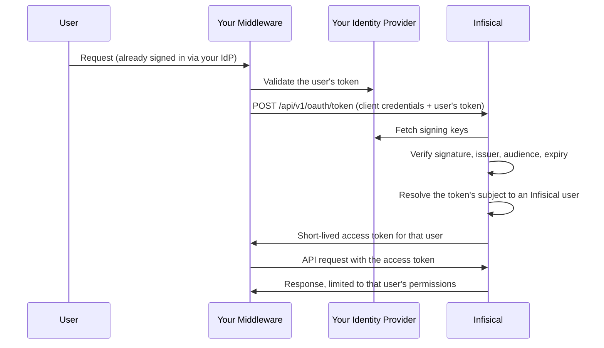

**Token exchange** lets a trusted service you run present a user's token from your identity provider and receive an Infisical token for that same user. The service acts as the user rather than as a shared service account, so every action is attributed to the real person and bounded by their own access.

It is one of the two flows an [OAuth application](/documentation/platform/oauth-applications/overview) can use, and the one to reach for when there is no browser to redirect.

<Info>
  This page is for organization admins registering middleware that acts on behalf of many users. If your platform can redirect a user's browser to a consent screen, use the [authorization code](/documentation/platform/oauth-applications/authorization-code) flow instead.
</Info>

<Note>
  Token exchange requires an active **OIDC** SSO configuration for your organization. Infisical verifies the tokens your middleware presents against that same provider, so disabling or deleting that configuration stops token exchange working, and changing its issuer changes who can vouch for your users. See [SSO overview](/documentation/platform/sso/overview).
</Note>

## When to use token exchange

<CardGroup cols={2}>
  <Card title="AI assistants and agents" icon="robot">
    An MCP server or agent platform reading secrets on behalf of the engineer who asked.
  </Card>
  <Card title="Internal developer portals" icon="window">
    A portal that shows each developer the secrets they personally can see.
  </Card>
  <Card title="API gateways" icon="shield">
    A gateway that already validates your identity provider's tokens and needs to forward the user's identity downstream.
  </Card>
  <Card title="CI middleware" icon="gears">
    Automation that runs a step on a named person's behalf rather than as a shared account.
  </Card>
</CardGroup>

## How it works



Structurally, this is your organization's OIDC sign-in with the token handed over directly instead of collected through a browser redirect.

### What the issued token can do

The issued token carries the user's **full effective permissions**, not a narrowed subset. There is no consent screen and no scope list: an organization admin approves the delegation once, when registering the application.

The token works across the Infisical API wherever the user's own permissions allow, with four deliberate exceptions:

- **Managing the user's account.** Password, MFA, session, and notification endpoints are never reachable with a delegated token.
- **Creating or deleting an organization**, including a sub-organization. All four require the user's own sign-in, so a delegated token is rejected even when the user is an organization admin. Updating an organization and managing its members stay available.
- **Minting another credential.** Machine identity tokens and client secrets, service tokens, SCIM tokens, KMIP client certificates, and gateway or relay enrollment tokens all outlive the delegation that created them, so issuing one stays first-party. Listing and revoking them is still available, since neither hands back secret material. Revoking this application has to revoke everything it obtained.
- **Widening its own access.** Managing OAuth applications, instance admin settings, upgrading the organization's privilege system, and both forms of privilege assumption stay first-party. That includes an organization admin granting themselves access to a project they are not a member of, because the membership it writes outlives the delegation that asked for it.

No refresh token is issued. When the access token expires, your middleware exchanges again against the still-valid identity provider token.

<Warning>
  The issued token is a bearer credential held by your middleware, protected by that service rather than by the user's hardware key or device trust. Treat the middleware as a system that can act as any of its users.
</Warning>

## Before you start

- **OIDC SSO is configured and enabled** for your organization.
- **Your identity provider signs tokens with an asymmetric algorithm** (RS256, RS512, or EdDSA), matching the algorithm on your OIDC SSO configuration, and publishes a key ID (`kid`) in the token header.
- **Its tokens carry an expiry (`exp`).** Infisical rejects a token without one, since it would be replayable indefinitely.
- **Each user has signed in to Infisical through OIDC SSO at least once.** Infisical matches the token's subject to the account created on that sign-in, so treat one browser sign-in as an onboarding step. The user also has to be an active member of the organization with their account set up and unlocked.
- **Your middleware has its own registration in your identity provider**, so its tokens carry an audience distinct from Infisical's, and are addressed to that registration alone or carry an `azp` claim naming it. See [Why the audience matters](#why-the-audience-matters).

## Registering your middleware

You need permission to manage both OAuth applications and SSO, because enabling token exchange decides whose externally issued tokens Infisical converts into user tokens. The same applies to changing an application's audience or rotating its client secret.

<Steps>
  <Step title="Open the OAuth Applications page">
    Head to **Organization Settings** and open **OAuth Applications**.
  </Step>
  <Step title="Add an application">
    Press **Add Application** and fill in the details:

    - **Name** (required): A friendly name for the middleware.
    - **Description** (optional): A short note about what it is used for.
    - **Flow**: Select **Token exchange**.
    - **Audience** (required): The audience your identity provider puts in tokens it issues for this middleware, for example `api://internal-mcp`. Infisical rejects any token carrying a different audience.
    - **Identity provider enforces MFA**: Turn this on to declare that your identity provider already requires MFA. Without it, exchanges fail for any user who requires MFA, because there is no Infisical MFA challenge to run.
    - **Access token lifetime**: How long the tokens this application issues stay valid, 1 day by default. These tokens act as the user and carry no refresh token, so keep it to the shortest window your middleware can re-exchange within.

    There is no issuer to set here. Infisical always verifies against your organization's OIDC SSO provider, which cannot be overridden per application.

    An application uses one flow or the other, so a service that needs both needs two registrations.
  </Step>
  <Step title="Store the credentials">
    Infisical shows the **Client ID** and **Client Secret** on creation.

    <Warning>
      The client secret is shown only once. If it is lost you can rotate it from the application's menu, but you cannot retrieve the original value.
    </Warning>
  </Step>
</Steps>

### Why the audience matters

Your identity provider signs tokens for every application in your estate. Without an expected audience, any of them could be presented to Infisical and come back as a working Infisical token. Binding the application to one audience is what stops a token minted for an expenses app becoming a secrets-read credential.

Set it to your middleware's own registration in your identity provider, never to Infisical's.

Some providers can be configured to address one token to several audiences at once, which would let a token minted for another application list yours alongside its own. When a subject token carries more than one audience, Infisical requires an `azp` (authorized party) claim naming your configured audience, and rejects the token otherwise. A token addressed to a single audience needs no `azp`, but if it carries one, that claim must name your configured audience as well.

## Exchanging a token

Token exchange follows [RFC 8693](https://datatracker.ietf.org/doc/html/rfc8693) on the existing token endpoint, so any RFC 8693-aware client library works. Client credentials may be sent as HTTP Basic auth or in the request body.

```bash
curl -X POST https://app.infisical.com/api/v1/oauth/token \
  -u "<client_id>:<client_secret>" \
  --data-urlencode "grant_type=urn:ietf:params:oauth:grant-type:token-exchange" \
  --data-urlencode "subject_token=<user's token from your identity provider>" \
  --data-urlencode "subject_token_type=urn:ietf:params:oauth:token-type:jwt"
```

| Parameter            | Value                                                                                |
| -------------------- | ------------------------------------------------------------------------------------ |
| `grant_type`         | `urn:ietf:params:oauth:grant-type:token-exchange`                                     |
| `subject_token`      | The user's token from your identity provider                                          |
| `subject_token_type` | `urn:ietf:params:oauth:token-type:jwt` or `urn:ietf:params:oauth:token-type:id_token`  |

The response is an access token for the user the subject token identified:

```json
{
  "access_token": "...",
  "issued_token_type": "urn:ietf:params:oauth:token-type:access_token",
  "token_type": "Bearer",
  "expires_in": 86400
}
```

Access token lifetime is the shortest of the application's **access token lifetime** (1 day by default), your organization's session length, and the instance default of 10 days. The application's own value is a ceiling rather than an override: it can shorten the lifetime but never extend it past what the organization allows. Because the middleware holds a credential that acts as the user, shorten it on the application rather than relying on the default.

### When an exchange fails

Failures follow [RFC 8693 section 2.2.2](https://datatracker.ietf.org/doc/html/rfc8693#section-2.2.2), which builds on [RFC 6749 section 5.2](https://datatracker.ietf.org/doc/html/rfc6749#section-5.2), so an RFC-aware client library can classify them without reading the prose:

```json
{
  "error": "invalid_request",
  "error_description": "The subject token has expired."
}
```

| `error`                  | Status | What it means                                                                                      |
| ------------------------ | ------ | -------------------------------------------------------------------------------------------------- |
| `invalid_client`         | 401    | The client ID or secret is wrong, or the secret was rotated mid-request. Reload your credentials.    |
| `unauthorized_client`    | 400    | The application is not registered for this grant. An admin enables it on the application.           |
| `invalid_request`        | 400    | A parameter is missing or malformed, **or the subject token was rejected**. See below.               |
| `unsupported_grant_type` | 400    | The `grant_type` is not one Infisical issues tokens for.                                             |
| `invalid_scope`          | 400    | A `scope` was sent. This grant has none.                                                             |
| `invalid_target`         | 400    | An `audience` or `resource` was sent. The audience is fixed on the application.                       |
| `server_error`           | 500    | Your OIDC SSO configuration is incomplete, or your identity provider could not be reached. Retry.     |

<Warning>
  RFC 8693 requires `invalid_request` for a subject token that is invalid for any reason or unacceptable by policy, so an expired token, a wrong audience, and a user who is not an active member all arrive under the same code as a malformed request. This grant never returns `invalid_grant`, which is what the authorization code flow uses for the equivalent failure.

  The distinction lives in `error_description`, which names the specific check that failed. Branch on the description, or simply re-authenticate the user and retry once, rather than expecting a code per cause.
</Warning>

Retry on `server_error`. `invalid_client` and `unauthorized_client` need an operator, not a retry.

<Note>
  `scope`, `audience`, `resource`, and `actor_token` are rejected rather than ignored. This grant has no scope concept, and the expected audience is fixed on the application, so silently dropping those parameters would leave you believing a restriction was applied when it was not.

  `actor_token` is refused for the same reason. RFC 8693 uses it to request **delegation**, where the issued token records that your middleware is acting for the user. Infisical issues an **impersonation** token, which is indistinguishable from the user's own and names no acting party, so accepting the parameter and dropping it would answer a delegation request with something weaker than you asked for. The requesting application is still recorded, in the audit event for the exchange and in every event the issued token produces.
</Note>

Use the access token as a standard Bearer token:

```bash
curl https://app.infisical.com/api/v4/secrets \
  -H "Authorization: Bearer <access_token>" \
  --get \
  --data-urlencode "projectId=<project-id>" \
  --data-urlencode "environment=dev"
```

## Cache the access token

<Warning>
  Exchange once per user and reuse the access token until it expires. Do not exchange on every request your middleware serves.
</Warning>

Exchanging per request makes your identity provider a hard dependency of every Infisical call, so a momentary blip there fails your own request path.

- Keep the token in memory keyed by the subject token's `sub` claim, alongside its expiry.
- Refresh slightly early, say 60 seconds before `expires_in` elapses, so an in-flight request never carries a token that expires mid-call.
- Exchange again when it is gone. No refresh token is issued.
- Drop the entry when the user's session at your identity provider ends, so their Infisical access does not outlive it.

<Note>
  Cache wherever you run Infisical. On Infisical Cloud the token endpoint is rate limited per source IP, so every instance of your middleware behind one egress address shares a single budget, and caching correctly means roughly one exchange per user per token lifetime, which stays well inside it. A self-hosted instance applies no limit of its own, so set one at your ingress and rely on caching to keep the endpoint quiet.
</Note>

## What Infisical verifies

Every exchange checks all of the following and names the failure in its error:

- The **signature** validates against your identity provider's published keys, using the algorithm your OIDC SSO configuration declares.
- The **issuer** matches your organization's configured OIDC SSO issuer.
- The **audience** matches the audience configured on the application, and any `azp` claim names it too.
- The token **carries an `exp` claim and has not passed it**, and is not used before its `nbf` time.
- The token's **subject** resolves to a user who has signed in through your organization's OIDC SSO, whose account is set up and unlocked, and who is an active member of the organization.
- **MFA** requirements are satisfied, either because none apply or because the application declares that the identity provider enforces them.

## Audit trail

Each exchange records an audit event attributed to the **subject user**, with the requesting application in its metadata. Every later action taken with the issued token appears under the same person.

## Revoking access

These actions revoke every token the application has issued, so they stop working on the next request rather than living until expiry:

- **Deleting the application.**
- **Rotating the client secret.** On a token exchange application the secret is the whole authority, so rotating it after a leak also cuts off whatever was minted with the old one. Expect the middleware to be signed out of every user until it picks up the new secret.
- **Turning off the token exchange grant.**
- **Changing the audience**, in either direction, since tokens already issued were accepted on a basis that no longer holds.
- **Turning off Identity provider enforces MFA.** That declaration is what let those exchanges skip an MFA requirement, so withdrawing it withdraws the tokens too.

Deactivating a user's organization membership stops further exchanges for that user, and the **OAuth Applications** page lists which applications use token exchange, so you can see the blast radius before changing SSO.

Because no refresh tokens are issued, exposure from a compromised middleware is otherwise bounded by the remaining lifetime of the access tokens it holds.
