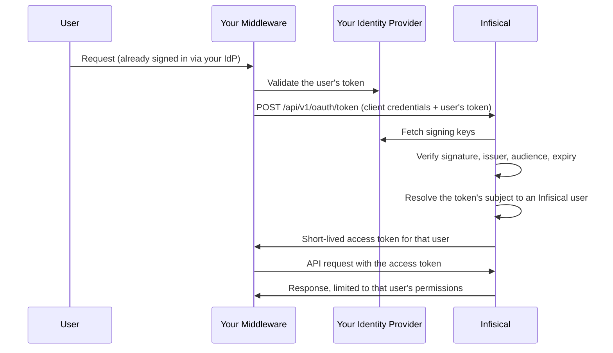

**Token exchange** lets a trusted service you run present a user's token from your identity provider and receive an Infisical token for that same user. The service acts as the user rather than as a shared service account, so every action is attributed to the real person and bounded by their own access.

<Info>
  This page is for organization admins registering middleware that acts on behalf of many users. If your platform can redirect a user's browser to a consent screen, use the authorization code flow on [OAuth Applications](/documentation/platform/oauth-applications) instead.
</Info>

<Note>
  Token exchange requires an active **OIDC** SSO configuration for your organization. Infisical verifies the tokens your middleware presents against that same provider, so there is nothing to trust until OIDC SSO is set up. See [SSO overview](/documentation/platform/sso/overview).
</Note>

## When to use token exchange

<CardGroup cols={2}>
  <Card title="AI assistants and agents" icon="robot">
    An MCP server or agent platform reading secrets on behalf of the engineer who asked.
  </Card>
  <Card title="Internal developer portals" icon="window">
    A portal that shows each developer the secrets they personally can see.
  </Card>
  <Card title="API gateways" icon="shield">
    A gateway that already validates your identity provider's tokens and needs to forward the user's identity downstream.
  </Card>
  <Card title="CI middleware" icon="gears">
    Automation that runs a step on a named person's behalf rather than as a shared account.
  </Card>
</CardGroup>

## How it works



Structurally, this is your organization's OIDC sign-in with the token handed over directly instead of collected through a browser redirect.

### What the issued token can do

The issued token carries the user's **full effective permissions**, not a narrowed subset. There is no consent screen and no scope list: an organization admin approves the delegation once, when registering the application.

Four things it deliberately cannot do:

- **Manage the user's account.** Changing MFA, revoking sessions, and other account self-management actions are never reachable with a delegated token.
- **Create or delete an organization.** Both require the user's own sign-in, so a delegated token is rejected on those endpoints even when the user is an organization admin.
- **Mint another credential.** Machine identity tokens and client secrets, service tokens, KMIP client certificates, and gateway or relay enrollment tokens all outlive the delegation that created them, so those endpoints stay first-party. Revoking this application has to revoke everything it obtained.
- **Outlive its access token.** No refresh token is issued, so your middleware exchanges again against the still-valid identity provider token.

<Warning>
  The issued token is a bearer credential held by your middleware, protected by that service rather than by the user's hardware key or device trust. Treat the middleware as a system that can act as any of its users.
</Warning>

## Before you start

- **OIDC SSO is configured and enabled** for your organization.
- **Your identity provider signs tokens with an asymmetric algorithm** (RS256, RS512, or EdDSA) and publishes a key ID (`kid`) in the token header.
- **Its tokens carry an expiry (`exp`).** Infisical rejects a token without one, since it would be replayable indefinitely.
- **Each user has signed in to Infisical through OIDC SSO at least once.** Infisical matches the token's subject to the account created on that sign-in, so treat one browser sign-in as an onboarding step.
- **Your middleware has its own registration in your identity provider**, so its tokens carry an audience distinct from Infisical's.
- **Its tokens are addressed to that registration alone**, or carry an `azp` claim naming it. See [Why the audience matters](#why-the-audience-matters).

## Registering your middleware

You need permission to manage both OAuth applications and SSO, because enabling token exchange decides whose externally issued tokens Infisical converts into user tokens. The same applies to changing an application's audience or rotating its client secret.

<Steps>
  <Step title="Open the OAuth Applications page">
    Head to **Organization Settings** and open **OAuth Applications**.
  </Step>
  <Step title="Add an application">
    Press **Add Application** and fill in the details:

    - **Name** (required): A friendly name for the middleware.
    - **Description** (optional): A short note about what it is used for.
    - **Flow**: Select **Token exchange**.
    - **Audience** (required): The audience your identity provider puts in tokens it issues for this middleware, for example `api://internal-mcp`. Infisical rejects any token carrying a different audience.
    - **Identity provider enforces MFA**: Turn this on to declare that your identity provider already requires MFA. Without it, exchanges fail for any user who requires MFA, because there is no Infisical MFA challenge to run.

    There is no issuer to set here. Infisical always verifies against your organization's OIDC SSO provider, which cannot be overridden per application.

    An application uses one flow or the other. Registering it for token exchange rules out the authorization code flow, and the reverse, so a service that needs both needs two registrations. This holds for the API too: sending `grantTypes` containing both the token-exchange grant and `authorization_code` is rejected.
  </Step>
  <Step title="Store the credentials">
    Infisical shows the **Client ID** and **Client Secret** on creation.

    <Warning>
      The client secret is shown only once. If it is lost you can rotate it from the application's menu, but you cannot retrieve the original value.
    </Warning>
  </Step>
</Steps>

### Why the audience matters

Your identity provider signs tokens for every application in your estate. Without an expected audience, any of them could be presented to Infisical and come back as a working Infisical token. Binding the application to one audience is what stops a token minted for an expenses app becoming a secrets-read credential.

Set it to your middleware's own registration in your identity provider, never to Infisical's.

Some providers can be configured to address one token to several audiences at once, which would let a token minted for another application list yours alongside its own. When a subject token carries more than one audience, Infisical requires an `azp` (authorized party) claim naming your configured audience, and rejects the token otherwise. A token addressed to a single audience needs no `azp`, but if it carries one, that claim must name your configured audience as well.

## Exchanging a token

Token exchange follows [RFC 8693](https://datatracker.ietf.org/doc/html/rfc8693) on the existing token endpoint, so any RFC 8693-aware client library works. Client credentials may be sent as HTTP Basic auth or in the request body.

```bash
curl -X POST https://app.infisical.com/api/v1/oauth/token \
  -u "<client_id>:<client_secret>" \
  --data-urlencode "grant_type=urn:ietf:params:oauth:grant-type:token-exchange" \
  --data-urlencode "subject_token=<user's token from your identity provider>" \
  --data-urlencode "subject_token_type=urn:ietf:params:oauth:token-type:jwt"
```

| Parameter            | Value                                                                                |
| -------------------- | ------------------------------------------------------------------------------------ |
| `grant_type`         | `urn:ietf:params:oauth:grant-type:token-exchange`                                     |
| `subject_token`      | The user's token from your identity provider                                          |
| `subject_token_type` | `urn:ietf:params:oauth:token-type:jwt` or `urn:ietf:params:oauth:token-type:id_token`  |

The response is an access token for the user the subject token identified:

```json
{
  "access_token": "...",
  "issued_token_type": "urn:ietf:params:oauth:token-type:access_token",
  "token_type": "Bearer",
  "expires_in": 3600
}
```

Access token lifetime follows your organization's **user token expiration** setting, falling back to the platform default of 10 days when that is not set. Because the middleware holds a credential that acts as the user, set a short expiration on the organization rather than relying on that default.

<Note>
  `scope`, `audience`, and `resource` are rejected rather than ignored. This grant has no scope concept, and the expected audience is fixed on the application, so silently dropping those parameters would leave you believing a restriction was applied when it was not.
</Note>

Use the access token as a standard Bearer token:

```bash
curl https://app.infisical.com/api/v4/secrets \
  -H "Authorization: Bearer <access_token>" \
  --get \
  --data-urlencode "projectId=<project-id>" \
  --data-urlencode "environment=dev"
```

<Note>
  Delegated tokens are currently accepted on the read-only secret-fetch endpoints. Endpoint coverage is expanding; if your integration needs an endpoint that rejects a delegated token, let us know which one.
</Note>

## Cache the access token

<Warning>
  Exchange once per user and reuse the access token until it expires. Do not exchange on every request your middleware serves.
</Warning>

Exchanging per request throws away that whole window and makes your identity provider a hard dependency of every Infisical call: a momentary blip there fails your own request path, and both Infisical and your provider see traffic proportional to your request volume rather than your user count.

- Keep the token in memory keyed by the subject token's `sub` claim, alongside its expiry.
- Refresh slightly early, say 60 seconds before `expires_in` elapses, so an in-flight request never carries a token that expires mid-call.
- Exchange again when it is gone. No refresh token is issued.
- Drop the entry when the user's session at your identity provider ends, so their Infisical access does not outlive it.

<Note>
  The token endpoint is rate limited per source IP, so every instance of your middleware behind one egress address shares a single budget. Caching correctly means roughly one exchange per user per token lifetime, which stays well inside it. Exchanging per request will be throttled under load.
</Note>

## What Infisical verifies

Every exchange checks all of the following and names the failure in its error:

- The **signature** validates against your identity provider's published keys.
- The **issuer** matches your organization's configured OIDC SSO issuer.
- The **audience** matches the audience configured on the application.
- The token **carries an `exp` claim and has not passed it**, and is not used before its `nbf` time.
- The **signing algorithm** matches your OIDC SSO configuration.
- The token's **subject** resolves to a user who has signed in through your organization's OIDC SSO and is an active member of it.
- That user's **Infisical account is usable**: setup is complete and the account is not locked.
- **MFA** requirements are satisfied, either because none apply or because the application declares that the identity provider enforces them.

## Audit trail

Each exchange records an audit event attributed to the **subject user**, with the requesting application in its metadata. Every later action taken with the issued token appears under the same person.

## Dependency on SSO

Token exchange has no trust anchor of its own:

- **Disabling or deleting the OIDC SSO configuration stops token exchange working.**
- **Changing the issuer changes who can vouch for your users.** Migrating identity providers moves both browser sign-in and token exchange at once.

The **OAuth Applications** page lists which applications use token exchange, so you can see the blast radius before changing either.

## Revoking access

Three actions revoke every token the application has issued, so they stop working on the next request rather than living until expiry:

- **Deleting the application.**
- **Rotating the client secret.** On a token exchange application the secret is the whole authority, so rotating it after a leak also cuts off whatever was minted with the old one. Expect the middleware to be signed out of every user until it picks up the new secret.
- **Turning off the token exchange grant.**

Because no refresh tokens are issued, exposure from a compromised middleware is otherwise bounded by the remaining lifetime of the access tokens it holds.
