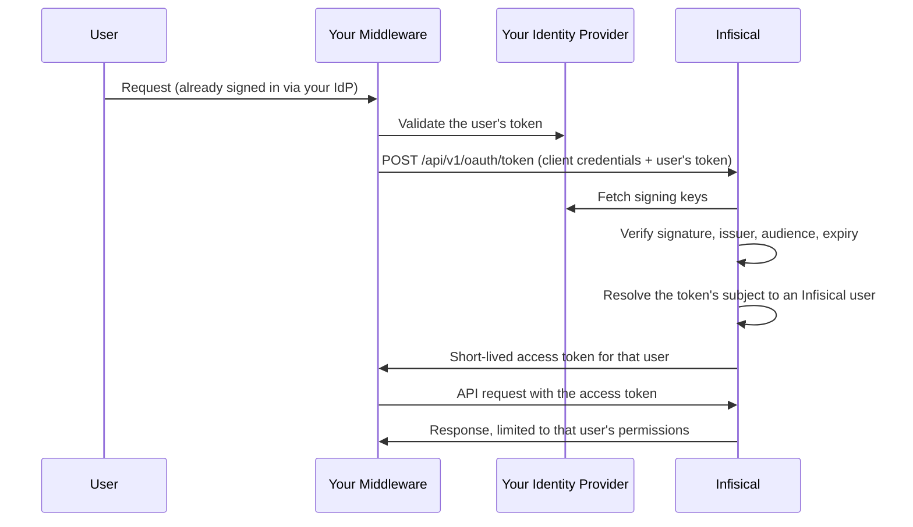

**Token exchange** lets a trusted service you run present a user's token from your identity provider and receive an Infisical token for that same user. The service acts as the user rather than as a shared service account, so every action in Infisical is attributed to the real person and bounded by their own access.

This is the pattern behind AI coding assistants, internal developer portals, API gateways, and any middleware that has to call Infisical "as the user who asked." Those tools have no browser to redirect through and no way to show each user a consent screen, so the standard [OAuth Applications](/documentation/platform/oauth-applications) authorization code flow does not fit them.

<Info>
  This page is for organization admins registering middleware that acts on behalf of many users. If you are wiring up a platform that can redirect a user's browser, use the authorization code flow on [OAuth Applications](/documentation/platform/oauth-applications) instead.
</Info>

<Note>
  Token exchange requires an active **OIDC** SSO configuration for your organization. Infisical verifies the tokens your middleware presents against that same identity provider, so there is nothing to trust until OIDC SSO is set up. See [SSO overview](/documentation/platform/sso/overview).
</Note>

## Why not a shared machine identity

A single [machine identity](/documentation/platform/identities/machine-identities) shared by every user of your middleware collapses the authorization boundary in two ways:

- **Attribution is lost.** Every audit log entry reads as the service account, so you cannot tell which person triggered an action.
- **Least privilege is lost.** Every user gets whatever the shared identity can reach, rather than what they personally can reach.

Token exchange fixes both. The token Infisical issues belongs to one user, carries that user's permissions, and appears in the audit log under their name alongside the application that requested it.

## When to use token exchange

<CardGroup cols={2}>
  <Card title="AI assistants and agents" icon="robot">
    An MCP server or agent platform reading secrets on behalf of the engineer who asked.
  </Card>
  <Card title="Internal developer portals" icon="window">
    A portal that shows each developer the secrets they personally can see.
  </Card>
  <Card title="API gateways" icon="shield">
    A gateway that already validates your identity provider's tokens and needs to forward the user's identity downstream.
  </Card>
  <Card title="CI middleware" icon="gears">
    Automation that runs a step on a named person's behalf rather than as a shared account.
  </Card>
</CardGroup>

## How it works

Three parties are involved:

- **Your identity provider** issues a token proving who the user is. This is the same provider your users already sign in to Infisical with.
- **Your middleware** holds an Infisical client ID and client secret, and presents the user's token.
- **Infisical** verifies that token, resolves it to the matching Infisical user, and issues a short-lived access token for them.



Structurally, this is your organization's OIDC sign-in with the token handed over directly instead of collected through a browser redirect.

### What the issued token can do

The issued token carries the user's **full effective permissions**, not a narrowed subset. There is no consent screen and no scope list, so an organization admin approves the delegation once when registering the application rather than each user approving it individually.

Two things it deliberately cannot do:

- **It cannot manage the user's account.** Changing MFA, revoking sessions, and other account self-management actions are never reachable with a delegated token, however it was obtained.
- **It cannot outlive its access token.** No refresh token is issued. Your middleware exchanges again against the still-valid identity provider token.

<Warning>
  A token issued through exchange is a bearer credential held by your middleware, protected by that service rather than by the user's hardware key or device trust. Treat the middleware as a system that can act as any of its users, and secure it accordingly.
</Warning>

## Before you start

- **OIDC SSO must be configured and enabled** for your organization.
- **Your identity provider must sign tokens with an asymmetric algorithm** (RS256, RS512, or EdDSA) and publish a key ID (`kid`) in the token header.
- **Each user must have signed in to Infisical through OIDC SSO at least once.** Infisical matches the token's subject to the account created on that first sign-in, so a user who has only ever used your middleware cannot be resolved yet. Treat one browser sign-in as an onboarding step.
- **You need a dedicated registration for your middleware in your identity provider**, so its tokens carry an audience distinct from Infisical's own.

## Registering your middleware

You need permission to manage both OAuth applications and SSO in the organization, because enabling token exchange decides whose externally issued tokens Infisical will convert into user tokens. The same applies to changing an existing application's audience or rotating its client secret, since either one grants the ability to act as your users.

<Steps>
  <Step title="Open the OAuth Applications page">
    Head to **Organization Settings** and open **OAuth Applications**.
  </Step>
  <Step title="Add an application">
    Press **Add Application** and fill in the details:

    - **Name** (required): A friendly name for the middleware.
    - **Description** (optional): A short note about what it is used for.
    - **Flow**: Select **Token exchange**.
    - **Audience** (required): The audience your identity provider puts in tokens it issues for this middleware, for example `api://internal-mcp`. Infisical rejects any token carrying a different audience.
    - **Identity provider enforces MFA**: Turn this on to declare that your identity provider already requires MFA. Without it, exchanges fail for any user who requires MFA, because there is no Infisical MFA challenge to run.

    There is no issuer to set here. Infisical always verifies against your organization's OIDC SSO provider, which is configured once on the **SSO** page and cannot be overridden per application.
  </Step>
  <Step title="Store the credentials">
    On creation, Infisical shows the **Client ID** and **Client Secret**.

    <Warning>
      The client secret is shown only once. Store it securely. If it is lost, you can rotate it from the application's menu, but you cannot retrieve the original value.
    </Warning>
  </Step>
</Steps>

### Why the audience matters

The audience is the control that does the real work. Your identity provider signs tokens for every application in your estate, and without an expected audience any of those tokens could be presented to Infisical and come back as a working Infisical token. Binding the application to one audience is what stops a token minted for an expenses app becoming a secrets-read credential.

Set it to your middleware's own registration in your identity provider, never to Infisical's.

## Exchanging a token

Token exchange follows [RFC 8693](https://datatracker.ietf.org/doc/html/rfc8693) on the existing token endpoint, so any RFC 8693-aware client library works. Client credentials may be sent as HTTP Basic auth or in the request body.

```bash
curl -X POST https://app.infisical.com/api/v1/oauth/token \
  -u "<client_id>:<client_secret>" \
  --data-urlencode "grant_type=urn:ietf:params:oauth:grant-type:token-exchange" \
  --data-urlencode "subject_token=<user's token from your identity provider>" \
  --data-urlencode "subject_token_type=urn:ietf:params:oauth:token-type:jwt"
```

Parameters:

| Parameter            | Value                                                                                                            |
| -------------------- | ---------------------------------------------------------------------------------------------------------------- |
| `grant_type`         | `urn:ietf:params:oauth:grant-type:token-exchange`                                                                 |
| `subject_token`      | The user's token from your identity provider                                                                      |
| `subject_token_type` | `urn:ietf:params:oauth:token-type:jwt` or `urn:ietf:params:oauth:token-type:id_token`                              |

The response is a short-lived access token for the user the subject token identified:

```json
{
  "access_token": "...",
  "issued_token_type": "urn:ietf:params:oauth:token-type:access_token",
  "token_type": "Bearer",
  "expires_in": 3600
}
```

Access token lifetime follows your organization's user token expiration setting, falling back to the platform default.

<Note>
  `scope`, `audience`, and `resource` are rejected rather than ignored. This grant has no scope concept, and the expected audience is fixed on the application, so silently dropping those parameters would leave you believing a restriction was applied when it was not.
</Note>

Use the access token as a standard Bearer token:

```bash
curl https://app.infisical.com/api/v4/secrets \
  -H "Authorization: Bearer <access_token>" \
  --get \
  --data-urlencode "workspaceId=<project-id>" \
  --data-urlencode "environment=dev"
```

<Note>
  Delegated tokens are currently accepted on the read-only secret-fetch endpoints. Endpoint coverage is expanding; if your integration needs an endpoint that rejects a delegated token, let us know which one.
</Note>

## What Infisical verifies

Every exchange checks all of the following, and fails the request with a message naming the problem if any of them does not hold:

- The **signature** validates against your identity provider's published keys.
- The **issuer** matches your organization's configured OIDC SSO issuer.
- The **audience** matches the audience configured on the application.
- The token is **not expired** and not used before its `nbf` time.
- The **signing algorithm** matches your OIDC SSO configuration.
- The token's **subject** resolves to a user who has signed in through your organization's OIDC SSO and is an active member of the organization.
- **MFA** requirements are satisfied, either because none apply or because the application declares that the identity provider enforces them.

## Audit trail

Each exchange records an audit event attributed to the **subject user**, with the requesting application recorded alongside it. Because the issued token belongs to that user, every later action taken with it appears under the same person, and can be traced back to the exchange that authorized it.

## Dependency on SSO

Token exchange has no trust anchor of its own. It relies on your organization's OIDC SSO configuration, which means:

- **Disabling OIDC SSO stops token exchange working.** So does deleting the configuration.
- **Changing the issuer changes who can vouch for your users.** Migrating identity providers moves both browser sign-in and token exchange at once.

The **SSO** page lists the applications that depend on the issuer, so you can see the blast radius before changing it.

## Revoking access

Deleting the application from the **OAuth Applications** page immediately revokes every token it issued, so they stop working on the next request rather than living until expiry. Rotating the client secret stops the middleware obtaining new tokens until it is updated.

Because no refresh tokens are issued, the exposure from a compromised middleware is bounded by the remaining lifetime of the access tokens it currently holds.
