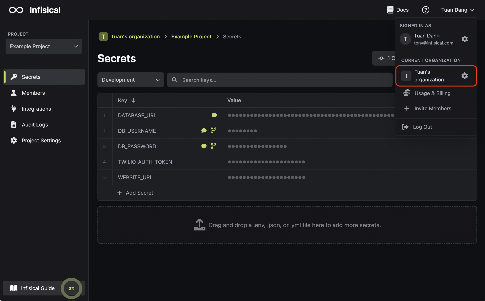
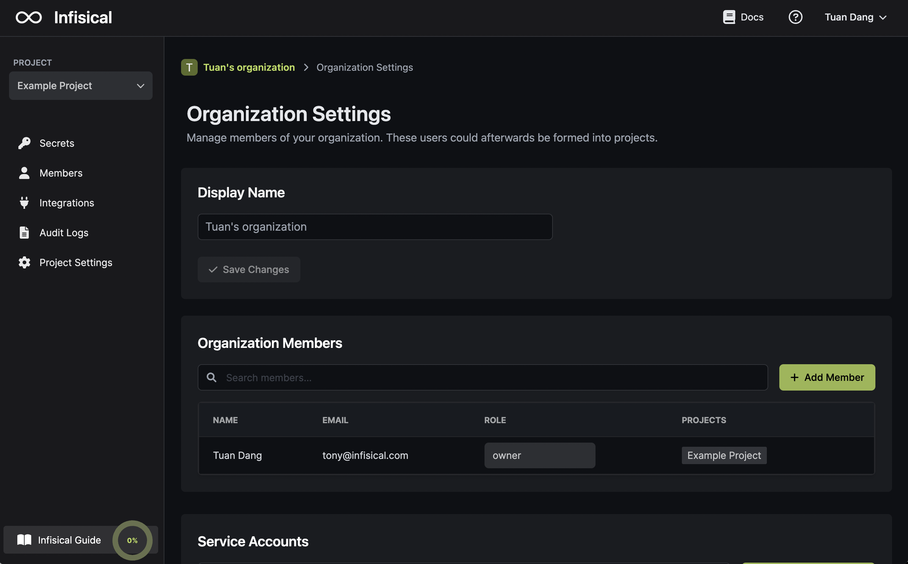
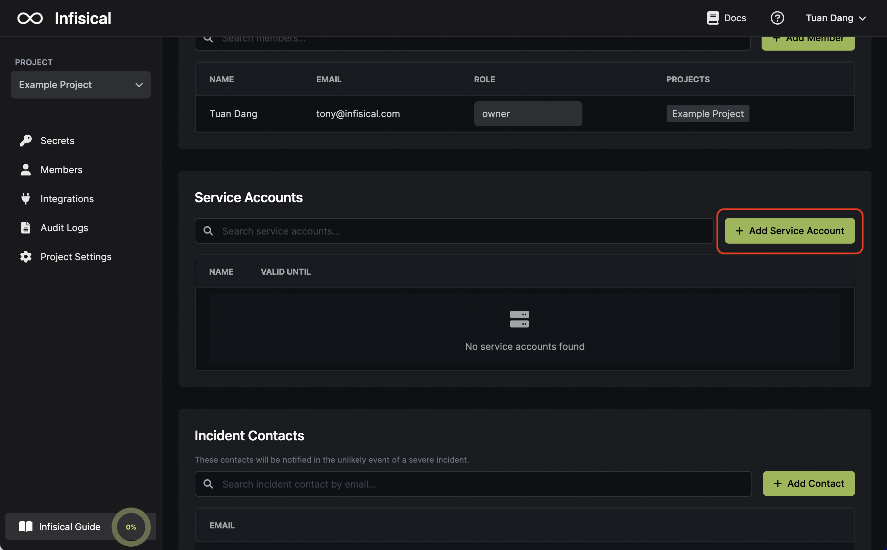
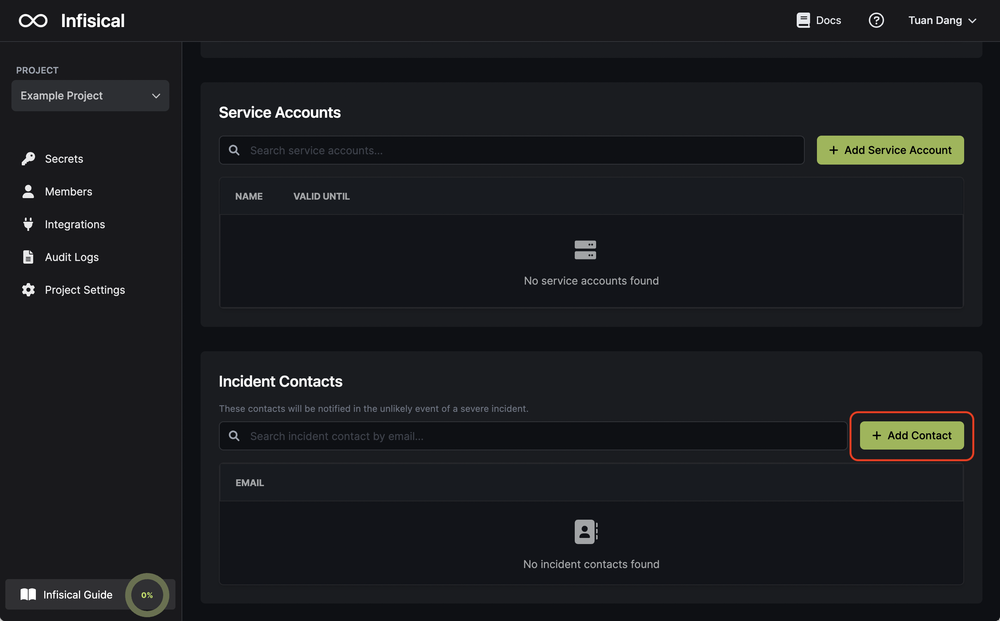

An organization houses projects and members.

By default, Infisical creates an organization under your name. You can manage your organization in your organization settings.

## Members

Members of an organization can create and add other members to projects within that organization.

To add a member to your organization, scroll down to the "Organization Members" section and invite the member via email. They'll receive an email to confirm their organization invitation. If the member is an existing user on the platform, they will be automatically added to the organization.

<Note>
  Note that access to projects must be provisioned to new members after they've
  accepted their organization invitation, and they will not be added to any
  projects by default.
</Note>

## Service Accounts

Service accounts represent machine identities such as VMs or application clients that can authenticate with Infisical. They can be provisioned read/write permissions for project(s) and environment(s).

To add a service account to your organization, scroll down to the "Service Accounts" section and create a service account. Afterwards, you can press on the edit button beside the service account to provision it permissions.

## Incident contacts

Incident contacts of an organization are alerted if anything abnormal is detected within the operations of an organization.

To add an incident contact to your organization, scroll down to the "Incident Contacts" section and add their email.

