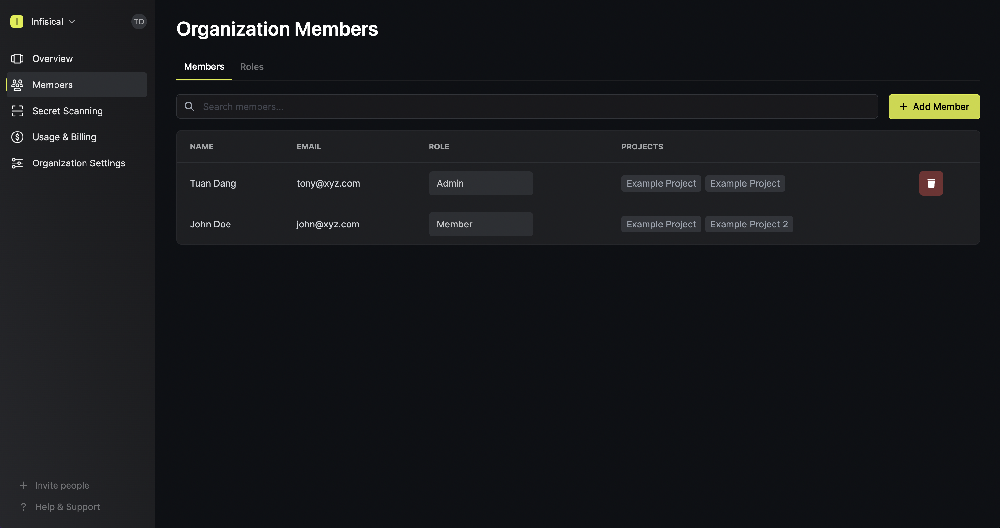

An organization houses projects and members.

## Projects

The **Projects** page is where you can view the projects that you have access to within your organization
as well as create a new project.

## Settings

The **Settings** page lets you manage information about your organization including:

- Name: The name of your organization.
- Incident contacts: Emails that should be alerted if anything abnormal is detected within the organization.
- SAML Authentication: The SAML SSO configuration of the organization (if applicable); Infisical currently
supports Okta, Azure, and JumpCloud identity providers.

## Members

The **Members** page is where you can manage members and their permissions within the organization.
In the **Members** tab, you can add external members to your organization or remove them; you can also
change their role.

In the **Roles** tab, you can manage roles for members within the organization. 

<Info>
  Note that Role-Based Access Management (RBAC) is partly a paid feature.
  
  Infisical provides immutable roles like `admin`, `member`, etc.
  at the organization and project level for free.

  If you're using Infisical Cloud, the ability to create custom roles is available under the **Pro Tier**. 
  If you're self-hosting Infisical, then you should contact team@infisical.com to purchase an enterprise license to use it.
</Info>

As you can see next, Infisical supports granular permissions that you can tailor to each role. So,
if you need certain members to only be able to access billing details, for example, then you can
assign them that permission only.

## Usage & Billing

The **Usage & Billing** page applies only to [Infisical Cloud](https://app.infisical.com) and is where you can
manage your plan and billing information.

This includes the following items:

- Current plan: The current plan information such as what tier your organization is on and what features/limits apply to this tier.
- Licenses: The license keys for self-hosted instances of Infisical (if applicable).
- Receipts: The receipts of monthly/annual invoices.
- Billing: The billing details of your organization including payment methods on file, tax IDs (if applicable), etc.

