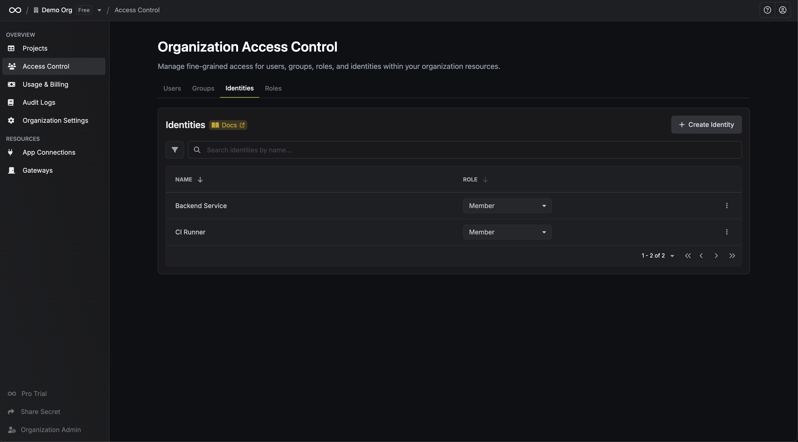

An Infisical organization is a set of [projects](./project) that use the same billing. Organizations allow one or more users to control billing and project permissions for all of the projects belonging to the organization. Each project belongs to an organization.

## Projects

The **Projects** page is where you can view the projects that you have access to within your organization
as well as create a new project.

## Settings

The **Settings** page lets you manage information about your organization including:

- **Name**: The name of your organization.
- **Slug**: The slug of your organization.
- **Default Organization Member Role**: The role assigned to users when joining your organization unless otherwise specified.
- **Incident Contacts**: Emails that should be alerted if anything abnormal is detected within the organization.
- **Enabled Products**: Products which are enabled for your organization. This setting strictly affects the sidebar UI; disabling a product does not disable its API or routes.

- Security and Authentication: A set of setting to enforce or manage [SAML](/documentation/platform/sso/overview), [OIDC](/documentation/platform/sso/overview), [SCIM](/documentation/platform/scim/overview), [LDAP](/documentation/platform/ldap/overview), and other authentication configurations.

<Tip>
	You can adjust the maximum time a user token will remain valid for your organization. After this period, users will be required to re-authenticate. This helps improve security by enforcing regular sign-ins.
</Tip>

## Access Control

The **Access Control** page is where you can manage identities (both people and machines) that are part of your organization.
You can add or remove additional members as well as modify their permissions.

In the **Organization Roles** tab, you can edit current or create new custom roles for members within the organization.

<Info>
  Note that Role-Based Access Management (RBAC) is partly a paid feature.

  Infisical provides immutable roles like `admin`, `member`, etc.
  at the organization and project level for free.

If you're using Infisical Cloud, the ability to create custom roles is available under the **Pro Tier**.
If you're self-hosting Infisical, then you should contact sales@infisical.com to purchase an enterprise license to use it.

</Info>

As you can see next, Infisical supports granular permissions that you can tailor to each role.
If you need certain members to only be able to access billing details, for example, then you can
assign them that permission only.

## Usage & Billing

The **Usage & Billing** page applies only to [Infisical Cloud](https://app.infisical.com) and is where you can
manage your plan and billing information.

This includes the following items:

- Current plan: The current plan information such as what tier your organization is on and what features/limits apply to this tier.
- Licenses: The license keys for self-hosted instances of Infisical (if applicable).
- Receipts: The receipts of monthly/annual invoices.
- Billing: The billing details of your organization including payment methods on file, tax IDs (if applicable), etc.

