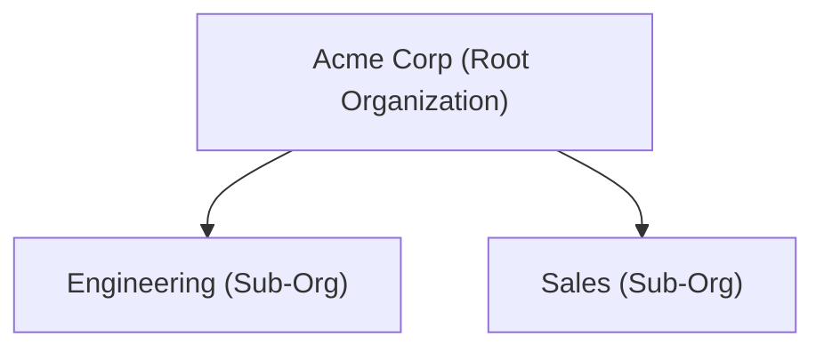

Infisical is structured around organizations and [projects](/documentation/platform/project).

## Organizations

An organization represents a company or high-level entity (e.g. Acme Corp) and acts as the root scope for managing members and machine identities, projects, usage and billing, global integrations and configuration (such as single sign-on, provisioning, etc), and more.

Within an organization, you can create any number of projects—each tied to a specific product type such as Secrets Management or PKI that determines the functionality available.

## Sub-Organizations

<Info>
  Sub-organizations is a paid feature. If you're using Infisical Cloud, then it
  is available under the **Enterprise Tier**. If you're self-hosting Infisical,
  then you should contact team@infisical.com to purchase an enterprise license
  to use it.
</Info>

Sub-organizations allow large enterprises to create autonomous child organizations within a parent (root) organization. Each sub-organization operates like a regular organization—with its own projects, members, and settings—while sharing authentication and billing with the root organization.

### When to Use Sub-Organizations

Sub-organizations are ideal when you need to:

- **Segment by business unit**: Give departments (Engineering, Sales, Marketing) independent project spaces
- **Delegate administration**: Allow team leads to manage their own organization without root-level access
- **Maintain clear boundaries**: Keep projects and resources isolated between teams while sharing a common user directory

### Key Concepts

**Root Organization**: The parent organization where authentication (SSO, SCIM, LDAP) and billing are configured. All users exist at this level.

**Sub-Organization**: A child organization that can have its own projects, groups, and machine identities. Resources from the root organization can be added to sub-orgs, but resources created in sub-orgs cannot be accessed from the root or other sub-orgs.

<Note>
Currently, only one level of nesting is supported: root organization → sub-organizations. Sub-organizations cannot create their own sub-organizations.
</Note>

### Resource Model

Resources from the root organization (users, groups, machine identities) can be added to sub-organizations, but resources never flow upward. Each sub-organization maintains its own isolated set of projects and app connections.

Resources must be **explicitly added** to a sub-organization before they can be used within it.

<Warning>
The following can only be configured at the root organization level:
- Authentication (SSO, SAML, OIDC, LDAP)
- User provisioning (SCIM)
- Billing and subscription management
- GitHub organization sync
</Warning>

### Example Structure

In this setup:
- All employees authenticate via Acme Corp's SSO configuration
- The Engineering team manages their own projects independently
- Engineering admins can add users from the root org to their sub-org
- Sales cannot access Engineering's projects (and vice versa)

### Creating a Sub-Organization

1. Click on the **Organization** tab in the header
2. Click **+ New Sub-Organization**
3. Enter a name (this becomes the slug used in API calls)
4. You are automatically assigned as Admin of the new sub-organization

### Adding Resources to a Sub-Organization

To use root organization resources in a sub-organization:

1. Switch to the sub-organization
2. Go to **Access Control** → **Users**, **Groups**, or **Machine Identities**
3. Click **Add from Organization** and select the resources to include

Once added, these resources can be assigned to projects within the sub-organization.

## Projects

The _Projects_ tab shows a list of projects that you have access to.

If you're an organization admin, you also have the option to view _All Projects_—a complete view of every project within the organization, including those you are not currently a member of— and gain access to any project.

Admins can gain access to any project in the organization by opening the options menu (⋮) next to a project and selecting Access. This will add you to the project as an admin and allow full visibility and control.

## Roles and Access Control

The _Access Control_ tab lets you view and manage roles and permissions for users, machine identities, and groups across your organization.

Users are invited to an organization and assigned organization-level roles such as `Admin` or `Member`. You can also define [custom roles](/documentation/platform/access-controls/role-based-access-controls#creating-custom-roles) at the organization level to fit your permission model.

Infisical supports [user identities](/documentation/platform/identities/user-identities) (representing people) and [machine identities](/documentation/platform/identities/machine-identities) (representing services, CI/CD pipelines, or agents). The same roles and permissions can be applied to either type of identity.

To manage access at scale, Infisical also supports [user groups](/documentation/platform/groups) — roles assigned to a group apply to all of its members automatically.

Note that Infisical distinguishes between organization-level and project-level access control:

- [Organization-level access control](/documentation/platform/access-controls/role-based-access-controls#organization-level-access-controls): Roles and permissions governing access to organization-level resources and controls such as billing, member management, and identity provider configuration.
- [Project-level access control](/documentation/platform/access-controls/role-based-access-controls#project-level-access-controls): Roles and permissions governing access to resources and workflows within a specific project (e.g., secrets, certificates, SSH hosts).

To learn more about how permissions work in detail, refer to the [access control documentation](/documentation/platform/access-controls/overview).

<Info>
Infisical provides immutable roles such as `admin` and `member` for free.

If you're using Infisical Cloud, the ability to create custom roles is available under the **Pro Tier**.

If you're self-hosting Infisical, then you should contact sales@infisical.com to purchase an enterprise license to use it.

</Info>

## Usage & Billing

The _Usage & Billing_ tab provides an overview of your organization's billing information and platform usage.

Infisical calculates usage at the organization level—aggregating activity across all projects and product types (e.g., Secrets Management, PAM, PKI). From this tab, you can track usage, view billing details, and manage your Infisical Cloud subscription.

## Audit Logs

Infisical provides a unified view of [audit logs](/documentation/platform/audit-logs) at the organization level. All platform activity—including secret access, certificate issuance, platform logins across the organization —is recorded and searchable in a central log view.

Audit logs are also viewable at the project level, where they are scoped to show only events relevant to that specific project. This allows project administrators to monitor activity and investigate changes without requiring organization-wide access.

## App Connections

Infisical supports [app connections](/integrations/app-connections/overview) — integrations configured at the organization level with third-party platforms such as AWS, GCP, GitHub, and many others.

Once configured, these connections can be reused across multiple projects as part of any feature that requires third-party integrations—such as [secret syncing](/integrations/secret-syncs/overview) or [dynamic credential generation](/documentation/platform/dynamic-secrets/overview).

To learn more, refer to the [app connections documentation](/integrations/app-connections/overview).

## Organization Settings

The _Organization Settings_ tab lets you configure global behavior and security controls for the organization.

Key configuration areas include:

- General: Manage the organization’s name, slug, and default role for newly invited members.
- Single Sign-On (SSO): Enable [SAML](/documentation/platform/sso/overview), [LDAP](/documentation/platform/ldap/overview), or [OIDC-based](/documentation/platform/sso/general-oidc/overview) authentication for user login.
- Provisioning: Enable [SCIM](/documentation/platform/scim/overview) to automatically provision and deprovision users and groups from an identity provider.
- Security Policies: Enforce MFA and configure session duration limits.
- Encryption: Integrate with external KMS systems or bring your own encryption keys (BYOK).
- [Audit Log Streaming](/documentation/platform/audit-log-streams/audit-log-streams): Forward audit events to third-party logging tools like SIEMs or cloud storage.
- Workflow Integrations: Trigger [Slack](/documentation/platform/workflow-integrations/slack-integration) or [Microsoft Teams](/documentation/platform/workflow-integrations/microsoft-teams-integration) notifications for events like access requests.
- [Project Templates](/documentation/platform/project-templates): Define default environments, roles, and settings to standardize project creation.
- KMIP (Enterprise): Connect to KMIP-compatible HSMs for hardware-backed key storage and operations.

