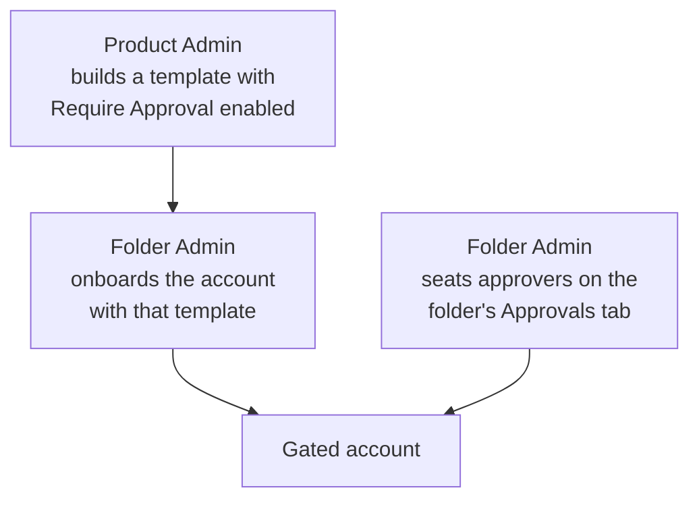
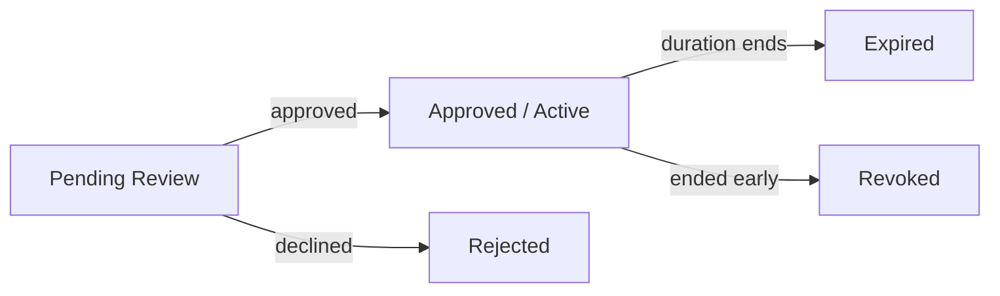

Some [accounts](/documentation/platform/pam/accounts/overview) are sensitive enough that simply having access to them should not be enough to use them. A production database or a domain admin account should be reachable only by people who are already trusted, but even for them, each individual use should clear an extra checkpoint. Access requests add that checkpoint: before a member can [launch a session](/documentation/platform/pam/sessions/overview) on a gated account, their access has to be approved.

## How it works

Approval sits on top of the access a member already holds. Two layers apply to a gated account:

- **Membership** grants use access, the right to launch a session and connect to the account. This comes from the [Connector or Admin role](/documentation/platform/pam/concepts/access-control) on the [folder](/documentation/platform/pam/folders/overview) or account, and it is the record of who can ever get in.
- **Approval** decides whether a member is cleared to use that access right now.

A gated account needs both. A member requests access on an account they can already use, an approver signs off, and the member's access opens for the duration they asked for. When the duration runs out, the access closes again.

<Note>
  A member can only request access on an account where they already hold use access. If they cannot already launch a session on the account, there is nothing for them to request.
</Note>

## How an account becomes gated

Whether an account is gated comes down to the [template](/documentation/platform/pam/templates/overview) it uses.

- The **[Product Admin](/documentation/platform/pam/concepts/access-control#product-membership)** builds the templates and turns on **Require Approval** for the ones meant to be secure.
- The **[Folder Admin](/documentation/platform/pam/concepts/access-control#folder-and-account-memberships)** gates an account by onboarding it with one of those templates. The account inherits the requirement from its template.
- The **Folder Admin** then seats the approvers on the folder's **Approvals** tab, since the template says approval is required but not who gives it.

## Setting up an access gate

<Steps>
  <Step title="Prepare a secure template (Product Admin)">
    Go to **Privileged Access Management → Account Templates**, open (or create) a template for the account type, and turn on **Require Approval**.

    See [Account Templates](/documentation/platform/pam/templates/overview) for the full list of template settings.
  </Step>
  <Step title="Onboard the account with that template (Folder Admin)">
    When you add the account to your folder, choose the template that requires approval. The account is now gated.
  </Step>
  <Step title="Seat approvers in the folder (Folder Admin)">
    Open the folder and go to its **Approvals** tab. Add the users or groups who can approve requests for the folder's gated accounts.

    Approvers must be members of the folder, so the picker only offers people who already belong to it. An approver does not need use access to the account: approving is a governance action, not an access action.
  </Step>
</Steps>

<Warning>
  A gated account with no approvers seated has no one who can clear its requests, so it stays locked until a Folder Admin adds approvers on the folder's **Approvals** tab.
</Warning>

## Requesting and granting access

### Filing a request

From **My Access**, a member sees every account they can reach. Gated accounts show **Request Access** instead of **Launch**.

To request, the member picks the account and provides a **reason** and a **duration**, both fixed at submission. The account then shows **Pending Approval** until it clears.

Once approved, the account moves into the member's approved access with a **Launch** button and a countdown to expiry.

### Reviewing a request

Approvers are notified by email and in the app when a request needs them. From **Approval Requests**, an approver sees the requests waiting on them, each showing the requester, account, folder, reason, and duration.

They **approve** or **reject** the request. A single approval from any one of the folder's seated approvers clears it; it does not have to come from a specific person.

### The request lifecycle

Every request carries the reason and duration set by the requester and moves through a small set of states.

| State | What it means |
|-------|---------------|
| **Pending Approval** | Filed and waiting on an approver. |
| **Approved** | An approver signed off. The access it asked for is now active and the member can launch sessions. |
| **Expired** | The requested duration ran out and the access closed on its own. |
| **Rejected** | An approver declined the request. No access was granted. |
| **Revoked** | Active access was ended early by a Folder Admin before its duration ran out. |

Rejected, expired, and revoked requests stay in the list so the audit trail stays complete.

## Frequently asked questions

<AccordionGroup>
  <Accordion title="When does the duration clock start, at filing or at approval?">
    At approval. The countdown begins the moment access becomes active, not when the request was filed, so the requester gets the full duration they asked for regardless of how long approval took. A four-hour request that sits pending for three hours still grants four hours of access once it clears. Time spent waiting on approvers never eats into the granted duration.
  </Accordion>
  <Accordion title="Can an approver approve their own request?">
    No. An approver who files a request cannot approve it. That separation of duties stops any one person from clearing their own access.
  </Accordion>
  <Accordion title="Can an approver change the requested reason or duration?">
    No. The reason and duration are fixed by the requester when they file, and an approver can only approve or reject. If the duration looks wrong, the approver rejects the request and the requester files a new one. What gets approved is always exactly what was requested.
  </Accordion>
  <Accordion title="Does an approver need use access to the account?">
    No. An approver has to be a member of the folder, but approving is a governance action rather than an access action, so they do not need to be able to use the gated account themselves.
  </Accordion>
  <Accordion title="Who can revoke access once it is granted?">
    A Folder Admin. Revoking ends an active request right away and cuts off access before its duration runs out. Any active session using that access is terminated immediately.
  </Accordion>
  <Accordion title="Do changes to a folder's approvers apply to requests already in flight?">
    No. Adding or removing approvers applies only to requests opened after the change; a request in flight is evaluated against the approvers that were in effect when it was created. An approved request is already granted and keeps its access until it expires or is revoked, whatever happens to the configuration afterward.
  </Accordion>
</AccordionGroup>

## Next Steps

<CardGroup cols={2}>
  <Card title="Account Templates" icon="layer-group" href="/documentation/platform/pam/templates/overview">
    Turn on Require Approval for sensitive account types.
  </Card>
  <Card title="Folders" icon="folder-tree" href="/documentation/platform/pam/folders/overview">
    Seat approvers on the folder's Approvals tab.
  </Card>
  <Card title="Access Control" icon="lock" href="/documentation/platform/pam/concepts/access-control">
    Understand the roles that grant use access in the first place.
  </Card>
  <Card title="Accounts" icon="user-lock" href="/documentation/platform/pam/accounts/overview">
    Add the databases and servers you want to gate.
  </Card>
</CardGroup>
