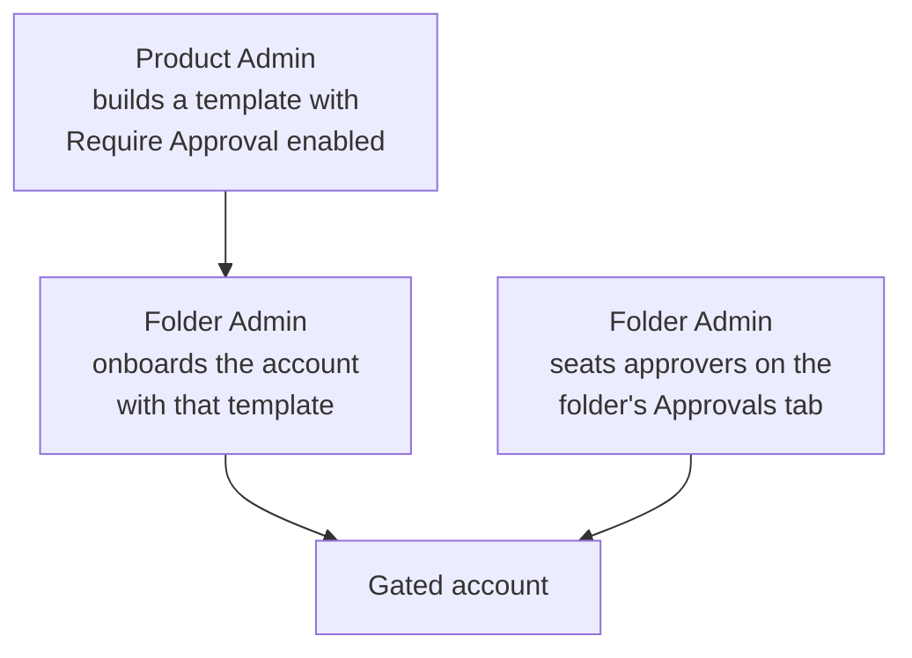
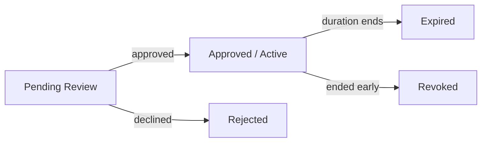
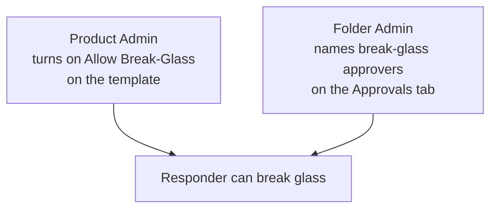

Some [accounts](/documentation/platform/pam/accounts/overview) are sensitive enough that simply having access to them shouldn't be enough to use them. A production database or a domain admin account should be reachable only by people who are already trusted, but even for them, each individual use should clear an extra checkpoint. Access requests add that checkpoint: before a member can [launch a session](/documentation/platform/pam/sessions/overview) on a gated account, their access has to be approved.

The template's **Require Approval** policy gates two things, and each is requested separately: launching a session, and [viewing the account's credentials](/documentation/platform/pam/accounts/overview#viewing-credentials). Everything below applies to both. An approved session request never reveals the credential, and an approved credential request never launches a session, so a member who needs both files both.

The same checkpoint applies to [AI agents](/documentation/platform/pam/ai-agents/overview). An agent requests access as whoever started it, a person or a [machine identity](/documentation/platform/identities/machine-identities), and waits for an approver either way.

## How it works

Approval sits on top of the access a member already holds. Two layers apply to a gated account:

- **Membership** grants use access, the right to launch a session and connect to the account. This comes from the [Admin, Operator, or Connector role](/documentation/platform/pam/concepts/access-control) on the [folder](/documentation/platform/pam/folders/overview) or account, and it's the record of who can ever get in. Credential access needs the Operator or Admin role specifically.
- **Approval** decides whether a member is cleared to use that access right now.

A gated account needs both. A member requests access on an account they can already use, an approver signs off, and the member's access opens for the duration they asked for. When the duration runs out, the access closes again.

<Note>
  A member can only request access on an account where they already hold use access. If they can't already launch a session on the account, there is nothing for them to request.
</Note>

## How an account becomes gated

Whether an account is gated comes down to the [template](/documentation/platform/pam/templates/overview) it uses.

- The **[Product Admin](/documentation/platform/pam/concepts/access-control#product-membership)** builds the templates and turns on **Require Approval** for the ones meant to be secure.
- The **[Folder Admin](/documentation/platform/pam/concepts/access-control#folder-and-account-memberships)** gates an account by onboarding it with one of those templates. The account inherits the requirement from its template.
- The **Folder Admin** then seats the approvers on the folder's **Approvals** tab, since the template says approval is required but not who gives it.

```mermaid
graph TD
    P["Product Admin<br/>builds a template with<br/>Require Approval enabled"]
    O["Folder Admin<br/>onboards the account<br/>with that template"]
    S["Folder Admin<br/>seats approvers on the<br/>folder's Approvals tab"]
    G["Gated account"]

    P --> O --> G
    S --> G
```

## Setting up an access gate

<Steps>
  <Step title="Prepare a secure template (Product Admin)">
    Go to **Privileged Access Management → Account Templates**, open (or create) a template for the account type, and turn on **Require Approval**.

    See [Account Templates](/documentation/platform/pam/templates/overview) for the full list of template settings.
  </Step>
  <Step title="Onboard the account with that template (Folder Admin)">
    When you add the account to your folder, choose the template that requires approval. The account is now gated.
  </Step>
  <Step title="Seat approvers in the folder (Folder Admin)">
    Open the folder and go to its **Approvals** tab. Add the users or groups who can approve requests for the folder's gated accounts.

    Approvers must be members of the folder, so the picker only offers people who already belong to it. An approver does not need use access to the account: approving is a governance action, not an access action.

    Only users and groups can be seated. Approving is a human sign-off, so a machine identity is never an approver, even one with Admin on the folder.
  </Step>
</Steps>

<Warning>
  A gated account with no approvers seated has no one who can clear its requests, so it stays locked until a Folder Admin adds approvers on the folder's **Approvals** tab.
</Warning>

## Requesting and granting access

### Filing a request

From the **Accounts** page, a member sees every account they can reach. Gated accounts show a **key icon** instead of the rocket (launch) button — select the key or select **Request Access** from the menu to start a request.

To request, the member provides a **reason** and a **duration**, both fixed at submission. The account then shows **Pending Approval** until it clears.

Once approved, the key icon switches to the rocket icon and the member can launch sessions until the grant expires.

### Reviewing a request

Approvers are notified by email and in the app when a request needs them. From **Approval Requests**, an approver sees the requests waiting on them, each showing the requester, account, folder, reason, and duration. A credential request carries a **Credentials** badge, so an approver can tell at a glance that approving hands over the raw password rather than opening a recorded session.

They **approve** or **reject** the request. A single approval from any one of the folder's seated approvers clears it; it doesn't have to come from a specific person.

### The request lifecycle

Every request carries the reason and duration set by the requester and moves through a small set of states.

| State | What it means |
|-------|---------------|
| **Pending Approval** | Filed and waiting on an approver. |
| **Approved** | An approver signed off. The access it asked for is now active and the member can launch sessions. |
| **Expired** | The requested duration ran out and the access closed on its own. |
| **Rejected** | An approver declined the request. No access was granted. |
| **Revoked** | Active access was ended early by a Folder Admin before its duration ran out. |

```mermaid
graph LR
    P["Pending Review"] -->|approved| A["Approved / Active"]
    P -->|declined| R["Rejected"]
    A -->|duration ends| E["Expired"]
    A -->|ended early| V["Revoked"]
```

Rejected, expired, and revoked requests stay in the list so the audit trail stays complete.

## Break-glass access

Break-glass access lets a named responder clear their own pending request without an approver. Every approver who was skipped is notified immediately.

It grants no standing access. The responder still files a request, still gives a reason, and still gets a time-boxed grant. The only thing that changes is who signs it off.

### The two switches

Break-glass needs two switches on, and a different person owns each one:

- The **Product Admin** turns on **Allow Break-Glass** on the [template](/documentation/platform/pam/templates/overview). This sets which accounts can ever be broken into.
- The **Folder Admin** names the break-glass approvers on the folder's **Approvals** tab. This sets who can do it.

An empty break-glass list means nobody, not everybody, so the template policy on its own changes nothing until a Folder Admin names someone.

<Note>
  **Allow Break-Glass** does nothing without **Require Approval** on the same template. Break-glass skips an approval, so an account that never needed one has nothing to skip.
</Note>

```mermaid
graph TD
    T["Product Admin<br/>turns on Allow Break-Glass<br/>on the template"]
    F["Folder Admin<br/>names break-glass approvers<br/>on the Approvals tab"]
    B["Responder can break glass"]

    T --> B
    F --> B
```

### Setting it up

<Steps>
  <Step title="Turn on the template policy (Product Admin)">
    Go to **Privileged Access Management → Account Templates**, open the template, and turn on **Allow Break-Glass** alongside **Require Approval**.
  </Step>
  <Step title="Name the responders (Folder Admin)">
    Open the folder, go to its **Approvals** tab, and add users or groups under **Break-Glass Approvers**.

    Break-glass approvers must be members of the folder, same as ordinary approvers, so the picker only offers people who already belong to it. Keep the list to your on-call responders rather than everyone who might need the account.
  </Step>
</Steps>

### Breaking glass

A break-glass approver files a request the usual way, with a reason and a duration. While it's pending, the request sheet offers **Break glass** below the approval workflow.

Breaking glass takes a second reason, at least 10 characters, for why this can't wait for an approver. Select **Break glass** and the grant opens straight away, for the duration the request asked for.

Nothing else about the grant changes. It expires on the same clock, a Folder Admin can revoke it the same way, and sessions on it are recorded like any other.

### What happens next

Every use of break-glass:

- Emails every approver who was skipped, with the reason given
- Notifies them in the app
- Posts to the folder's Slack channels, if you've configured notifications on the folder
- Writes a **PAM Access Policy Bypassed** entry to the [audit log](/documentation/platform/pam/auditing) with the reason, the account, the folder, and how many approvers were skipped
- Marks the request with a **Break-glass** badge, in the folder's request history and in the approver's own queue

The badge and the audit entry are permanent.

## Requests from AI agents

An agent requests access on the same terms as a person, but from the [CLI](/cli/commands/pam-agentic) instead of the dashboard. A request from an agent running as a machine identity shows the identity's name in place of a requester's email; one from an agent you started yourself is filed under your own name.

When an agent reaches for a gated account, the request is filed for it automatically, and the account starts working on the agent's next attempt after you approve.

<Warning>
  Approving a request from an agent's identity means approving whatever that agent does with the access for the duration you grant. Keep those identities scoped to the accounts they need, and review the [session recordings](/documentation/platform/pam/sessions/session-recording).
</Warning>

## Frequently asked questions

<AccordionGroup>
  <Accordion title="When does the duration clock start, at filing or at approval?">
    At approval. The countdown begins the moment access becomes active, not when the request was filed, so the requester gets the full duration they asked for regardless of how long approval took. A four-hour request that sits pending for three hours still grants four hours of access once it clears. Time spent waiting on approvers never eats into the granted duration.
  </Accordion>
  <Accordion title="Can an approver approve their own request?">
    No. An approver who files a request can't approve it. That separation of duties stops any one person from clearing their own access.
  </Accordion>
  <Accordion title="Can an approver change the requested reason or duration?">
    No. The reason and duration are fixed by the requester when they file, and an approver can only approve or reject. If the duration looks wrong, the approver rejects the request and the requester files a new one. What gets approved is always exactly what was requested.
  </Accordion>
  <Accordion title="Does an approver need use access to the account?">
    No. An approver has to be a member of the folder, but approving is a governance action rather than an access action, so they don't need to be able to use the gated account themselves.
  </Accordion>
  <Accordion title="Who can revoke access once it is granted?">
    A Folder Admin. Revoking ends an active request right away and cuts off access before its duration runs out. Any active session using that access is terminated immediately.

    Revoking a credential request is weaker: it stops further reveals, but a credential already copied is outside Infisical and stays valid until the account is rotated. It also leaves live sessions alone, since those are authorized by their own grant.
  </Accordion>
  <Accordion title="Can a machine identity or an AI agent break glass?">
    No. Only a person can break glass, whether they're named directly or belong to a group that is, the same rule that keeps a machine identity from being an ordinary approver.
  </Accordion>
  <Accordion title="Can someone break glass on another person's request?">
    No. Break-glass clears your own pending request and nothing else.
  </Accordion>
  <Accordion title="Does break-glass give longer or wider access than an approval?">
    No. The grant is the one the request asked for: same duration, same account, same expiry. A Folder Admin can revoke it early, and sessions on it are recorded like any other. The only difference is that no approver signed it off.
  </Accordion>
  <Accordion title="What happens if the account moves or the folder's policy changes mid-request?">
    Infisical runs the same checks it runs for an approval, and refuses rather than granting access under a folder's old rules. That covers an account that moved to another folder or was removed, and a folder whose approvers were cleared. You'll also lose the ability to break glass if you're dropped from the folder, or from its break-glass list, while your request is pending.
  </Accordion>
  <Accordion title="Do changes to a folder's approvers apply to requests already in flight?">
    Removing an approver takes effect right away: someone dropped from the folder's approvers can no longer act on a request that is still pending. Adding an approver doesn't reach back into requests already in flight, so a pending request can only be cleared by the approvers it had when it was created. An approved request is already granted and keeps its access until it expires or is revoked, whatever changes afterward.
  </Accordion>
</AccordionGroup>

## Next steps

<CardGroup cols={2}>
  <Card title="Account Templates" icon="layer-group" href="/documentation/platform/pam/templates/overview">
    Turn on Require Approval for sensitive account types.
  </Card>
  <Card title="Folders" icon="folder-tree" href="/documentation/platform/pam/folders/overview">
    Seat approvers on the folder's Approvals tab.
  </Card>
  <Card title="Access Control" icon="lock" href="/documentation/platform/pam/concepts/access-control">
    Understand the roles that grant use access in the first place.
  </Card>
  <Card title="Accounts" icon="user-lock" href="/documentation/platform/pam/accounts/overview">
    Add the databases and servers you want to gate.
  </Card>
</CardGroup>
